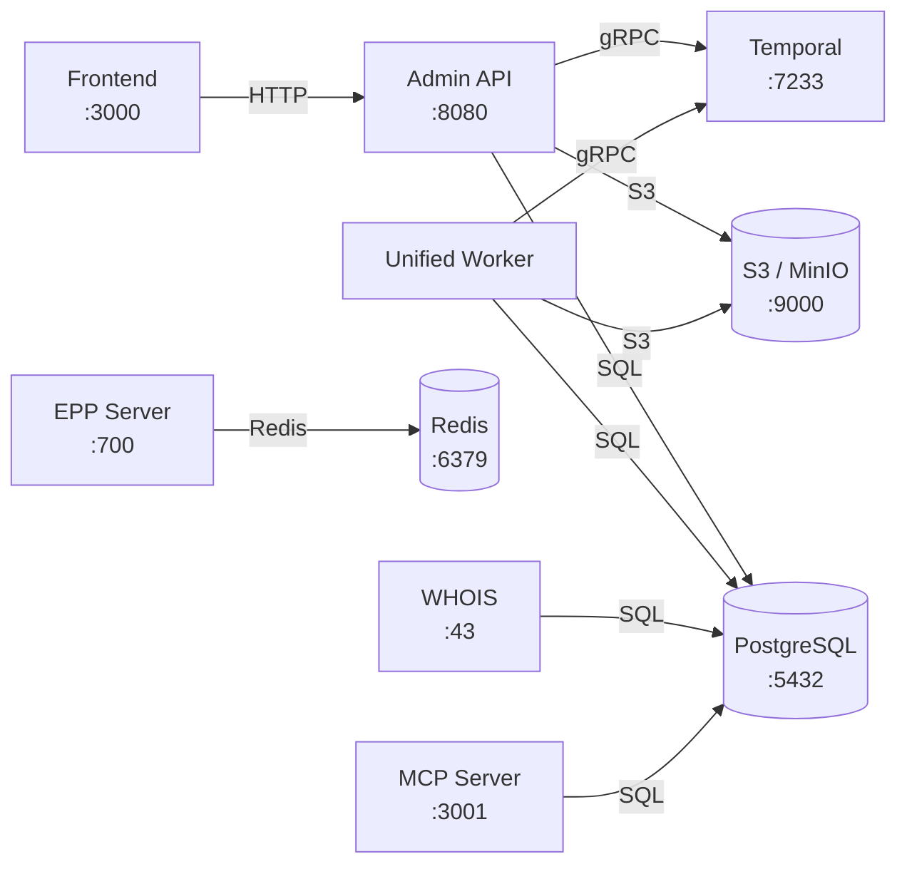

# domain-os

[](https://github.com/onasunnymorning/domain-os/actions/workflows/ci.yaml)
[](https://goreportcard.com/report/github.com/onasunnymorning/domain-os)

A domain name registry backend — the system that manages the lifecycle of domain names, registrars, TLDs, and all the RFC-compliant operations a registry needs to run.

---

## Why does this exist?

Registry backends operate in a high-volume, low-margin environment. The legacy systems we've worked with tend to be monolithic, hard to adapt, and built on technology stacks that make change expensive. Policy changes, new TLD launches, infrastructure migrations — each of these becomes a project in itself.

**domain-os** is built from the accumulated experience of working in this industry, with a few goals:

- **Modular** — swap infrastructure, add features, or change policy without rewriting the core
- **Automated** — domain lifecycle, registrar sync, escrow import — these run as durable workflows, not manual processes
- **RFC-aligned** — the data model mirrors the standards (EPP, RDE, IANA), so concepts map directly to the specs
- **Observable** — testing, metrics, and visibility are built in from the start, not bolted on later
- **Cost-efficient to operate** — designed for the economics of the registry business

> It's not finished. It's not yet optimized for peak load. But it has the architecture, the test coverage, and the visibility to evolve quickly when the time comes.

---

## What you get

| Capability | Description |
|---|---|
| **Admin REST API** | Full CRUD for domains, TLDs, registrars, contacts, hosts, pricing, DNSSEC, and more. Swagger docs included. |
| **EPP Server** | RFC 5730-compliant EPP on port 700 with TLS. Redis-backed session and rate limiting. |
| **WHOIS Server** | Standard port 43 WHOIS. |
| **MCP Server** | Model Context Protocol server exposing registry tools for AI agents (stdio + HTTP). |
| **Temporal Workflows** | Durable, automated lifecycle management — expiry, purge, restore, registrar sync, escrow import, FX updates. |
| **Admin Dashboard** | Next.js web UI for registry operators, TLDs, registrars, domains, and escrow imports. |
| **CLI Tools** | Command-line utilities for EPP testing, escrow operations, data import, lifecycle management, and more. |
| **Multi-TLD Support** | Registry operators, TLD phases, pricing engines with premium labels and FX conversion. |

---

## Service Topology

The system consists of 6 deployable services plus shared infrastructure:



### Services

| Service | Port | Docker Image | Health Check |
|---|---|---|---|
| Admin API | 8080 | `geapex/domain-os` | `GET /ping` |
| Unified Worker | — | `geapex/unified-worker` | Temporal heartbeat |
| EPP Server | 700 | `geapex/epp-server` | TCP connect |
| WHOIS Server | 43 | `geapex/whois` | TCP connect |
| MCP Server | 3001 | `geapex/mcp-server` | `GET /healthz` |
| Frontend | 3000 | `geapex/domain-os-frontend` | — |

### Infrastructure Dependencies

| Component | Default Port | Used By |
|---|---|---|
| PostgreSQL | 5432 | API, Worker, WHOIS, MCP |
| Redis | 6379 | EPP Server |
| Temporal | 7233 | API (start workflows), Worker (execute workflows) |
| S3 / MinIO | 9000 | API (presigned URLs), Worker (escrow, snapshots, events) |

### Versioning

All services share a single version from the [`VERSION`](VERSION) file at the repo root. Version info is injected at build time via the [`internal/buildinfo`](internal/buildinfo/buildinfo.go) package and is available at runtime through:

- **API**: `GET /ping` → returns `version`, `git_sha`, `build_date`
- **All services**: Logged at startup

---

## The big idea: Workflows & Activities

The most important architectural decision in domain-os is how it handles **processes that span time**. Domain expiry, escrow imports, registrar synchronization — these aren't simple request/response operations. They're multi-step processes that can take minutes or hours, need to survive restarts, and must handle partial failures gracefully.

We use [Temporal](https://temporal.io) to make this work. If you're not familiar with it, here's the short version:

- A **Workflow** is the orchestration logic — it defines *what* steps to execute and in *what order*
- An **Activity** is a single unit of work — it talks to the database, calls an API, writes a file
- Temporal guarantees that if a workflow is interrupted (server crash, deploy, network issue), it **picks up exactly where it left off**

This means we write business logic as straightforward Go code, and Temporal handles retries, timeouts, and crash recovery.

### How it looks in practice

Take the **Expiry Loop** — the workflow that handles expired domains:

```
ExpiryLoop (runs hourly via Temporal Schedule)
│
├─ GetExpiredDomainCount     → Any domains past their expiry date?
├─ ListExpiringDomains       → Get the list
│
└─ For each domain:
   ├─ CheckDomainCanAutoRenew → Is auto-renew enabled and billable?
   │
   ├─ YES → AutoRenewDomain   → Extend registration, bill registrar
   └─ NO  → ExpireDomain      → Set status to expired, begin grace period
```

Each box is an **Activity** — a single Go function that does one thing. The **Workflow** is just the control flow. If `AutoRenewDomain` fails for one domain, Temporal retries it automatically. If the whole server goes down mid-loop, Temporal resumes from the exact domain it was processing.

### All workflows at a glance

| Workflow | What it does | When it runs |
|---|---|---|
| **ExpiryLoop** | Scans for expired domains, auto-renews or expires them | Hourly (scheduled) |
| **PurgeLoop** | Removes domains past their redemption grace period | Periodic (scheduled) |
| **RestoreWorkflow** | Processes domains pending restore — clears status, force-renews | Periodic (scheduled) |
| **SyncRegistrarsWorkflow** | Syncs local registrars with IANA/ICANN registry data, creates new ones, updates status | Periodic (scheduled) |
| **UpdateFX** | Refreshes exchange rates for USD, EUR, GBP, PEN, RUB, CAD, AUD | Periodic (scheduled) |
| **EscrowStagingWorkflow** | Multi-step escrow import: validate → parse → collate → map registrars → stage | On demand (via API) |
| **EscrowIngestionWorkflow** | Bulk-ingests staged escrow data: contacts → hosts → domains → NNDNs → link hosts → accredit registrars | Triggered by staging (child workflow) |
| **TLDCleanupWorkflow** | Safely removes all assets for a TLD. Plans the cleanup, waits for human confirmation signal, backs up to S3, then deletes. | On demand (via API) |

### Activities — the building blocks

There are **65+ activity implementations** across the codebase. Each is a focused function: `AutoRenewDomain`, `PurgeDomain`, `IngestContacts`, `BackupTLDAssets`, `ValidateEscrowSource`, `UpdateFX`, etc.

Activities are grouped by concern:

| Group | Activities | Examples |
|---|---|---|
| **Domain Lifecycle** | ~15 | `AutoRenewDomain`, `ExpireDomain`, `PurgeDomain`, `RenewDomain`, `SetDomainStatus` |
| **Escrow Import** | ~10 | `ValidateEscrowSource`, `ParseAndExtractAssets`, `BuildStagingDatabase`, `ResolveRegistrars`, `ApplyRegistrarMappings`, `IngestDomains`, `IngestContacts` |
| **Registrar Sync** | ~8 | `SyncIanaRegistrars`, `GetICANNRegistrars`, `DiffAndPlanRegistrars`, `CreateRegistrar`, `SetRegistrarStatus` |
| **TLD Cleanup** | ~5 | `CheckTLDCanBeDeleted`, `PlanTLDCleanup`, `BackupTLDAssets`, `DeleteTLDAssets` |
| **FX** | 1 | `UpdateFX` |

### Temporal Schedules

Recurring workflows are managed as Temporal Schedules — not cron jobs, not timers in application code. The Temporal UI provides full visibility into schedule history, next run times, and execution logs.

---

## Architecture

domain-os follows a **Hexagonal (Ports & Adapters)** architecture with **Domain-Driven Design**:

```
pkg/domain/
├── entities/           120+ domain entities — pure Go, zero dependencies
└── repositories/       22 repository interfaces — the contracts

internal/
├── application/        Use-case orchestration
│   ├── workflows/      Temporal workflow definitions
│   ├── activities/     Temporal activity implementations
│   ├── schedules/      Temporal scheduled workflows
│   └── services/       Business logic services
├── infrastructure/     Adapters (Postgres, Redis, Temporal, S3, Auth0)
└── interface/          Entry points (REST API, CLI, EPP)
```

**The key rule**: the domain layer has no imports of database drivers, HTTP frameworks, or external services. Business logic is decoupled from infrastructure. You can swap Postgres for something else without touching a single entity.

For the full architecture document, see [architecture.md](architecture.md).

---

## Tech stack

| Layer | Technology |
|---|---|
| **Language** | Go |
| **API Framework** | Gin |
| **Database** | PostgreSQL (via GORM) |
| **Workflow Engine** | Temporal |
| **Cache** | Redis |
| **Object Storage** | MinIO (S3-compatible) |
| **EPP Protocol** | Custom TLS server on port 700 |
| **MCP Protocol** | Streamable HTTP + stdio |
| **Frontend** | Next.js 15, React 19, TypeScript, Tailwind CSS, Radix UI |
| **Auth** | Auth0 |
| **Observability** | Prometheus, Grafana, Temporal UI, PostHog |
| **Secrets** | Doppler |
| **CI/CD** | GitHub Actions |

Full stack details in [stack.md](stack.md).

---

## Getting started

### Prerequisites

- Docker Desktop
- Go 1.21+ (for local development)
- Node.js 18+ (for frontend development)
- [Doppler CLI](https://docs.doppler.com/docs/install-cli) for secrets (or use a `.env` file)

### Quick start with pre-built images

```bash
BRANCH=latest docker compose --profile essential up
```

This starts: PostgreSQL, Redis, Admin API, EPP Server, Temporal (server + UI), Unified Worker, MinIO, and Metabase.

### Development setup

```bash
# Copy the example env file
cp example.env .env

# Terminal 1: Start backend services
make dev

# Terminal 2: Start the frontend
make dev-frontend
```

### Useful commands

```bash
make help              # See all available commands
make test              # Unit tests
make test-integration  # Integration tests (requires running services)
make dev-logs          # Tail service logs
make stop              # Stop everything
make clean             # Remove containers and volumes
make shell-db          # PostgreSQL shell
```

### Using the API

1. Open **http://localhost:8080/swagger/index.html** for interactive API docs
2. Grab the Postman collection from the Swagger UI
3. Set `baseUrl` and `token` environment variables in Postman
4. Start creating resources:
   - Registry Operator → TLD → Phase → Registrars → Domains

---

## Project structure

```
domain-os/
├── cmd/                    Application entry points
│   ├── api/ry-admin/       Admin REST API
│   ├── epp/                EPP server
│   ├── whois/              WHOIS server
│   ├── mcp/                MCP server (AI tool interface)
│   ├── workers/unified/    Temporal worker (all workflows)
│   └── cli/                CLI tools
├── pkg/domain/             Domain entities & repository interfaces
├── internal/
│   ├── application/        Workflows, activities, services
│   ├── buildinfo/          Build-time version metadata
│   ├── infrastructure/     Database, Temporal, S3, auth adapters
│   └── interface/          REST controllers, CLI handlers, MCP tools
├── frontend/               Next.js admin dashboard
├── deploy/                 Deployment configs (Helm, Render, Pulumi)
└── docs/                   Extended documentation
```

---

## Testing

The project has tests at multiple levels:

- **Unit tests** — `make test` — fast, isolated, mocked dependencies
- **Integration tests** — `make test-integration` — real database and services
- **EPP tests** — `make test-epp` — EPP protocol-specific tests
- **Coverage** — `make test-coverage` — generates HTML coverage report

---

## Documentation

Extended documentation lives in [`/docs`](docs/):

- [Architecture](architecture.md) — hexagonal design, layer responsibilities
- [Tech Stack](stack.md) — full technology inventory
- [Temporal Integration](docs/temporal-integration.md) — workflow patterns and setup
- [EPP Architecture](docs/epp-production-architecture.md) — EPP server design
- [Escrow Import Walkthrough](docs/escrow-import-walkthrough.md) — step-by-step import guide
- [Domain Status Overview](docs/domain-status-overview.md) — status model reference
- [API Integration Testing](docs/api-integration-testing-guide.md) — testing against the real API

---

## Contributing

1. Create a feature branch from `main`
2. Make your changes
3. Run tests: `make test && make test-integration`
4. Format code: `make fmt`
5. Submit a pull request

> **Rule**: PRs without tests will be rejected. See [architecture.md](architecture.md) for the full testing strategy.

---

## License

See [LICENSE](LICENSE) for details.
