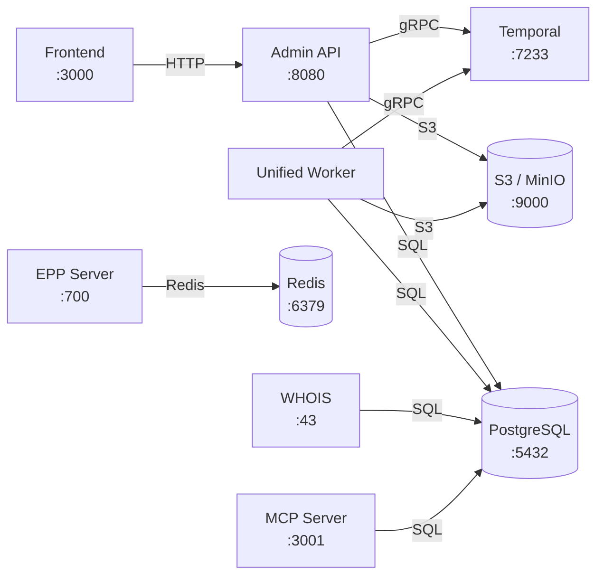

# domain-os

[](https://github.com/onasunnymorning/domain-os/actions/workflows/ci.yaml)
[](https://goreportcard.com/report/github.com/onasunnymorning/domain-os)

A domain name registry backend — the system that manages the lifecycle of domain names, registrars, TLDs, and all the RFC-compliant operations a registry needs to run.

---

## Quickstart

Prerequisites: **Docker Desktop** and **Go 1.26.5** (`asdf install` reads `.tool-versions`).

```bash
git clone https://github.com/onasunnymorning/domain-os.git && cd domain-os
cp .env.example .env      # no edits needed
make dev                  # builds, starts, migrates, seeds — allow ~15 min cold
make test                 # full suite, green
```

`make doctor` diagnoses a failed start. **Local development needs no cloud credentials** — no AWS, no Doppler, no Auth0, no network egress. See [Troubleshooting](#troubleshooting).

---

## Why does this exist?

Registry backends operate in a high-volume, low-margin environment. The legacy systems we've worked with tend to be monolithic, hard to adapt, and built on technology stacks that make change expensive. Policy changes, new TLD launches, infrastructure migrations — each of these becomes a project in itself.

**domain-os** is built from the accumulated experience of working in this industry, with a few goals:

- **Modular** — swap infrastructure, add features, or change policy without rewriting the core
- **Automated** — domain lifecycle, registrar sync, escrow import — these run as durable workflows, not manual processes
- **RFC-aligned** — the data model mirrors the standards (EPP, RDE, IANA), so concepts map directly to the specs
- **Observable** — testing, metrics, and visibility are built in from the start, not bolted on later
- **Cost-efficient to operate** — designed for the economics of the registry business

> It's not finished. It's not yet optimized for peak load. But it has the architecture, the test coverage, and the visibility to evolve quickly when the time comes.

---

## What you get

| Capability | Description |
|---|---|
| **Admin REST API** | Full CRUD for domains, TLDs, registrars, contacts, hosts, pricing, DNSSEC, and more. Swagger docs included. |
| **EPP Server** | RFC 5730-compliant EPP on port 700 with TLS. Redis-backed session and rate limiting. |
| **WHOIS Server** | Standard port 43 WHOIS. |
| **MCP Server** | Model Context Protocol server exposing registry tools for AI agents (stdio + HTTP). |
| **Temporal Workflows** | Durable, automated lifecycle management — expiry, purge, restore, registrar sync, escrow import, FX updates. |
| **Admin Dashboard** | Next.js web UI for registry operators, TLDs, registrars, domains, and escrow imports. |
| **CLI Tools** | Command-line utilities for EPP testing, escrow operations, data import, lifecycle management, and more. |
| **Multi-TLD Support** | Registry operators, TLD phases, pricing engines with premium labels and FX conversion. |

---

## Service Topology

The system consists of 6 deployable services plus shared infrastructure:



### Services

| Service | Port | Docker Image | Health Check |
|---|---|---|---|
| Admin API | 8080 | `gprins/domain-os-api` | `GET /ping` |
| Unified Worker | — | `gprins/domain-os-worker` | Temporal heartbeat |
| EPP Server | 700 | `gprins/domain-os-epp` | TCP connect |
| WHOIS Server | 43 | `gprins/domain-os-whois` | TCP connect |
| MCP Server | 3001 | `gprins/domain-os-mcp` | `GET /healthz` |
| Frontend | 3000 | `gprins/domain-os-frontend` | — |

### Infrastructure Dependencies

| Component | Default Port | Used By |
|---|---|---|
| PostgreSQL | 5432 | API, Worker, WHOIS, MCP |
| Redis | 6379 | EPP Server |
| Temporal | 7233 | API (start workflows), Worker (execute workflows) |
| S3 / MinIO | 9000 | API (presigned URLs), Worker (escrow, snapshots, events) |

### Versioning

All services share a single version derived from the git tag (`v*`, managed by release-please) — there is no committed version file. CI stamps it into every binary at build time via `git describe` and the [`internal/buildinfo`](internal/buildinfo/buildinfo.go) package, available at runtime through:

- **API**: `GET /ping` → returns `version`, `git_sha`
- **All services**: Logged at startup

---

## The big idea: Workflows & Activities

The most important architectural decision in domain-os is how it handles **processes that span time**. Domain expiry, escrow imports, registrar synchronization — these aren't simple request/response operations. They're multi-step processes that can take minutes or hours, need to survive restarts, and must handle partial failures gracefully.

We use [Temporal](https://temporal.io) to make this work. If you're not familiar with it, here's the short version:

- A **Workflow** is the orchestration logic — it defines *what* steps to execute and in *what order*
- An **Activity** is a single unit of work — it talks to the database, calls an API, writes a file
- Temporal guarantees that if a workflow is interrupted (server crash, deploy, network issue), it **picks up exactly where it left off**

This means we write business logic as straightforward Go code, and Temporal handles retries, timeouts, and crash recovery.

### How it looks in practice

Take the **Expiry Loop** — the workflow that handles expired domains:

```
ExpiryLoop (runs hourly via Temporal Schedule)
│
├─ GetExpiredDomainCount     → Any domains past their expiry date?
├─ ListExpiringDomains       → Get the list
│
└─ For each domain:
   ├─ CheckDomainCanAutoRenew → Is auto-renew enabled and billable?
   │
   ├─ YES → AutoRenewDomain   → Extend registration, bill registrar
   └─ NO  → ExpireDomain      → Set status to expired, begin grace period
```

Each box is an **Activity** — a single Go function that does one thing. The **Workflow** is just the control flow. If `AutoRenewDomain` fails for one domain, Temporal retries it automatically. If the whole server goes down mid-loop, Temporal resumes from the exact domain it was processing.

### All workflows at a glance

| Workflow | What it does | When it runs |
|---|---|---|
| **ExpiryLoop** | Scans for expired domains, auto-renews or expires them | Hourly (scheduled) |
| **PurgeLoop** | Removes domains past their redemption grace period | Periodic (scheduled) |
| **RestoreWorkflow** | Processes domains pending restore — clears status, force-renews | Periodic (scheduled) |
| **SyncRegistrarsWorkflow** | Syncs local registrars with IANA/ICANN registry data, creates new ones, updates status | Periodic (scheduled) |
| **UpdateFX** | Refreshes exchange rates for USD, EUR, GBP, PEN, RUB, CAD, AUD | Periodic (scheduled) |
| **EscrowStagingWorkflow** | Multi-step escrow import: validate → parse → collate → map registrars → stage | On demand (via API) |
| **EscrowIngestionWorkflow** | Bulk-ingests staged escrow data: contacts → hosts → domains → NNDNs → link hosts → accredit registrars | Triggered by staging (child workflow) |
| **TLDCleanupWorkflow** | Safely removes all assets for a TLD. Plans the cleanup, waits for human confirmation signal, backs up to S3, then deletes. | On demand (via API) |

### Activities — the building blocks

There are **65+ activity implementations** across the codebase. Each is a focused function: `AutoRenewDomain`, `PurgeDomain`, `IngestContacts`, `BackupTLDAssets`, `ValidateEscrowSource`, `UpdateFX`, etc.

Activities are grouped by concern:

| Group | Activities | Examples |
|---|---|---|
| **Domain Lifecycle** | ~15 | `AutoRenewDomain`, `ExpireDomain`, `PurgeDomain`, `RenewDomain`, `SetDomainStatus` |
| **Escrow Import** | ~10 | `ValidateEscrowSource`, `ParseAndExtractAssets`, `BuildStagingDatabase`, `ResolveRegistrars`, `ApplyRegistrarMappings`, `IngestDomains`, `IngestContacts` |
| **Registrar Sync** | ~8 | `SyncIanaRegistrars`, `GetICANNRegistrars`, `DiffAndPlanRegistrars`, `CreateRegistrar`, `SetRegistrarStatus` |
| **TLD Cleanup** | ~5 | `CheckTLDCanBeDeleted`, `PlanTLDCleanup`, `BackupTLDAssets`, `DeleteTLDAssets` |
| **FX** | 1 | `UpdateFX` |

### Temporal Schedules

Recurring workflows are managed as Temporal Schedules — not cron jobs, not timers in application code. The Temporal UI provides full visibility into schedule history, next run times, and execution logs.

---

## Architecture

domain-os follows a **Hexagonal (Ports & Adapters)** architecture with **Domain-Driven Design**:

```
pkg/domain/
├── entities/           120+ domain entities — pure Go, zero dependencies
└── repositories/       22 repository interfaces — the contracts

internal/
├── application/        Use-case orchestration
│   ├── workflows/      Temporal workflow definitions
│   ├── activities/     Temporal activity implementations
│   ├── schedules/      Temporal scheduled workflows
│   └── services/       Business logic services
├── infrastructure/     Adapters (Postgres, Redis, Temporal, S3, Auth0)
└── interface/          Entry points (REST API, CLI, EPP)
```

**The key rule**: the domain layer has no imports of database drivers, HTTP frameworks, or external services. Business logic is decoupled from infrastructure. You can swap Postgres for something else without touching a single entity.

For the full architecture document, see [architecture.md](architecture.md).

---

## Tech stack

| Layer | Technology |
|---|---|
| **Language** | Go |
| **API Framework** | Gin |
| **Database** | PostgreSQL (via GORM) |
| **Workflow Engine** | Temporal |
| **Cache** | Redis |
| **Object Storage** | MinIO (S3-compatible) |
| **EPP Protocol** | Custom TLS server on port 700 |
| **MCP Protocol** | Streamable HTTP + stdio |
| **Frontend** | Next.js 15, React 19, TypeScript, Tailwind CSS, Radix UI |
| **Auth** | Auth0 |
| **Observability** | Prometheus, Grafana, Temporal UI, PostHog |
| **Secrets** | Doppler |
| **CI/CD** | GitHub Actions |

Full stack details in [stack.md](stack.md).

---

## Getting started

### Prerequisites

Versions are pinned in `.tool-versions` (asdf/mise), `go.mod`, and `frontend/.nvmrc` — install them with `asdf install` rather than by hand.

- Docker Desktop (with Compose v2)
- Go 1.26.5 — backend
- Node.js 22 — frontend only; the backend and the test suite do not need it

No cloud accounts. Doppler is used for staging and production secrets, but nothing in the local boot or test path reads it.

### The five targets that matter

| Target | What it does |
|---|---|
| `make dev` | Cold machine → running stack, migrated and seeded |
| `make test` | Full suite against a throwaway database (safe to run while `make dev` is up) |
| `make down` | Stop services, keep your data |
| `make reset` | Destroy volumes and state — the next `make dev` is a first-ever run |
| `make doctor` | Preflight: Docker, ports, toolchain, `.env`, disk. Run this first when something breaks |

`make help` lists everything else.

### What `make dev` gives you

The stack comes up seeded with a synthetic dataset — no escrow data, no real registrants:

- one TLD, `.test` (reserved by RFC 2606, so it can never collide with a real registration)
- six registrars — four generated, plus the `9998`/`9999` operator accounts the TLD provisions
- nine domains spanning the lifecycle states the workflows branch on: active, locked, add/renew/auto-renew grace, expiring, redemption, and pending delete

| Service | URL |
|---|---|
| Admin API | http://localhost:8080 — Swagger at `/swagger/index.html` |
| Temporal UI | http://localhost:8081 |
| MinIO console | http://localhost:9001 — `minioadmin` / `minioadmin` |
| Frontend | `make dev-frontend`, then http://localhost:3002 |
| PostgreSQL | `localhost:5432` — or `make shell-db` |
| EPP | `localhost:7700` (port 700 inside the container) |
| WHOIS | `localhost:4343` (port 43 inside the container) |

EPP and WHOIS are published high because 700 and 43 are privileged ports: Docker Desktop on macOS publishes them fine, but on Linux they need root. Publishing high means the same command works on both.

### Using the API

1. Open **http://localhost:8080/swagger/index.html** for interactive API docs
2. Grab the Postman collection from the Swagger UI
3. Set `baseUrl` and `token` environment variables in Postman
4. Start creating resources:
   - Registry Operator → TLD → Phase → Registrars → Domains

### Troubleshooting

**Run `make doctor` first.** It checks Docker, ports, toolchain versions, `.env`, and disk, and prints the command that fixes whatever it finds. Most of what follows is what it will tell you.

| Symptom | Cause and fix |
|---|---|
| `make dev` fails immediately, no output from Docker | Docker Desktop is not running. Start it and wait for the whale icon to settle. |
| `port is already allocated`, port 5432 | Another Postgres — often a Homebrew `postgresql` service, or another project's stack. `brew services stop postgresql`, or `make down` in the other project. `make doctor` names the process holding it. |
| `port is already allocated`, port 7700 or 8080 | Something else on your machine. `lsof -nP -iTCP:7700 -sTCP:LISTEN` names it. Note: port **7000** is deliberately not used — macOS AirPlay Receiver listens there, which is why EPP is published on 7700. |
| First `make dev` takes 10–15 minutes | Expected. It builds three Go services and pulls eight images. Subsequent runs are seconds; only a first-ever run or a `make reset` pays this. |
| `make test` fails on a database connection | The suite needs its own Postgres on port 5433, which `make test` starts for you. If 5433 is taken, override it: `make test TEST_DB_PORT=5455`. |
| Tests fail but `make dev` is running | They shouldn't — the test database is on 5433 precisely so the two coexist. If you see a port collision, something else took 5433. |
| App behaves as if a setting is missing | Your `.env` predates a newly added variable. `make doctor` warns when `.env` is older than `.env.example`. Compare with `diff <(sort .env) <(sort .env.example)`. |
| `password authentication failed for user "postgres"` | You have a Postgres volume from an earlier install, created with a different password. Postgres only applies `POSTGRES_PASSWORD` when it initialises an *empty* data directory, so changing `DB_PASS` in `.env` has no effect on an existing volume. Fix: `make reset && make dev`. |
| Database is in a weird state | `make reset && make dev` — destroys volumes and rebuilds from empty. This is expected to work at any time; if it doesn't, that's a bug. |
| `make dev-frontend` fails on the Node version | The frontend needs Node 22 (`frontend/.nvmrc`). `nvm use` or `asdf install`. The backend and the test suite do not need Node at all. |
| Something asks for a Doppler login | You ran a maintainer target. `make dev`, `make test`, `make down`, `make reset`, and `make doctor` never touch Doppler; `make dev-doppler`, `make askg`, and `make local` do. |

**Local requires no cloud credentials and no network egress after the initial image pulls.** There is no AWS key, no Grafana Cloud token, no Auth0 tenant, and no Doppler login in the boot or test path. If something asks you for a credential, that is a bug — please report it rather than working around it.

---

## Project structure

```
domain-os/
├── cmd/                    Application entry points
│   ├── api/ry-admin/       Admin REST API
│   ├── epp/                EPP server
│   ├── whois/              WHOIS server
│   ├── mcp/                MCP server (AI tool interface)
│   ├── workers/unified/    Temporal worker (all workflows)
│   └── cli/                CLI tools
├── pkg/domain/             Domain entities & repository interfaces
├── internal/
│   ├── application/        Workflows, activities, services
│   ├── buildinfo/          Build-time version metadata
│   ├── infrastructure/     Database, Temporal, S3, auth adapters
│   └── interface/          REST controllers, CLI handlers, MCP tools
├── frontend/               Next.js admin dashboard
├── deploy/                 Deployment contract (contract.json) + Helm, Pulumi
└── docs/                   Extended documentation
```

---

## Testing

The project has tests at multiple levels:

- **Unit tests** — `make test` — fast, isolated, mocked dependencies
- **Integration tests** — `make test-integration` — real database and services
- **EPP tests** — `make test-epp` — EPP protocol-specific tests
- **Coverage** — `make test-coverage` — generates HTML coverage report

---

## Documentation

Extended documentation lives in [`/docs`](docs/):

- [Architecture](architecture.md) — hexagonal design, layer responsibilities
- [Tech Stack](stack.md) — full technology inventory
- [Temporal Integration](docs/temporal-integration.md) — workflow patterns and setup
- [EPP Architecture](docs/epp-production-architecture.md) — EPP server design
- [Escrow Import Walkthrough](docs/escrow-import-walkthrough.md) — step-by-step import guide
- [Domain Status Overview](docs/domain-status-overview.md) — status model reference
- [API Integration Testing](docs/api-integration-testing-guide.md) — testing against the real API
- [CI/CD & Image Publishing](docs/ci-cd.md) — how images are built, scanned, published, and released

---

## Contributing

1. Create a feature branch from `main`
2. Make your changes
3. Run tests: `make test && make test-integration`
4. Format code: `make fmt`
5. Submit a pull request

> **Rule**: PRs without tests will be rejected. See [architecture.md](architecture.md) for the full testing strategy.

---

## License

See [LICENSE](LICENSE) for details.
