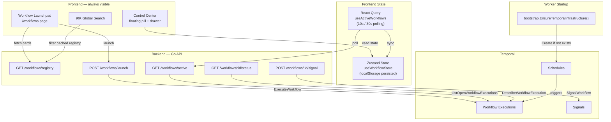

# Workflow Launchpad & Infrastructure Architecture

> **Audience**: Developers (human and agentic) working on domain-os Temporal workflows and frontend.
> **Scope**: Covers the Workflow Launchpad UI, the self-healing bootstrap system, the sidecar documentation convention, and how all the pieces connect.

---

## 1. Architecture Overview

The Workflow Launchpad is a unified system for launching, monitoring, and interacting with all Temporal workflows through a single UI surface. It replaces ad-hoc per-workflow API calls and CLI commands with a consistent, searchable, always-visible experience.



---

## 2. Workflow Registry

**File**: `internal/application/workflows/workflow_registry.go`

The workflow registry is the **single source of truth** for all workflow metadata. It drives:

- The Launchpad card grid (name, description, tags, category)
- The ⌘K global search (filterable by name, description, tags, category, key)
- The stepper progress UI (ordered step list per workflow)
- The launch form (which params each workflow needs)
- The Control Center (signal names for HITL workflows)

### Adding a new workflow to the registry

```go
{
    Key:         "my-new-workflow",
    Name:        "My New Workflow",
    Description: "One-liner description for the card",
    Queue:       temporal.QueueData,
    Category:    "operations",
    Tags:        []string{"operations", "my-domain"},
    HasSignal:   false,
    Scheduled:   false,
    Steps: []WorkflowStep{
        {Key: "step-1", Label: "First Step"},
        {Key: "step-2", Label: "Second Step"},
    },
},
```

> **Rule**: Every workflow must be registered here. If it's not in the registry, users can't find or launch it. See `.agents/AGENTS.md` for the full "Definition of Done" checklist.

---

## 3. Self-Healing Bootstrap

**File**: `internal/infrastructure/bootstrap/ensure.go`

### Problem

Previously, Temporal schedules were created via manual CLI commands (`lifecycle schedule create expiry`, etc.). This had several issues:

- Easy to forget during deployment
- Not idempotent (old code used `uuid.NewString()` for schedule IDs, creating duplicates)
- Required human intervention for every new environment

### Solution

A `bootstrap.EnsureTemporalInfrastructure(client)` function runs **at worker startup**, before any workers begin polling. It:

1. Iterates over a declarative list of desired schedules
2. Calls `ScheduleClient().Create()` for each
3. If the schedule already exists (`serviceerror.AlreadyExists`), silently skips it
4. If creation succeeds, logs the new schedule

**Key design decisions:**

| Decision | Rationale |
|----------|-----------|
| **Deterministic IDs** (`dominos-expiry-loop`) | Makes `Create` idempotent. Old code used `uuid.NewString()` which created duplicates on every call. |
| **Separate `bootstrap` package** | Avoids import cycle: `workflows → temporal` and `temporal → workflows` would conflict. |
| **30s context timeout** | Prevents startup hang if Temporal is unreachable. Worker still starts even if schedule creation fails (logged as WARNING). |
| **No init container** | Schedules are checked on every deploy. Self-heals if someone accidentally deletes a schedule. No extra Docker image or K8s ordering needed. |

### Adding a new schedule

Edit `desiredSchedules()` in `internal/infrastructure/bootstrap/ensure.go`:

```go
{
    ID:       "dominos-my-new-schedule",
    Workflow: workflows.MyNewWorkflow,
    Queue:    temporal.QueueData,
    Interval: 6 * time.Hour,
    Offset:   0,
    Args:     nil, // or []interface{}{arg1, arg2}
},
```

The next worker restart will create it. No CLI commands, no manual steps.

### Startup log output

```
[infra] Schedule "dominos-expiry-loop" already exists — skipping
[infra] Schedule "dominos-purge-loop" already exists — skipping
[infra] Schedule "dominos-restore-workflow" already exists — skipping
[infra] Schedule "dominos-sync-registrars" already exists — skipping
[infra] Schedule "dominos-update-fx" already exists — skipping
[infra] Schedule reconciliation complete: 5/5 schedules ensured
```

On first deploy to a fresh environment:

```
[infra] Schedule "dominos-expiry-loop" created (every 1h0m0s, offset 0s, queue object-lifecycle)
[infra] Schedule "dominos-purge-loop" created (every 1h0m0s, offset 30m0s, queue object-lifecycle)
...
[infra] Schedule reconciliation complete: 5/5 schedules ensured
```

---

## 4. Workflow Launchpad UI

**Page**: `frontend/app/workflows/page.tsx` — route: `/workflows`

### Features

| Feature | Component | Description |
|---------|-----------|-------------|
| **Card Grid** | `WorkflowCard` | One card per workflow type, showing name, description, tag pills, queue badge, and a launch button |
| **Tag Filtering** | `WorkflowTagFilter` | Pill-style toggles above the grid. Additive OR filtering. Count per tag. |
| **Launch Form** | `WorkflowLaunchForm` | Dialog with dynamic form per workflow type (e.g., TLD input for cleanup, batch size for sync) |
| **Control Center** | `WorkflowControlCenter` | Floating pill (bottom-right) + Sheet drawer. Always visible across all pages. Shows running/completed/failed status. |
| **Progress Stepper** | `WorkflowStepper` | Vertical step visualization inside the Control Center drawer |
| **HITL Review** | `WorkflowArtifactViewer` | Artifact links + Approve/Reject buttons for signal-gated workflows |
| **Temporal Link** | `WorkflowTemporalLink` | Parametrized deep-link to Temporal UI (`{TEMPORAL_UI_URL}/namespaces/{ns}/workflows/{id}/{runId}`) |
| **⌘K Search** | `GlobalSearch` | Workflows searchable by name, description, tags. Navigates to `/workflows?highlight=key` |

### State Management

```
┌─────────────────────────┐
│ Zustand Store            │  ← localStorage persisted
│ (useWorkflowStore)       │
│                          │
│ runs: WorkflowRun[]      │  ← Tracks all launched workflows
│ drawerOpen: boolean      │  ← Control Center open/closed
│ selectedRunId: string    │  ← Which run is expanded
└───────────┬─────────────┘
            │ sync
┌───────────▼─────────────┐
│ React Query              │
│ (useActiveWorkflows)     │
│                          │
│ Polls GET /workflows/    │  ← 10s when running, 30s idle
│        active            │
│                          │
│ Updates store on each    │
│ poll cycle               │
└─────────────────────────┘
```

### Component Tree

```
DashboardLayout
├── Header (with ⌘K GlobalSearch)
├── Sidebar (includes "Workflows" link)
├── <main> (page content)
│   └── /workflows page
│       ├── WorkflowTagFilter
│       └── WorkflowCard[] grid
│           └── WorkflowLaunchForm (Dialog, on card click)
└── WorkflowControlCenter (floating, always mounted)
    └── Sheet drawer
        ├── WorkflowRun list
        │   ├── WorkflowStepper (expandable per run)
        │   ├── WorkflowTemporalLink
        │   └── WorkflowArtifactViewer (for HITL)
        └── Footer (Clear Completed, Open Launchpad)
```

---

## 5. Sidecar Documentation

Every workflow has a `.doc.md` file living next to its `.go` file:

```
internal/application/workflows/
├── escrowImport.go
├── escrowImport.doc.md          ← sidecar doc
├── tldCleanupWorkflow.go
├── tldCleanupWorkflow.doc.md    ← sidecar doc
├── expiryLoop.go
├── expiryLoop.doc.md            ← sidecar doc
├── ...
└── WORKFLOW_DOC_TEMPLATE.md     ← template for new workflows
```

### What each doc contains

1. **Metadata table** — status, queue, category, tags, trigger type, HITL, launchpad card
2. **Mermaid flow diagram** — visual representation of the workflow step sequence
3. **Input/output contracts** — Go struct definitions + JSON examples
4. **Step breakdown** — activity names, timeout values, retry policies
5. **Signals** — signal names, payload types, timeout behavior
6. **Failure modes** — what can go wrong + recovery steps
7. **Operational notes** — scheduling, monitoring, manual intervention

### Definition of Done (from `.agents/AGENTS.md`)

| Operation | Required Actions |
|-----------|-----------------|
| **Creating** a workflow | 1. Write the `.go` file. 2. Create matching `.doc.md` from template. 3. Add to workflow registry. |
| **Modifying** a workflow | 1. Update the `.go` file. 2. Update the `.doc.md`. 3. Update registry if steps/tags/signals changed. |
| **Retiring** a workflow | 1. Set `Status: RETIRED` in `.doc.md`. 2. Remove from registry. 3. Remove schedule from bootstrap (if applicable). |

---

## 6. API Reference

All endpoints are under `/workflows` and have full Swagger annotations.

| Method | Path | Description | Used By |
|--------|------|-------------|---------|
| `GET` | `/workflows/registry` | All workflow type metadata | Launchpad cards, ⌘K search |
| `POST` | `/workflows/launch` | Start a workflow by type + params | Launch form |
| `GET` | `/workflows/active` | List running workflows | Control Center polling |
| `GET` | `/workflows/:id/status` | Describe a single execution | Stepper detail view |
| `POST` | `/workflows/:id/signal` | Send signal to running workflow | HITL approve/reject |

### Launch Request

```json
{
  "workflowType": "tld-cleanup",
  "params": {
    "tld": "COM",
    "keepTLDAndPhases": false
  }
}
```

### Launch Response (202)

```json
{
  "workflowId": "tld-cleanup-COM-20260623-211500",
  "runId": "abc123-def456",
  "status": "RUNNING",
  "url": "http://localhost:8081/namespaces/default/workflows/tld-cleanup-COM-20260623-211500/abc123-def456",
  "steps": [
    {"key": "check-eligibility", "label": "Check Eligibility"},
    {"key": "plan-cleanup", "label": "Plan Cleanup"},
    {"key": "await-confirmation", "label": "Await Confirmation"},
    {"key": "backup-assets", "label": "Backup Assets"},
    {"key": "delete-assets", "label": "Delete Assets"}
  ]
}
```

---

## 7. File Index

### Backend

| File | Purpose |
|------|---------|
| `internal/application/workflows/workflow_registry.go` | Workflow metadata registry |
| `internal/interface/rest/workflow_controller.go` | REST API endpoints |
| `internal/infrastructure/bootstrap/ensure.go` | Self-healing schedule creation |
| `internal/application/workflows/WORKFLOW_DOC_TEMPLATE.md` | Sidecar doc template |
| `internal/application/workflows/*.doc.md` | Per-workflow sidecar documentation |

### Frontend

| File | Purpose |
|------|---------|
| `frontend/app/workflows/page.tsx` | Launchpad page |
| `frontend/lib/stores/useWorkflowStore.ts` | Zustand global state |
| `frontend/lib/api/workflows.ts` | API client functions |
| `frontend/lib/hooks/useActiveWorkflows.ts` | Polling hook |
| `frontend/components/workflows/WorkflowCard.tsx` | Card component |
| `frontend/components/workflows/WorkflowTagFilter.tsx` | Tag filter bar |
| `frontend/components/workflows/WorkflowLaunchForm.tsx` | Dynamic launch form |
| `frontend/components/workflows/WorkflowStepper.tsx` | Step progress |
| `frontend/components/workflows/WorkflowControlCenter.tsx` | Floating pill + drawer |
| `frontend/components/workflows/WorkflowArtifactViewer.tsx` | HITL artifact review |
| `frontend/components/workflows/WorkflowTemporalLink.tsx` | Temporal UI deep-link |
| `frontend/lib/api/search.ts` | Search with workflow filtering |
| `frontend/components/search/GlobalSearch.tsx` | ⌘K with workflows |

### Configuration

| File | Purpose |
|------|---------|
| `.agents/AGENTS.md` | Agent rules (workflow documentation "Definition of Done") |
| `cmd/workers/unified/main.go` | Worker entrypoint (calls bootstrap) |
