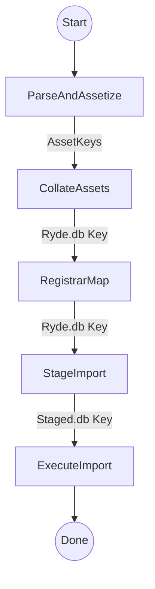

# Walkthrough - Refactored Escrow Import Pipeline

I have refactored the sequential `EscrowImportWorkflow` into a modular, observable 5-stage pipeline as requested.

## Architecture

The workflow now consists of 5 distinct stages, each passing state via S3 Assets.

## Implementation Details

### 1. ParseAndAssetize (Activity)
*   **Input**: XML Object Key
*   **Output**: List of CSV Asset Keys
*   **Action**: Streams XML, generates CSVs for each entity type, uploads to S3. Replaces `StreamingAnalysis`.

### 2. CollateAssets (Activity)
*   **Input**: Asset Keys
*   **Output**: `ryde.db` Key
*   **Action**: Ingests CSV assets into a monolithic SQLite database (`ryde.db`).

### 3. RegistrarMap (Activity)
*   **Input**: `ryde.db` Key, Overrides
*   **Output**: `ryde.db` Key (Updated)
*   **Action**: 
    1. Downloads `ryde.db`.
    2. Queries `registrars` table.
    3. Resolves mappings via API or Overrides.
    4. Persists mappings to `registrar_mapping` table in `ryde.db`.
    5. Uploads updated DB.

### 4. StageImport (Activity)
*   **Input**: `ryde.db` Key
*   **Output**: `staged.db` Key
*   **Action**:
    1. Creates a new `staged.db` by copying `ryde.db`.
    2. Performs SQL `UPDATE` operations to swap internal IDs (ClID, CrRr, UpRr) with mapped Registrar IDs using `registrar_mapping`.
    3. Uploads `staged.db`.

### 5. ExecuteImport (Activity)
*   **Input**: `staged.db` Key
*   **Output**: Import Counts
*   **Action**:
    1. Downloads `staged.db`.
    2. Instantiates `DirectDBImporter`.
    3. Streams data from `staged.db` into Postgres using `DirectDBImporter` (Contacts, Hosts, Domains).
    4. Uses "Identity Mapping" since IDs are already swapped in `staged.db`.

## Verification
*   **Build**: `go build` passed for workflows and activities.
*   **Linting**: Fixed unused variables and import issues.

The code is ready for deployment and execution.

## UI Alignment

The frontend has been updated to reflect the new 5-stage pipeline:

1.  **Pipeline Stages**: The "Runs" table now displays a "Stage 1/5" to "Stage 5/5" badge, inferred from the existence of artifacts.
2.  **New Artifact Links**:
    *   **Staged DB**: Link to the intermediate `staged.db` (Stage 4).
    *   **Events**: Link to `import-events.json` (Stage 5 result).
3.  **Backend Support**: `ExecuteImport` now uploads the run report, and `ListImports` exposes the new artifacts.

### Verification
- **Backend Build**: Passed `go build -v ./internal/...`
- **Frontend Check**: Passed `npx tsc --noEmit` on modified files.
- **Manual Check**: User can refresh the Escrow page to see the new columns and links.
