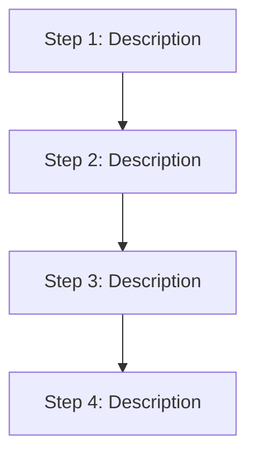

# Workflow Documentation Template

> Copy this file to `<workflowName>.doc.md` when creating a new workflow.
> Fill in all sections. Remove this header block.

---

| Field | Value |
|-------|-------|
| **Status** | `ACTIVE` / `RETIRED` |
| **Queue** | e.g., `data-pipeline` or `object-lifecycle` |
| **Category** | e.g., `data-pipeline` / `lifecycle` / `operations` |
| **Tags** | e.g., `data`, `escrow`, `import` |
| **Trigger** | `API` / `Schedule` / `Child Workflow` / `CLI` |
| **Human-in-the-Loop** | `Yes` — signal: `SignalName` / `No` |
| **Launchpad Card** | `Yes` / `Read-only (scheduled)` |

## Overview

_One paragraph describing what this workflow does and why it exists._

## Flow Diagram



## Input

```go
type WorkflowParams struct {
    // Field descriptions here
}
```

**Example JSON:**
```json
{
  "field": "value"
}
```

## Output

```go
type WorkflowResult struct {
    // Field descriptions here
}
```

## Steps

### 1. Step Name
- **Activity**: `ActivityFunctionName`
- **Timeout**: Start-to-close X, Heartbeat Y
- **Retry**: Max N attempts, backoff coefficient Z
- **Description**: What this step does.

### 2. Step Name
_Repeat for each step._

## Signals (if applicable)

| Signal Name | Payload Type | Description |
|-------------|-------------|-------------|
| `SignalName` | `bool` | Sent by the user to approve/reject the operation |

**Timeout behavior**: If no signal is received within X hours, the workflow [auto-rejects / escalates / times out].

## Failure Modes

| Failure | Cause | Workflow Behavior | Manual Recovery |
|---------|-------|-------------------|-----------------|
| Activity timeout | Slow external service | Retries up to N times | Check service health, retry workflow |

## Artifacts

_List any artifacts produced by this workflow (S3 objects, reports, DB records)._

| Artifact | Storage | Purpose |
|----------|---------|---------|
| `summary.json` | S3: `escrow/{tld}/{date}/{wfId}/` | Run summary for UI display |

## Operational Notes

### Scheduling
_If scheduled: cron expression, interval, offset._

### Monitoring
_Key metrics, dashboards, alerts._

### Manual Intervention
_When and how to manually run, reset, or cancel this workflow._

---

> **Last updated**: YYYY-MM-DD
> **Updated by**: [author]
