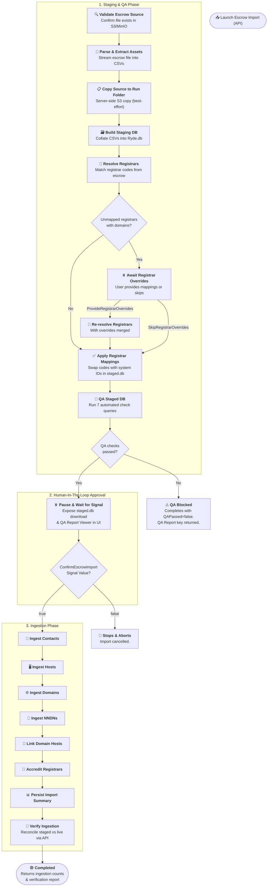

# Escrow Import Workflow

| Field | Value |
|-------|-------|
| **Status** | `ACTIVE` |
| **Queue** | `data-pipeline` |
| **Category** | `data-pipeline` |
| **Tags** | `data`, `escrow`, `import` |
| **Trigger** | `API` |
| **Human-in-the-Loop** | `Yes` — signals: `ProvideRegistrarOverrides`, `SkipRegistrarOverrides`, `ConfirmEscrowImport` |
| **Launchpad Card** | `Yes` |

## Overview

The **Escrow Import** workflow is a unified data pipeline that prepares and validates a TLD's registry escrow deposit data, pauses for human operator validation, and then ingests the verified records into the production environment. By combining staging and ingestion into a single, cohesive workflow, it prevents staging-only data orphans, ensures automated quality gates cannot be bypassed, and simplifies operational control.

## Flow Diagram



## Input

```go
type EscrowImportParams struct {
	TLD       string                 `json:"tld"`
	ObjectKey string                 `json:"objectKey"`
	Options   map[string]interface{} `json:"options"`
}
```

**Example JSON:**
```json
{
  "tld": "best",
  "objectKey": "uploads/best/1750896751/best-escrow-2026-06-25.xml",
  "options": {
    "registrarOverrides": {
      "raw_registrar_code_1": "system-resolved-id-99"
    }
  }
}
```

## Output

```go
type EscrowImportResult struct {
	TLD            string           `json:"tld"`
	ObjectKey      string           `json:"objectKey"`
	RunPrefix      string           `json:"runPrefix"`
	StagedDBKey    string           `json:"stagedDbKey"`
	QAPassed       bool             `json:"qaPassed"`
	QAReportKey    string           `json:"qaReportKey"`
	Confirmed      bool             `json:"confirmed"`
	IngestedCounts map[string]int64 `json:"ingestedCounts,omitempty"`
}
```

## Steps

### 1. Validate Escrow Source
- **Activity**: `ValidateEscrowSource`
- **Timeout**: Start-to-close 2h
- **Retry**: Max 5 attempts, backoff coefficient 2.0
- **Description**: Verifies that the input S3 object key exists in the configured bucket and that the target TLD matches system expectations.

### 2. Parse & Extract Assets
- **Activity**: `ParseAndExtractAssets`
- **Timeout**: Start-to-close 2h
- **Retry**: Max 5 attempts, backoff coefficient 2.0
- **Description**: Streams the XML/CSV escrow file and splits it into individual CSV entity tables (`domains.csv`, `contacts.csv`, etc.) uploaded under the run folder (`<workflowID>/`).

### 2b. Copy Source to Run Folder
- **Activity**: `CopySourceToRunFolder`
- **Timeout**: Start-to-close 5m
- **Retry**: Max 3 attempts, backoff coefficient 2.0
- **Best-effort**: Failure does **not** fail the workflow (result is discarded).
- **Description**: Copies the original uploaded source file from the ephemeral `uploads/` prefix into the run folder using a server-side S3 copy (no download/upload roundtrip). This keeps the source file collocated with all derived artifacts for auditability. Runs immediately after ParseAndExtractAssets.

### 3. Build Staging Database
- **Activity**: `BuildStagingDatabase`
- **Timeout**: Start-to-close 2h
- **Retry**: Max 5 attempts, backoff coefficient 2.0
- **Description**: Combines all the individual CSV assets into a single SQLite file named `ryde.db` under the run prefix.

### 4. Resolve Registrars
- **Activity**: `ResolveRegistrars`
- **Timeout**: Start-to-close 2h
- **Retry**: Max 5 attempts, backoff coefficient 2.0
- **Description**: Inspects registrar codes in `ryde.db` and attempts to match them with system registrars using a 3-tier strategy: (1) manual overrides, (2) auto-map by GurID, (3) auto-map by name. Manual mappings can be provided via `registrarOverrides` in workflow params or via the `ProvideRegistrarOverrides` signal.

### 4b. Await Registrar Overrides (Conditional HITL)
- **Signal**: `ProvideRegistrarOverrides` (payload: `map[string]string`) or `SkipRegistrarOverrides` (payload: `bool`)
- **Phase**: `pending_registrar_overrides`
- **Condition**: Only activates when unmapped registrars with `domainCount > 0` exist. Auto-skipped when all unmapped registrars are empty (no domains, only contacts/hosts).
- **Description**: Pauses workflow execution and exposes the list of unmapped registrars in the workflow state. The UI shows an interactive override form where operators can either map each unmapped registrar to an existing system registrar (via search), create a new registrar on the fly, or skip. On `ProvideRegistrarOverrides`, the signal payload is merged with any initial overrides and `ResolveRegistrars` is re-run without re-parsing the escrow data. On `SkipRegistrarOverrides`, the workflow continues with the current (potentially incomplete) mappings.

### 5. Apply Registrar Mappings
- **Activity**: `ApplyRegistrarMappings`
- **Timeout**: Start-to-close 2h
- **Retry**: Max 5 attempts, backoff coefficient 2.0
- **Description**: Produces the `staged.db` SQLite file by replacing all raw registrar codes with system IDs in all records.

### 6. QA Staged Database
- **Activity**: `QAStagedDatabase`
- **Timeout**: Start-to-close 2h
- **Retry**: Max 5 attempts, backoff coefficient 2.0
- **Description**: Runs 7 automated database check queries. Creates the `qa-report.json` report. If any check with `error` severity fails, ingestion is blocked and the workflow completes with `QAPassed=false` (phase `qa_failed`). This is an application-level outcome, not a workflow error — the result contains the QA Report key and Staged DB key so operators can inspect and fix the data.

### 7. Await Confirmation (HITL)
- **Signal**: `ConfirmEscrowImport`
- **Description**: Pauses workflow execution. During this pause, the UI displays the interactive QA Report and provides S3 download links for the staged database. If approved (`true`), ingestion starts. If rejected (`false`), the workflow aborts.

### 8. Ingest Contacts
- **Activity**: `IngestContacts`
- **Timeout**: Start-to-close 10h, Heartbeat 10m
- **Retry**: Max 3 attempts, backoff coefficient 2.0
- **Description**: Upserts contact records from `staged.db` to the live database, preserving original creation times and identifiers.

### 9. Ingest Hosts
- **Activity**: `IngestHosts`
- **Timeout**: Start-to-close 10h, Heartbeat 10m
- **Retry**: Max 3 attempts, backoff coefficient 2.0
- **Description**: Upserts host nameserver records from `staged.db` to the live registry.

### 10. Ingest Domains
- **Activity**: `IngestDomains`
- **Timeout**: Start-to-close 10h, Heartbeat 10m
- **Retry**: Max 3 attempts, backoff coefficient 2.0
- **Description**: Upserts domain registration records.

### 11. Ingest NNDNs
- **Activity**: `IngestNNDNs`
- **Timeout**: Start-to-close 10h, Heartbeat 10m
- **Retry**: Max 3 attempts, backoff coefficient 2.0
- **Description**: Ingests Non-Existent Domain Name reservations.

### 12. Link Domain Hosts
- **Activity**: `LinkDomainHosts`
- **Timeout**: Start-to-close 10h, Heartbeat 10m
- **Retry**: Max 3 attempts, backoff coefficient 2.0
- **Description**: Resolves domain-nameserver associations.

### 13. Accredit Registrars
- **Activity**: `AccreditRegistrars`
- **Timeout**: Start-to-close 10h, Heartbeat 10m
- **Retry**: Max 3 attempts, backoff coefficient 2.0
- **Description**: Grants accreditations to registrars mapping to the imported TLD.

### 14. Persist Import Summary
- **Activity**: `PersistImportSummary`
- **Timeout**: Start-to-close 5m
- **Description**: Serializes ingestion counts and metadata to a JSON summary in S3. Non-critical — failures are logged as warnings.

### 15. Verify Ingestion
- **Activity**: `VerifyIngestion`
- **Timeout**: Start-to-close 5m
- **Description**: Post-ingestion verification. Downloads the staged DB and compares it against the live system via admin API. Runs domain count reconciliation and a 20-domain random sample spot-check. Results are uploaded as `verification-report.json`. Verification failures are informational — they do not fail the workflow.

## Signals

| Signal Name | Payload Type | Description |
|-------------|-------------|-------------|
| `ConfirmEscrowImport` | `bool` | Sent by the user to approve (`true`) or cancel (`false`) the import execution |

## Failure Modes

| Failure | Cause | Workflow Behavior | Manual Recovery |
|---------|-------|-------------------|-----------------|
| QA Check Blocked | Staged data contains missing/null CLIDs, contacts, or hosts | Workflow **completes** with `QAPassed=false` (phase `qa_failed`). Ingestion is not started. Result contains QA Report and Staged DB keys. | Review the interactive QA Report, fix mappings or source file, re-run import. |
| Ingestion Activity Timeout | Large TLD database size | Retries activity up to 3 times. | If retries exhaust, check DB load and restart workflow using the same staged DB if possible, or run a new import. |

## Artifacts

All artifacts are saved under a flat run folder at the bucket root: `<workflowID>/` (e.g. `escrow-import-best-20260625-001231/`). The workflow ID already encodes the TLD and date, so no additional nesting is needed.

Uploaded source files land in an ephemeral prefix `uploads/<tld>/<timestamp>/<filename>` and are copied into the run folder after parsing.

| Artifact | S3 Key Example | Purpose |
|----------|---------------|---------|
| Source file (copy) | `<workflowID>/best-escrow-2026-06-25.xml` | Original escrow deposit, copied into run folder for auditability |
| `*-domains.csv` (and others) | `<workflowID>/best-domains.csv` | Extracted asset files |
| `ryde.db` | `<workflowID>/ryde.db` | SQLite database of raw imported records |
| `staged.db` | `<workflowID>/staged.db` | Final staged SQLite database with resolved registrar mappings |
| `qa-report.json` | `<workflowID>/qa-report.json` | Automated QA check results |

## Operational Notes

### Bucket Layout
Each workflow run produces a single top-level folder named after the workflow ID:
```
escrow-import-best-20260625-001231/
  best-escrow-2026-06-25.xml     ← source copy
  best-domains.csv
  best-contacts.csv
  ryde.db
  staged.db
  qa-report.json
  verification-report.json
  import-summary.json
```

### ListImports Backward Compatibility
The `ListImports` endpoint scans bucket root prefixes to discover runs. It supports both the current flat layout (e.g. `escrow-import-best-20260625-001231/`) and legacy nested keys (`escrow/<tld>/<date>/<workflowID>/`) from older runs.

### Monitoring
Monitor progress via the **Launchpad UI**. While paused, the operator should inspect the interactive QA Report inline and download the `staged.db` artifact for manual SQL queries if needed.

### Manual Intervention
If an import needs to be cancelled while paused, click "Reject" in the Launchpad drawer to abort the workflow safely.

---

> **Last updated**: 2026-06-25
> **Updated by**: Antigravity
