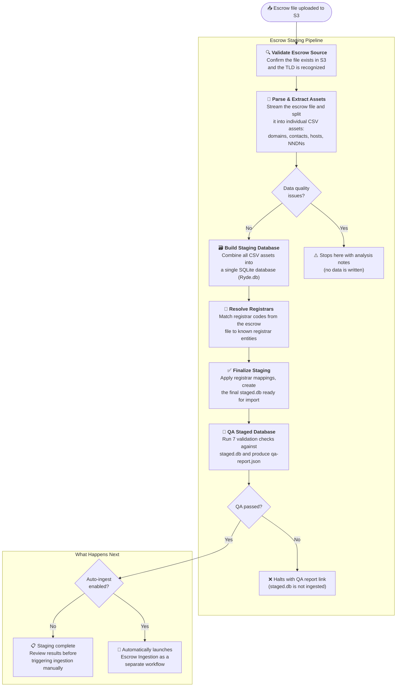
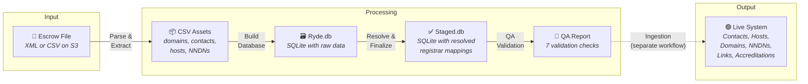
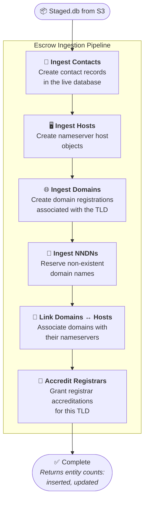

# Escrow Import Workflows

> This document covers the two-phase escrow data pipeline: **Staging** prepares the data, **Ingestion** loads it into the live system.

---

## Escrow Staging

### What It Does

Takes a raw escrow deposit file uploaded to S3 — typically a large XML or CSV from a registry operator — and transforms it into a clean, validated database ready for import. Think of it as a data preparation pipeline that catches problems before they reach production.

### When To Use It

- **Onboarding a new TLD** — importing the initial domain portfolio from a registry transfer
- **Periodic escrow reconciliation** — validating an escrow file against the live system
- **Data recovery** — restaging from a known-good escrow deposit

### How It Works



### Step-by-Step Breakdown

#### Step 0 — Validate Escrow Source

**Purpose:** Make sure we have something to work with before committing resources.

Checks that the S3 object key points to a real file and that the TLD is recognized in the system. Fails fast with a clear error if the file is missing or the TLD is unknown — no wasted processing.

| Detail | Value |
|--------|-------|
| Timeout | 2 hours (4h hard limit) |
| Retries | Up to 5 with exponential backoff |
| Can fail? | Yes — if the file doesn't exist or TLD is invalid |

---

#### Step 1 — Parse & Extract Assets

**Purpose:** Break the monolithic escrow file into manageable, typed pieces.

Streams the escrow XML or CSV (which can be gigabytes for large TLDs) and extracts individual entity files — one CSV each for domains, contacts, hosts, and NNDNs. These are uploaded to S3 under a unique run prefix so every import has its own isolated workspace.

If the parser finds structural problems (malformed records, missing required fields), the workflow **stops here** and returns detailed analysis notes. No partial data is written — it's an all-or-nothing quality gate.

| Detail | Value |
|--------|-------|
| Output | Individual CSV files on S3: `{tld}-domains.csv`, `{tld}-contacts.csv`, etc. |
| Quality gate | Returns early with issues list if problems are found |
| Processing | Single-pass streaming — efficient even for very large files |

---

#### Step 2 — Build Staging Database

**Purpose:** Create a queryable, self-contained database from the extracted assets.

Reads all the CSV asset files and combines them into a single SQLite database called **Ryde.db**. This is the intermediate format that makes the subsequent steps (registrar mapping, staging) fast and reliable — everything is in one place, queryable with SQL.

| Detail | Value |
|--------|-------|
| Input | CSV asset files from Step 1 |
| Output | `ryde.db` — a SQLite database uploaded to S3 |
| Idempotent | Yes — can be re-run safely |

---

#### Step 3 — Resolve Registrars

**Purpose:** Translate registrar codes from the escrow file into registrar entities known to our system.

Escrow files use registrar identifiers (CLIDs) that may not directly match our internal registrar records. This step looks up each registrar code and maps it to the correct entity. When automatic matching fails, you can provide **manual overrides** at launch time.

| Detail | Value |
|--------|-------|
| Input | `ryde.db` from Step 2 + optional override map |
| Output | Updated `ryde.db` with `registrar_mapping` table |
| Overrides | Pass `registrarOverrides` in the launch options to force specific mappings |

---

#### Step 4 — Finalize Staging

**Purpose:** Produce the final import-ready database.

Creates `staged.db` by copying `ryde.db` and applying all registrar mappings — swapping raw registrar codes with resolved system IDs throughout the domains, contacts, and hosts tables. The result is a database where every entity is ready to be inserted directly into the live system.

| Detail | Value |
|--------|-------|
| Input | `ryde.db` with registrar mappings |
| Output | `staged.db` — the final artifact, ready for ingestion |
| What it produces | The `StagedDBKey` needed to launch Escrow Ingestion |

---

#### Step 5 — QA Staged Database

**Purpose:** Validate the staged database before allowing ingestion.

Runs 7 automated checks against `staged.db` to catch data-quality problems that would cause issues during ingestion or in the live system. All checks are pure SQL queries against the local SQLite file — no network dependencies.

**Checks performed:**

| # | Check | Severity | Description |
|---|-------|----------|-------------|
| 1 | Unmapped CLIDs | `error` | Detects domains/contacts still referencing raw registrar codes instead of resolved system IDs |
| 2 | Null CLIDs | `error` | Finds entities with missing registrar assignments |
| 3 | Registrar mapping completeness | `error` | Verifies every CLID in the source data has a corresponding entry in the registrar mapping table |
| 4 | Entity count consistency | `warning` | Compares entity counts between `ryde.db` and `staged.db` to detect dropped records |
| 5 | Referential contacts | `error` | Ensures all contact references on domains point to contacts that exist in the staged data |
| 6 | Referential hosts | `error` | Ensures all host references on domains point to hosts that exist in the staged data |
| 7 | Expiry date sanity | `warning` | Flags domains with expiry dates in the past or unreasonably far in the future |

Produces a `qa-report.json` artifact that is uploaded to S3 alongside the other run artifacts. The report contains the result of each check, including counts and sample offending records.

**If any `error`-severity check fails**, the workflow halts and returns the S3 URL of the QA report. The staged database is not deleted — you can inspect the data, fix the source, and re-run staging.

| Detail | Value |
|--------|-------|
| Input | `staged.db` from Step 4 |
| Output | `qa-report.json` uploaded to S3 |
| Blocks ingestion? | Yes — if any `error`-severity check fails |
| Network dependencies | None — pure SQL against local SQLite |

---

#### Step 6 (Optional) — Trigger Ingestion

If `autoIngest` is enabled and QA passes, the workflow automatically launches the **Escrow Ingestion** workflow as an independent child process. It captures the child's Run ID for tracking, then completes — the ingestion runs on its own and continues even if the staging workflow is closed.

### Data Journey



### What Can Go Wrong

| Situation | What Happens | What To Do |
|-----------|-------------|------------|
| **File not found** | Workflow fails immediately | Check the S3 key is correct, re-upload if needed, retry |
| **Malformed escrow data** | Stops after Step 1 with analysis notes | Review the notes, fix the source file, retry |
| **Activity timeout** | Retries automatically (up to 5 times) | For very large TLDs (5M+ domains), expect longer runs. Check S3 health if retries are exhausting. |
| **Registrar not resolved** | Mapping step may flag unknowns | Re-run with `registrarOverrides` to manually map unresolved codes |
| **QA check fails (error severity)** | Workflow halts after Step 5 with a link to `qa-report.json` | Download the QA report from S3, review the failing checks, fix the source data or registrar mappings, and re-run staging |
| **QA check warns (warning severity)** | Workflow continues but warnings are recorded in `qa-report.json` | Review warnings before or after ingestion — they flag potential issues that are not blocking |
| **Ingestion trigger fails** | Staging is still complete | Launch ingestion manually using the `StagedDBKey` from the result |

### Launch Parameters

| Parameter | Type | Required | Description |
|-----------|------|----------|-------------|
| `tld` | String | ✅ | The TLD to import data for (e.g., `"com"`, `"example"`) |
| `objectKey` | String | ✅ | S3 path to the escrow file (e.g., `"uploads/example-escrow-2025-06-20.xml"`) |
| `autoIngest` | Boolean | No | Automatically start ingestion after staging completes (default: `false`) |
| `registrarOverrides` | Map | No | Manual registrar code → system ID mappings for unresolved entries |

### S3 Artifacts

Each run creates an isolated workspace under a predictable path:

```
escrow/
└── {tld}/
    └── {YYYYMMDD}/
        └── {workflowId}/
            ├── *-domains.csv      ← extracted domain records
            ├── *-contacts.csv     ← extracted contact records
            ├── *-hosts.csv        ← extracted host records
            ├── *-nndns.csv        ← extracted NNDN reservations
            ├── ryde.db            ← collated SQLite database
            ├── staged.db          ← final staged database
            └── qa-report.json     ← QA validation results (7 checks)
```

---

## Escrow Ingestion

### What It Does

Takes a staged database (produced by Escrow Staging) and loads its contents into the live production system. Entities are imported in a specific order that respects their dependencies — contacts first, then hosts, then domains, and so on. Each entity is **upserted** — new records are inserted and existing records are updated with the incoming data.

### When To Use It

- **After successful staging** — either triggered automatically via `autoIngest` or launched manually
- **Re-ingestion** — safe to re-run; existing entities are updated in place. On re-import, `ro_id`, `auth_info`, and `created_at` are preserved.
- **Correcting data** — re-running an import with corrected source data overwrites the previous data

### How It Works



> **Why this order?** Domains reference contacts and hosts. Host-domain links reference both domains and hosts. Accreditations reference registrars resolved during staging. Each step builds on the previous one.

### Step-by-Step Breakdown

#### Step 1 — Ingest Contacts

Reads all contact records from the staged database and upserts them into the live system. New contacts are inserted; existing contacts are updated with the incoming data. On re-import, `ro_id`, `auth_info`, and `created_at` are preserved. Reports total processed, inserted, and updated counts.

#### Step 2 — Ingest Hosts

Imports nameserver host objects (e.g., `ns1.example.com`). Upserts (inserts new, updates existing). Must complete before domain-host linking in Step 5.

#### Step 3 — Ingest Domains

Creates or updates domain registrations, associating each domain with the target TLD. This is typically the longest step for large TLDs. Upserts (inserts new, updates existing) — `ro_id`, `auth_info`, and `created_at` are preserved on re-import.

#### Step 4 — Ingest NNDNs

Imports NNDN (Non-existent Domain Name) reservations — domain names that are blocked from registration. Upserts (inserts new, updates existing).

#### Step 5 — Link Domains ↔ Hosts

Creates the associations between domains and their nameserver hosts. Requires both domains (Step 3) and hosts (Step 2) to be present in the live system.

#### Step 6 — Accredit Registrars

Grants registrar accreditations for this TLD based on the registrars found in the staged data. This ensures the registrars that manage domains in this TLD are properly authorized.

### Timing & Scale

| TLD Size | Expected Duration | Notes |
|----------|------------------|-------|
| Small (< 100K domains) | Minutes | Most steps complete quickly |
| Medium (100K–1M domains) | 30 min – 2 hours | Domain ingestion is the bottleneck |
| Large (1M–5M domains) | 2 – 6 hours | Monitor heartbeats for health |
| Very Large (5M+ domains) | 6 – 15 hours | Well within the 20h timeout |

### What Can Go Wrong

| Situation | What Happens | What To Do |
|-----------|-------------|------------|
| **Activity timeout** | Retries up to 3 times | Check database performance, consider batch tuning |
| **Heartbeat stops** | Temporal cancels and retries the activity | Check worker logs for OOM or deadlocks |
| **Existing data** | Entities are upserted — new records inserted, existing records updated | Safe behavior — check `inserted` and `updated` counts in the result |
| **Step fails mid-pipeline** | Workflow stops; later steps don't run | Fix the issue, re-run. Already-ingested entities will be updated in place. |

### Launch Parameters

| Parameter | Type | Required | Description |
|-----------|------|----------|-------------|
| `tld` | String | ✅ | The TLD the data belongs to |
| `stagedDbKey` | String | ✅ | S3 key of the staged database (from staging result) |

---

> **Last updated**: 2025-06-24
