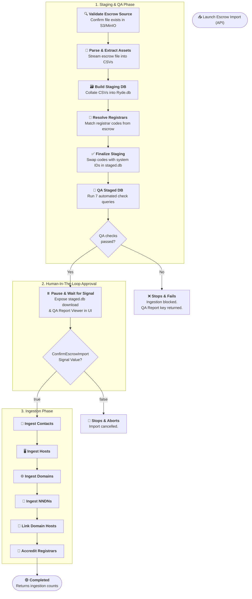

# Escrow Import Workflow

| Field | Value |
|-------|-------|
| **Status** | `ACTIVE` |
| **Queue** | `data-pipeline` |
| **Category** | `data-pipeline` |
| **Tags** | `data`, `escrow`, `import` |
| **Trigger** | `API` |
| **Human-in-the-Loop** | `Yes` — signal: `ConfirmEscrowImport` |
| **Launchpad Card** | `Yes` |

## Overview

The **Escrow Import** workflow is a unified data pipeline that prepares and validates a TLD's registry escrow deposit data, pauses for human operator validation, and then ingests the verified records into the production environment. By combining staging and ingestion into a single, cohesive workflow, it prevents staging-only data orphans, ensures automated quality gates cannot be bypassed, and simplifies operational control.

## Flow Diagram



## Input

```go
type EscrowImportParams struct {
	TLD       string                 `json:"tld"`
	ObjectKey string                 `json:"objectKey"`
	Options   map[string]interface{} `json:"options"`
}
```

**Example JSON:**
```json
{
  "tld": "com",
  "objectKey": "uploads/com-escrow-2025-06-20.xml",
  "options": {
    "registrarOverrides": {
      "raw_registrar_code_1": "system-resolved-id-99"
    }
  }
}
```

## Output

```go
type EscrowImportResult struct {
	TLD            string           `json:"tld"`
	ObjectKey      string           `json:"objectKey"`
	RunPrefix      string           `json:"runPrefix"`
	StagedDBKey    string           `json:"stagedDbKey"`
	QAPassed       bool             `json:"qaPassed"`
	QAReportKey    string           `json:"qaReportKey"`
	Confirmed      bool             `json:"confirmed"`
	IngestedCounts map[string]int64 `json:"ingestedCounts,omitempty"`
}
```

## Steps

### 1. Validate Escrow Source
- **Activity**: `ValidateEscrowSource`
- **Timeout**: Start-to-close 2h
- **Retry**: Max 5 attempts, backoff coefficient 2.0
- **Description**: Verifies that the input S3 object key exists in the configured bucket and that the target TLD matches system expectations.

### 2. Parse & Extract Assets
- **Activity**: `ParseAndExtractAssets`
- **Timeout**: Start-to-close 2h
- **Retry**: Max 5 attempts, backoff coefficient 2.0
- **Description**: Streams the XML/CSV escrow file and splits it into individual CSV entity tables (`domains.csv`, `contacts.csv`, etc.) uploaded under the unique run prefix.

### 3. Build Staging Database
- **Activity**: `BuildStagingDatabase`
- **Timeout**: Start-to-close 2h
- **Retry**: Max 5 attempts, backoff coefficient 2.0
- **Description**: Combines all the individual CSV assets into a single SQLite file named `ryde.db` under the run prefix.

### 4. Resolve Registrars
- **Activity**: `ResolveRegistrars`
- **Timeout**: Start-to-close 2h
- **Retry**: Max 5 attempts, backoff coefficient 2.0
- **Description**: Inspects registrar codes in `ryde.db` and attempts to match them with system registrars. Manual mappings can be provided in `registrarOverrides`.

### 5. Finalize Staging
- **Activity**: `FinalizeStaging`
- **Timeout**: Start-to-close 2h
- **Retry**: Max 5 attempts, backoff coefficient 2.0
- **Description**: Produces the `staged.db` SQLite file by replacing all raw registrar codes with system IDs in all records.

### 6. QA Staged Database
- **Activity**: `QAStagedDatabase`
- **Timeout**: Start-to-close 2h
- **Retry**: Max 5 attempts, backoff coefficient 2.0
- **Description**: Runs 7 automated database check queries. Creates the `qa-report.json` report. If any check with `error` severity fails, ingestion is blocked, and the workflow stops and fails immediately.

### 7. Await Confirmation (HITL)
- **Signal**: `ConfirmEscrowImport`
- **Description**: Pauses workflow execution. During this pause, the UI displays the interactive QA Report and provides S3 download links for the staged database. If approved (`true`), ingestion starts. If rejected (`false`), the workflow aborts.

### 8. Ingest Contacts
- **Activity**: `IngestContacts`
- **Timeout**: Start-to-close 10h, Heartbeat 10m
- **Retry**: Max 3 attempts, backoff coefficient 2.0
- **Description**: Upserts contact records from `staged.db` to the live database, preserving original creation times and identifiers.

### 9. Ingest Hosts
- **Activity**: `IngestHosts`
- **Timeout**: Start-to-close 10h, Heartbeat 10m
- **Retry**: Max 3 attempts, backoff coefficient 2.0
- **Description**: Upserts host nameserver records from `staged.db` to the live registry.

### 10. Ingest Domains
- **Activity**: `IngestDomains`
- **Timeout**: Start-to-close 10h, Heartbeat 10m
- **Retry**: Max 3 attempts, backoff coefficient 2.0
- **Description**: Upserts domain registration records.

### 11. Ingest NNDNs
- **Activity**: `IngestNNDNs`
- **Timeout**: Start-to-close 10h, Heartbeat 10m
- **Retry**: Max 3 attempts, backoff coefficient 2.0
- **Description**: Ingests Non-Existent Domain Name reservations.

### 12. Link Domain Hosts
- **Activity**: `LinkDomainHosts`
- **Timeout**: Start-to-close 10h, Heartbeat 10m
- **Retry**: Max 3 attempts, backoff coefficient 2.0
- **Description**: Resolves domain-nameserver associations.

### 13. Accredit Registrars
- **Activity**: `AccreditRegistrars`
- **Timeout**: Start-to-close 10h, Heartbeat 10m
- **Retry**: Max 3 attempts, backoff coefficient 2.0
- **Description**: Grants accreditations to registrars mapping to the imported TLD.

## Signals

| Signal Name | Payload Type | Description |
|-------------|-------------|-------------|
| `ConfirmEscrowImport` | `bool` | Sent by the user to approve (`true`) or cancel (`false`) the import execution |

## Failure Modes

| Failure | Cause | Workflow Behavior | Manual Recovery |
|---------|-------|-------------------|-----------------|
| QA Check Failed | Staged data contains missing/null CLIDs, contacts, or hosts | Ingestion is blocked. Workflow fails immediately. | Review the QA Report, fix mappings or source file, re-run import. |
| Ingestion Activity Timeout | Large TLD database size | Retries activity up to 3 times. | If retries exhaust, check DB load and restart workflow using the same staged DB if possible, or run a new import. |

## Artifacts

All artifacts are saved under an isolated S3 path: `escrow/{tld}/{date}/{workflowId}/`.

| Artifact | Storage | Purpose |
|----------|---------|---------|
| `*-domains.csv` (and others) | S3 | Extracted asset files |
| `ryde.db` | S3 | SQLite database of raw imported records |
| `staged.db` | S3 | Final staged SQLite database with resolved registrar mappings |
| `qa-report.json` | S3 | Automated QA check results |

## Operational Notes

### Monitoring
Monitor progress via the **Launchpad UI**. While paused, the operator should inspect the interactive QA Report inline and download the `staged.db` artifact for manual SQL queries if needed.

### Manual Intervention
If an import needs to be cancelled while paused, click "Reject" in the Launchpad drawer to abort the workflow safely.

---

> **Last updated**: 2026-06-24
> **Updated by**: Antigravity
