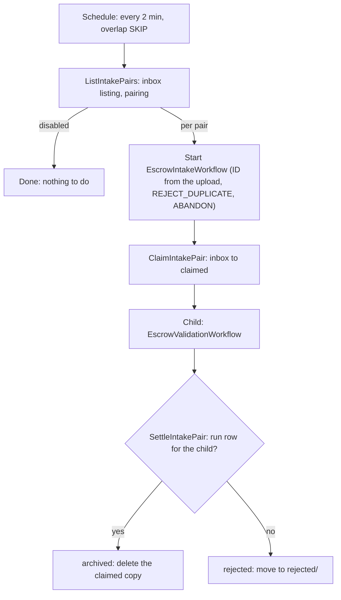

| Field | Value |
|-------|-------|
| **Status** | `ACTIVE` |
| **Queue** | `scheduled` (sweep) · `heavy-batch` (each intake and its validation) |
| **Category** | `data` |
| **Tags** | `data`, `escrow`, `eve`, `sftp` |
| **Trigger** | `Schedule` (`escrow-intake-sweep`); each intake is a `Child Workflow` |
| **Human-in-the-Loop** | `No` |
| **Launchpad Card** | `Read-only (scheduled)` |

## Overview

Registry Operators upload RDE deposits (`<name>.ryde` and `<name>.sig`) over sFTP. The sFTP server is SFTPGo, run by alpaca-infra (`docs/sftp-intake.md` there). It writes the files to the escrow bucket under `sftp/inbox/<RyID>/<tld>/`.

This sweep turns each complete deposit into an escrow validation run, with no one launching it by hand.

A deposit is one of:
- a signed pair, `<base>.ryde` with `<base>.sig`, validated with the `ryde+sig` profile;
- **only when `ESCROW_INTAKE_SFTP_ALLOW_PLAINTEXT` is true**, a lone unsigned `<name>.xml` or `<name>.xml.gz`, validated with the `xml` profile. It needs no partner file.

Plaintext is off by default. An unsigned deposit is registry data in the clear at rest: sFTP encrypts the transfer, but the bucket holds the file under SSE-S3 only, whereas a `.ryde` stays encrypted until the validator opens it. No real Registry Operator should send one, so plaintext intake is meant for test and simulation environments. While it is off, such files stay in the inbox, are counted as `plaintextRefused` in the sweep result, and expire with the bucket's lifecycle rule. The sweep reads the inbox and starts one `EscrowIntakeWorkflow` per pair. That intake then owns its pair to the end:
1. It moves the pair out of the operator's reach.
2. It validates the pair with the unchanged `EscrowValidationWorkflow`.
3. It settles the uploaded copy.

The `<RyID>` path segment is the authenticated intake context that issue #412 requires. The operator never chooses it, and the bucket policy lets only that operator's role write under it. The TLD comes from the directory the file was uploaded into. `BindDeposit` then checks that the TLD belongs to that operator, and the validator checks it against the RDE header. The file name is never used to bind a deposit.

## Flow Diagram



## Bucket areas

The default prefix is `sftp/` (`ESCROW_INTAKE_SFTP_PREFIX`).

| Key | Meaning |
|---|---|
| `sftp/inbox/<RyID>/<tld>/<base>.{ryde,sig}`, or `<name>.{xml,xml.gz}` | Uploaded and not yet picked up. Only the operator writes here. |
| `sftp/claimed/<RyID>/<tld>/<intakeID>/<base>.*` | Owned by exactly one running intake. |
| `sftp/rejected/<RyID>/<tld>/<intakeID>/<base>.*` | Never bound to a deposit. Kept for a human. |
| `escrow-validation/<RyID>/<tld>/<depositID>/deposit.*` | The archive copy `BindDeposit` makes. This is the record. |

The `<intakeID>` level keeps two uploads of the same file name apart while both are in flight. The base name is kept so `BindDeposit` can still read hints from the file name. The bucket's lifecycle rule expires anything left behind.

## Input

```go
type EscrowIntakeSweepParams struct {
    MaxPairs int // intakes started per sweep; default 25
}

type EscrowIntakeParams struct { // one per deposit, built by the sweep
    Scope, TLD, IntakeID      string
    Profile                   string    // "ryde+sig" (default) or "xml"
    ArtifactKey, SignatureKey string    // inbox keys; no signature for "xml"
    ReceivedAt                time.Time // the latest upload of the deposit
}
```

## Output

The sweep returns `EscrowIntakeSweepResult` with these counts and lists:
- `started`, `alreadyStarted` and `failedToStart`
- `deferred`, for pairs over `MaxPairs`
- `unpaired` and `oldestUnpairedWaited`, for half pairs
- `ignored`, for objects that are not intake objects
- `plaintextRefused`, for unsigned `.xml`/`.xml.gz` deposits left in place because plaintext intake is off
- `truncated`, set when the listing hit its 5000-object cap
- the IDs of the intakes it started

Each intake returns `EscrowIntakeResult`:
- `validationWorkflowId`
- `validationOutcome` (PASS or FAIL), or `validationError`
- `validationRunId`
- `disposition`: `archived` or `rejected`

## Steps

### Sweep
1. **ListIntakePairs** (`scheduled`; 2 min start-to-close; 3 attempts).
   - Returns nothing while `ESCROW_INTAKE_SFTP_ENABLED` is false.
   - Otherwise lists the inbox and pairs `.ryde` with `.sig` by `<RyID>/<tld>/<base>`, returning the oldest deposits first.
   - With plaintext allowed, each `.xml` or `.xml.gz` is a deposit on its own. It is independent of a `.ryde` with the same base name.
   - Ignores directory markers, other extensions, other depths, and RyIDs outside `[A-Za-z0-9-]{3,16}`.
   - Half a pair waits for its other half. It is logged as a warning once it has waited more than an hour.
2. **Start intakes.** Each intake's workflow ID is `escrow-intake-<RyID>-<tld>-<intakeID>`.
   - `intakeID` is a hash of both objects' keys, ETags and LastModified.
   - The intake is started with `REJECT_DUPLICATE`, so a pair the previous sweep already started is counted as `alreadyStarted` rather than started twice.
   - A re-upload of the same file name gets a new LastModified, and so a new ID.
   - The sweep waits only for each start, and the intakes outlive it (`ABANDON`).

### Intake (`heavy-batch`)
1. **ClaimIntakePair** (30 min; 5 attempts).
   - Moves both files to `claimed/` (copy, then delete). This is safe to retry from any point.
   - From then on the operator can neither see nor rename them.
2. **EscrowValidationWorkflow** (child; ID `<intakeID workflow>-validation`).
   - `profile` as listed (`ryde+sig`, or `xml` with no signature key), `SubmittedBy=sftp:<RyID>`, `IntakeRef=sftp:<inbox key>`, `ReceivedAt` = the latest upload time.
   - Claiming a plaintext deposit is refused, non-retryably, if `ESCROW_INTAKE_SFTP_ALLOW_PLAINTEXT` was turned off after the sweep listed it; the file stays in the inbox.
   - Its failure does not fail the intake.
3. **SettleIntakePair** (30 min; 20 attempts). It decides by fact, not by outcome:
   - **A run row exists** for the child's workflow ID. `BindDeposit` has archived the deposit, so the claimed copy is deleted. This holds for PASS, FAIL and ERROR alike; an ERROR run can be re-run from the archive.
   - **No run row exists.** Nothing was archived (wrong TLD for the operator, oversized signature, …), so the pair is moved to `rejected/`.

## Failure Modes

| Failure | Cause | Workflow Behavior | Manual Recovery |
|---------|-------|-------------------|-----------------|
| Sweep fails | Bucket unreachable | Retries 3×; the next tick runs again | None needed once storage is back |
| `failedToStart` > 0 | Temporal start error | Recorded in the result; the pair stays in the inbox and the next tick retries | — |
| Intake fails at claim | A file vanished (renamed by the operator) between listing and claim | Non-retryable; the renamed file is a new key, found by the next tick | — |
| Pair in `rejected/` | Validation never bound a deposit | Logged as a warning; the intake succeeds | Read the child validation workflow's error, fix the cause, re-upload |
| Intake fails at settle | Database or bucket unavailable for ~2h | Pair stays in `claimed/` | Re-run settle by resetting the intake, or delete it once the run is confirmed |
| Upload works, nothing validates | `ESCROW_INTAKE_SFTP_ENABLED` is false, or the `.sig` is missing | Sweep result says `enabled: false` or counts `unpaired` | Enable, or ask the operator for the signature |
| An `.xml`/`.xml.gz` upload is not validated | Plaintext intake is off | Sweep result counts `plaintextRefused` | Ask for a signed `.ryde`/`.sig`, or, in a test environment only, set `ESCROW_INTAKE_SFTP_ALLOW_PLAINTEXT=true` |

## Operations

### Configuration

| Variable | Default | Effect |
|---|---|---|
| `ESCROW_INTAKE_SFTP_ENABLED` | `false` | The schedule always exists; this gates the work |
| `ESCROW_INTAKE_SFTP_ALLOW_PLAINTEXT` | `false` | Also accept a lone unsigned `.xml`/`.xml.gz`; test and simulation environments only |
| `ESCROW_INTAKE_SFTP_PREFIX` | `sftp/` | Must match alpaca-infra's path contract; must not overlap `escrow-validation/` or `uploads/` |
| `ESCROW_INTAKE_SWEEP_INTERVAL` | `2m` | Read at worker start; minimum 30s |

### Monitoring
- The sweep result shows `unpaired`, `ignored`, `deferred` and `truncated`.
- Intakes log `correlation_id`, `run_id`, `tld`, `stage` and `outcome`. They never log a file name or an object key.

### Not done (deferred)
- Event-driven triggering (S3 → SQS).
- Missing-deposit (`DRFN`) and orphan-file alerting.
- Making results visible to the operator over sFTP.
