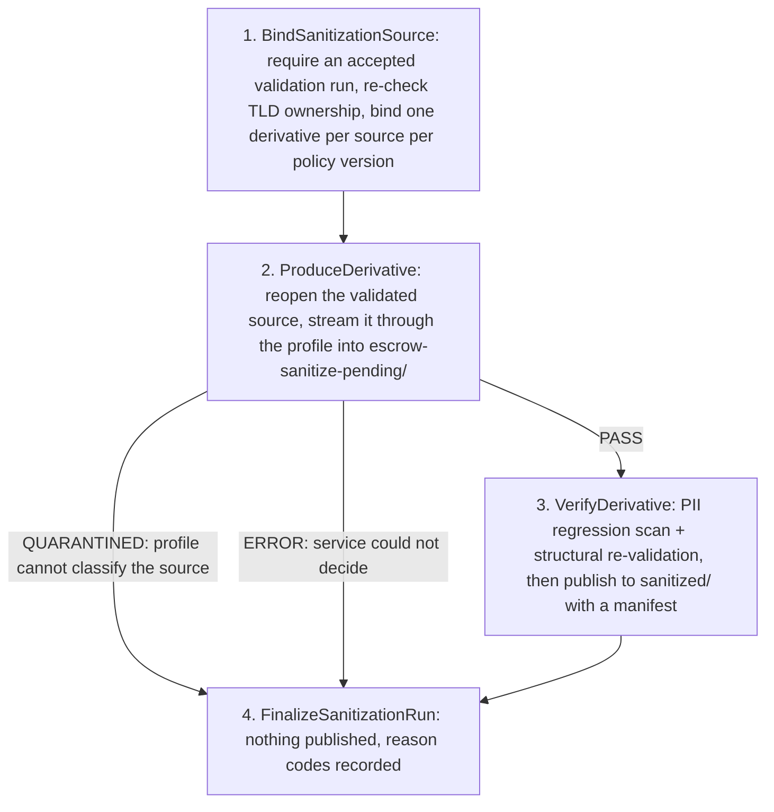

| Field | Value |
|-------|-------|
| **Status** | `ACTIVE` |
| **Queue** | `heavy-batch` |
| **Category** | `data` |
| **Tags** | `data`, `escrow`, `eve`, `privacy` |
| **Trigger** | `API` (`POST /escrow/sanitizations`, Launchpad `escrow-sanitize`) |
| **Human-in-the-Loop** | `No` |
| **Launchpad Card** | `Yes` |

## Overview

Derives a **sanitized-pseudonymized** copy of an already-accepted RDE deposit, for internal analytics, engineering and non-production testing (issue #415). It streams the validated source through a versioned field profile, writes the derivative under a `sanitized/` prefix beside the deposit, and records an immutable run with a non-PII manifest.

**The derivative is an adjunct to escrow custody, not a modification of it.** Escrow data exists to support recovery, and ICANN's RDE material requires the archived deposited copy to stay unmodified. This workflow never writes to, moves or re-labels the source object; the raw deposit remains the authoritative custody artifact and the derivative must never be reported as an accepted escrow file or used for an ICANN/RSP/EBERO release.

**It is also not import.** There is no path from here to the escrow import pipeline or to registry data; `escrow_validation_isolation_test.go` and a Postgres-backed side-effect test enforce that.

`sanitized-pseudonymized` is the required label and it is deliberately not "anonymous": tokens stay linkable within a tenant, the HMAC key is sensitive material, and the retained analytical fields (country, city, postal code, timestamps, status combinations) can re-identify in combination.

## Flow Diagram



## Input

```go
type EscrowSanitizeParams struct {
    Scope                 string        // operator scope from the authenticated request (ADR-0006)
    SourceValidationRunID string        // must be a PASS run belonging to Scope
    SyntheticSuffix       string        // optional; overrides ESCROW_SANITIZE_SUFFIX
    RequestedBy           string        // authenticated identity
    SanitizeTimeout       time.Duration // optional; mirror ESCROW_SANITIZE_TIMEOUT
}
```

The TLD is deliberately not a parameter: it is whatever the bound source deposit says, so a derivative cannot be attributed to a TLD the source did not belong to.

**Example JSON:**
```json
{
  "scope": "ryop1",
  "sourceValidationRunId": "9f1d6a1e-7f0e-4a49-9a7f-4a0a1a2b3c4d",
  "syntheticSuffix": "artful-dodger",
  "requestedBy": "auth0|abc"
}
```

## Output

```go
type EscrowSanitizeResult struct {
    SanitizationRunID string
    Replay            bool     // the same source had already been derived under this policy version
    TLD               string
    PolicyVersion     string   // the in-repo profile version that decided the content
    SyntheticSuffix   string
    Outcome           string   // PASS | QUARANTINED | ERROR
    DerivativeKey     string   // set only on PASS
    ManifestKey       string   // set only on PASS
    Codes             []string
}
```

## Steps

| # | Activity | Timeout | Retries | Notes |
|---|----------|---------|---------|-------|
| 1 | `BindSanitizationSource` | 30 m | 3 | Refuses a source that did not pass validation; re-checks TLD ownership; one derivative per (tenant, source run, policy version) |
| 2 | `ProduceDerivative` | `SanitizeTimeout` + 10 m, heartbeat 5 m | 2 | Reopens the validated source through the same code validation used; aborts the upload if the profile refuses the source |
| 3 | `VerifyDerivative` | `SanitizeTimeout` + 10 m, heartbeat 5 m | 2 | PII regression scan, structural re-validation, aggregate statistics counted from the derivative, then publish |
| 4 | `FinalizeSanitizationRun` | 5 m | 3 | Single conditional UPDATE; only a PASS may reference an object |

## Failure Modes

| Failure | Cause | Workflow Behavior | Manual Recovery |
|---------|-------|-------------------|-----------------|
| Bind non-retryable | Source run not found for this tenant, did not pass, or its TLD is not operated by the caller | Fails before any record exists | Validate the deposit first, or launch under the right scope |
| Outcome `QUARANTINED` | An element, attribute or namespace the profile does not classify; a DTD; a non-UTF-8 encoding; a depth/count/field-length limit | **Nothing is published**, run finalised QUARANTINED, workflow completes | Classify the field in `rdesanitize/profile.go`, bump `PolicyVersion`, re-run — the new version produces a separate derivative |
| Outcome `ERROR` | Token key unavailable, escrow keyring unavailable, source artifact changed since validation, timeout, internal failure | Nothing published, run finalised ERROR, workflow fails | Fix the service condition and relaunch |
| Replay of a finished derivative | Same source, same policy version | Returns the existing run and its keys; produces nothing | None — this is the intended behaviour |

## Artifacts

| Artifact | Storage | Purpose |
|----------|---------|---------|
| `deposit-{policy}.xml.gz` | S3 escrow bucket: `escrow-sanitize-pending/{tenant}/{tld}/{depositID}/{runID}/` | Staged derivative, verified before it is published. Nothing here is authoritative — a passed derivative has already been copied to `sanitized/` — so a lifecycle rule expires the whole prefix. It is a top level prefix precisely so a rule can name it: a lifecycle filter is a literal key prefix and cannot express `*/pending/` |
| `sanitized/deposit-{policy}.xml.gz` | same prefix | The published derivative. Never overwritten: a different policy version is a different run and a different object |
| `sanitized/manifest-{policy}.json` | same prefix | Source and derivative checksums, tenant/TLD, policy and workflow versions, token key fingerprint, timestamps, field/action counts. No values, no excerpts |
| `escrow_sanitization_runs` | Postgres | Immutable record; unique on (tenant, source validation run, policy version) |

## Operational Notes

### Scheduling
Not scheduled. A derivative is produced on request, after the deposit it comes from has been validated.

### Monitoring
Logs carry `correlation_id`, `sanitization_run_id`, `source_run_id`, `tld`, `stage`, `outcome`, `codes` and nothing from the payload. A rising `QUARANTINED` count means the profile is behind the deposits, not that the deposits are bad; a rising `ERROR` count is a service problem.

### Manual Intervention
Rotating `ESCROW_SANITIZE_HMAC_KEY` changes every token, so derivatives made before and after it are no longer joinable. The key fingerprint is recorded on every manifest so that break is visible rather than silent.

Extending the profile is a reviewed code change followed by a `PolicyVersion` bump; re-running an already-derived source under the new version creates a separate, separately traceable derivative and never overwrites the old one.

---

> **Last updated**: 2026-09-09
> **Updated by**: issue #415
