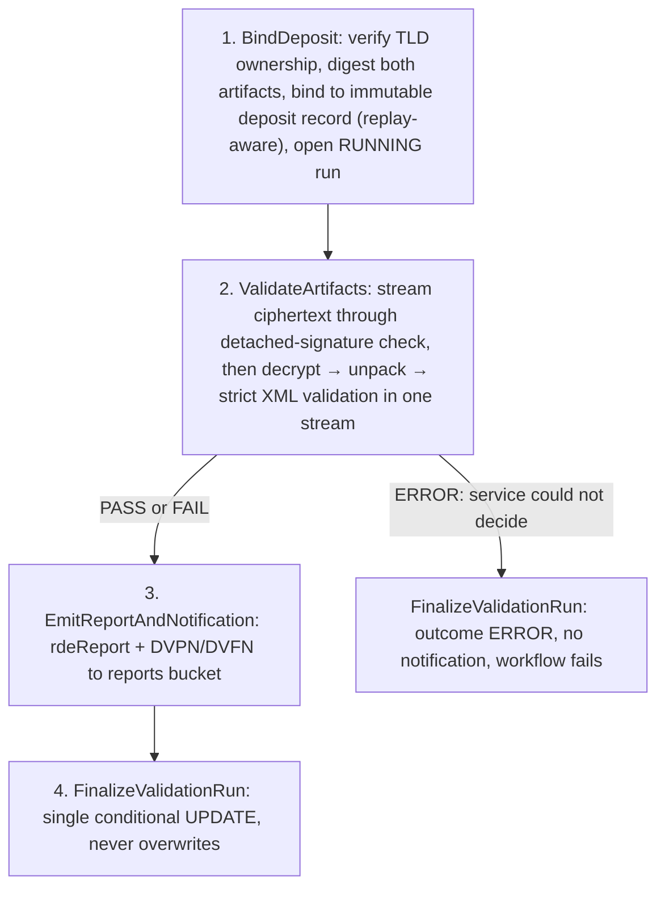

| Field | Value |
|-------|-------|
| **Status** | `ACTIVE` |
| **Queue** | `heavy-batch` |
| **Category** | `data` |
| **Tags** | `data`, `escrow`, `eve`, `validation` |
| **Trigger** | `API` (`POST /escrow/validations`, Launchpad `escrow-validation`) |
| **Human-in-the-Loop** | `No` |
| **Launchpad Card** | `Yes` |

## Overview

Stage 1 of the escrow verification (EVE) service for issue #412. It takes an ICANN-style RDE deposit supplied as a `.ryde` archive plus its detached `.sig`, bound to the caller's operator tenant and a TLD, and produces an auditable, profile-aware verification decision: the detached signature is verified against the registry keys trusted for that tenant/TLD, the archive is decrypted with the service keyring and unpacked under explicit limits, the RDE XML is streamed through strict structural and content checks, an immutable validation record is persisted, and a schema-valid `rdeReport:report` plus `rdeNotification:notification` (`DVPN` on pass, `DVFN` on a received-but-invalid deposit) is written to the reports bucket.

### Profiles

| Profile | Artifact set | Signature verified | `Verified()` | Notification |
|---|---|---|---|---|
| `ryde+sig` (default) | `.ryde` + detached `.sig` | Yes, against the tenant/TLD trusted keys | Yes on PASS | `DVPN` / `DVFN` |
| `xml` | a single `.xml` or `.xml.gz` | No — there is none | **Never** | **None** |

The `xml` profile (issue #415) runs exactly the same unpack and RDE checks; what it cannot do is say anything about who sent the deposit, so it never claims a cryptographically verified pass and never emits an ICANN notification. It exists so a plaintext deposit can be accepted as the source of a sanitized derivative.

**Validation is not import.** This workflow never calls the escrow import pipeline or mutates registry data; `escrow_validation_isolation_test.go` and `TestEscrowValidation_NoRegistryWriteSideEffect` enforce that. See ADR-0007.

## Flow Diagram



## Input

```go
type EscrowValidationParams struct {
    Scope             string        // operator scope from the authenticated request (ADR-0006)
    TLD               string        // must be operated by Scope; re-checked in BindDeposit
    Profile            string       // "ryde+sig" (default) or "xml" for an unsigned .xml/.xml.gz
    ArtifactObjectKey  string       // escrow bucket key of the deposit artifact
    SignatureObjectKey string       // escrow bucket key of the detached .sig; empty when unsigned
    SubmittedBy       string        // authenticated identity
    IntakeRef         string        // opaque intake reference (optional)
    ReceivedAt        time.Time     // intake timestamp
    ValidationTimeout time.Duration // optional; mirror ESCROW_VALIDATION_TIMEOUT
}
```

**Example JSON:**
```json
{
  "scope": "ryop1",
  "tld": "example",
  "profile": "ryde+sig",
  "artifactObjectKey": "uploads/20260908/1757300000/example_2026-09-08_full_S1_R0.ryde",
  "signatureObjectKey": "uploads/20260908/1757300000/example_2026-09-08_full_S1_R0.sig",
  "submittedBy": "auth0|abc",
  "receivedAt": "2026-09-08T03:15:00Z"
}
```

## Output

```go
type EscrowValidationResult struct {
    DepositID, ValidationRunID string
    Replay                     bool     // the same artifact set was already bound
    Outcome                    string   // PASS | FAIL | ERROR
    Verified                   bool     // PASS on the ryde+sig profile only
    NotificationStatus         string   // DVPN | DVFN | ""
    ReportKey, NotificationKey string   // reports bucket
    Codes                      []string // stable finding codes
}
```

## Steps

### 1. Bind Deposit
- **Activity**: `BindDeposit`
- **Timeout**: Start-to-close 30m, Heartbeat 5m
- **Retry**: Max 3 attempts, backoff 2.0
- **Description**: Verifies the TLD belongs to the scope (SQL-enforced), checks both artifacts exist, digests them, binds to the existing deposit record for that exact pair or creates one, copies the pair once to `escrow-validation/{tenant}/{tld}/{depositID}/deposit.{ryde,sig}` in the escrow bucket, and opens a RUNNING run. Never overwrites.

### 2. Validate Artifacts
- **Activity**: `ValidateArtifacts`
- **Timeout**: Start-to-close `ValidationTimeout`+10m, Heartbeat 5m
- **Retry**: Max 2 attempts
- **Description**: Streams the ciphertext from object storage twice: once through the detached-signature check against the trusted keys active for the tenant/TLD, then (only if that passed) through decrypt → safe unpack → strict RDE XML validation as one chained stream. Nothing touches disk; plaintext is never persisted, only digested. Returns a structured `Result` with stable codes.

### 3. Emit Report and Notification
- **Activity**: `EmitReportAndNotification`
- **Timeout**: Start-to-close 5m
- **Retry**: Max 3 attempts
- **Description**: Builds the `rdeReport:report` and the `DVPN`/`DVFN` per draft-lozano-icann-registry-interfaces-26 and writes them under `escrow-validation/{tenant}/{tld}/{depositID}/{runID}/` in the reports bucket. Skipped for ERROR outcomes.

### 4. Finalize Validation Run
- **Activity**: `FinalizeValidationRun`
- **Timeout**: Start-to-close 5m
- **Retry**: Max 3 attempts
- **Description**: One conditional UPDATE from RUNNING to the terminal outcome with findings, key fingerprints, digests, deposit metadata and artifact keys. A second finalisation is rejected and the first outcome stands.

## Failure Modes

| Failure | Cause | Workflow Behavior | Manual Recovery |
|---------|-------|-------------------|-----------------|
| BindDeposit non-retryable | TLD not operated by scope, artifact missing, oversize signature, artifact set that does not match the profile | Workflow fails before any record exists | Fix intake, relaunch |
| Outcome `FAIL` | Bad/untrusted signature, wrong recipient key, unsafe archive, limit breach, malformed XML, invalid RDE object, count/TLD mismatch | `DVFN` emitted, run finalised FAIL, workflow completes | None: the deposit is invalid; registry resubmits |
| Outcome `ERROR` | Service keyring unavailable, timeout, internal error, artifact changed since intake | Run finalised ERROR, **no notification**, workflow fails | Fix the service condition, relaunch (replay binds to the same deposit, new run) |
| Activity infrastructure error after bind | Storage/DB outage beyond retries | Run finalised ERROR via disconnected context, workflow fails | Relaunch |

## Artifacts

| Artifact | Storage | Purpose |
|----------|---------|---------|
| `deposit.ryde` + `deposit.sig`, or `deposit.xml` / `deposit.xml.gz` | S3 escrow bucket: `escrow-validation/{tenant}/{tld}/{depositID}/` | Immutable copy of the exact artifact set validated |
| `report.xml` | S3 reports bucket: `escrow-validation/{tenant}/{tld}/{depositID}/{runID}/` | `rdeReport:report` |
| `notification.xml` | same prefix | `rdeNotification:notification` (DVPN/DVFN) |
| `escrow_deposits`, `escrow_validation_runs` | Postgres | Immutable records, traceable by tenant/TLD/deposit id/digest; `workflow_id` is the correlation id (INV-16) |

## Operational Notes

### Scheduling
Not scheduled. Missing-deposit notices (`DRFN`) are a follow-on.

### Monitoring
Logs carry `correlation_id`, `deposit_id`, `run_id`, `tld`, `stage`, `outcome`, `codes` and nothing from the payload. Query the run table by outcome; a growing count of `ERROR` runs means a service problem, not bad deposits.

### Manual Intervention
Relaunching with the same artifact set is safe: it binds to the existing deposit and creates a new run; earlier outcomes are never overwritten. Trusted registry keys are managed through `/escrow/trusted-keys`; the service keyring through `ESCROW_VALIDATION_PRIVATE_KEYS`.

---

> **Last updated**: 2026-09-09
> **Updated by**: issue #415 (unsigned `xml` profile); originally issue #412
