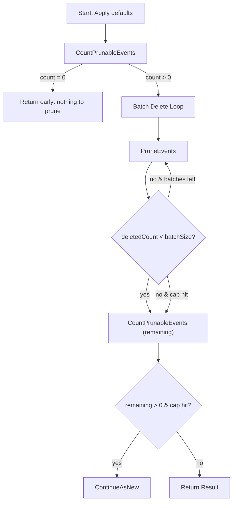

# Event Prune Workflow

| Field | Value |
|-------|-------|
| **Status** | `ACTIVE` |
| **Queue** | `data-pipeline` |
| **Category** | `data` |
| **Tags** | `data`, `events`, `prune`, `cleanup`, `cloud` |
| **Trigger** | `Schedule` |
| **Human-in-the-Loop** | `No` |
| **Launchpad Card** | `Read-only (scheduled)` |

## Overview

The Event Prune workflow deletes old domain events that have exceeded the retention window (default 30 days). It operates in batches with a safety cap and uses Temporal's continue-as-new mechanism when there are more events to prune than the cap allows in a single execution. This prevents the workflow execution history from growing unbounded while still draining the backlog.

## Flow Diagram



## Input

```go
type EventPruneParams struct {
    RetentionDays int `json:"retentionDays,omitempty"` // default 30
    BatchSize     int `json:"batchSize,omitempty"`     // default 10000
    MaxBatches    int `json:"maxBatches,omitempty"`    // default 50 (safety cap)
}
```

**Example JSON:**
```json
{
  "retentionDays": 30,
  "batchSize": 10000,
  "maxBatches": 50
}
```

## Output

```go
type EventPruneResult struct {
    StartedAt      time.Time `json:"startedAt"`
    CompletedAt    time.Time `json:"completedAt"`
    TotalPruned    int64     `json:"totalPruned"`
    TotalBatches   int       `json:"totalBatches"`
    RemainingCount int64     `json:"remainingCount"`
    Notes          []string  `json:"notes"`
}
```

## Steps

### 1. CountPrunableEvents
- **Activity**: `CountPrunableEvents`
- **Timeout**: Start-to-close 10 min, Heartbeat 2 min
- **Retry**: Max 3 attempts, backoff 2.0, max interval 10 min
- **Description**: Counts domain events older than `retentionDays` that are eligible for pruning (already published/archived).

### 2. PruneEvents (batched)
- **Activity**: `PruneEvents`
- **Timeout**: Start-to-close 10 min, Heartbeat 2 min
- **Retry**: Max 3 attempts, backoff 2.0, max interval 10 min
- **Description**: Deletes up to `batchSize` events older than `retentionDays`. Returns the actual count of deleted rows. Loops up to `maxBatches` times.

### 3. CountPrunableEvents (remaining)
- **Activity**: `CountPrunableEvents`
- **Timeout**: Start-to-close 10 min, Heartbeat 2 min
- **Retry**: Max 3 attempts, backoff 2.0, max interval 10 min
- **Description**: Re-counts remaining prunable events after the loop completes to determine if continue-as-new is needed.

## Failure Modes

| Failure | Cause | Workflow Behavior | Manual Recovery |
|---------|-------|-------------------|-----------------|
| CountPrunableEvents timeout | Database under heavy load | Retries up to 3 times | Check DB connection, retry workflow |
| PruneEvents timeout | Large batch or lock contention | Retries up to 3 times | Reduce batchSize parameter |
| Partial completion (cap hit) | More events than maxBatches × batchSize | ContinueAsNew to drain remainder | Monitor successive runs |

## Artifacts

_No external artifacts produced — this workflow deletes data._

## Operational Notes

### Scheduling
Scheduled to run daily on the `data-pipeline` queue.

### Monitoring
- Watch `TotalPruned` and `RemainingCount` to ensure the prune keeps pace with event generation.
- If the workflow frequently triggers ContinueAsNew, consider increasing `batchSize` or `maxBatches`.

### Manual Intervention
- Adjust `retentionDays` to keep events longer before pruning.
- Safe to run manually — deletes are idempotent (already-deleted events won't be counted).
- Use `retentionDays: 0` with caution — it would prune all published events.

---

> **Last updated**: 2026-06-30
> **Updated by**: Antigravity
