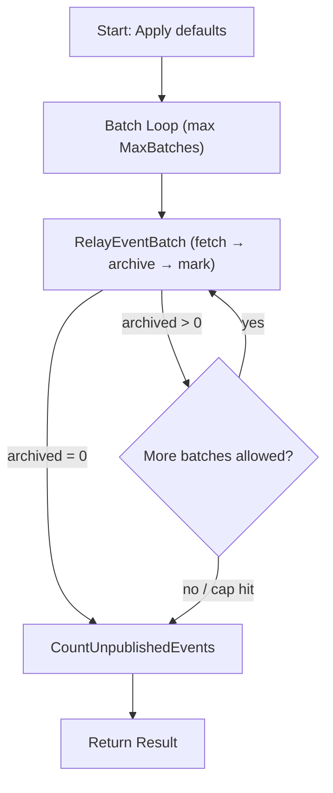

# Event Relay Workflow

| Field | Value |
|-------|-------|
| **Status** | `ACTIVE` |
| **Queue** | `scheduled` |
| **Category** | `data` |
| **Tags** | `data`, `events`, `relay`, `s3`, `cloud` |
| **Trigger** | `Schedule` |
| **Human-in-the-Loop** | `No` |
| **Launchpad Card** | `Read-only (scheduled)` |

## Overview

The Event Relay workflow drains unpublished domain events from the database, archives each batch as a gzip JSONL file in S3, and marks the events as published. Each batch is a **single consolidated activity** (`RelayEventBatch`) that fetches, archives, and marks in one execution — event payloads never cross the Temporal boundary, only `{archived, s3Key}` metadata does. It runs on a schedule and processes events in configurable batches with a safety cap to prevent unbounded execution. This is the first stage of the Consumer Cloud pipeline — downstream consumers read from S3.

Delivery is **at-least-once**: if marking fails after the S3 upload, the retry re-fetches the same (still-unpublished) events and uploads them under a new key. A duplicate archive object is possible; lost or double-marked events are not.

## Flow Diagram



## Input

```go
type EventRelayParams struct {
    BatchSize  int `json:"batchSize,omitempty"`  // default 200
    MaxBatches int `json:"maxBatches,omitempty"` // default 10 (safety cap per run)
}
```

**Example JSON:**
```json
{
  "batchSize": 200,
  "maxBatches": 10
}
```

## Output

```go
type EventRelayResult struct {
    StartedAt      time.Time `json:"startedAt"`
    CompletedAt    time.Time `json:"completedAt"`
    TotalArchived  int       `json:"totalArchived"`
    TotalBatches   int       `json:"totalBatches"`
    S3Keys         []string  `json:"s3Keys,omitempty"`
    RemainingCount int64     `json:"remainingCount"`
    Notes          []string  `json:"notes"`
}
```

## Steps

### 1. RelayEventBatch (looped, up to MaxBatches times)
- **Activity**: `RelayEventBatch` (struct method on `EventRelayActivities`)
- **Timeout**: Start-to-close 10 min, heartbeat 2 min
- **Retry**: Max 3 attempts, backoff 2.0, max interval 10 min
- **Description**: In one activity execution: fetches up to `batchSize` rows where `published = false` (ordered by `occurred_at`), serializes them as gzip JSONL to S3 under a date-partitioned key, and sets `published = true` for the archived IDs. Returns `{archived, s3Key}`. An empty fetch returns `archived = 0`, which ends the loop.

### 2. CountUnpublishedEvents
- **Activity**: `CountUnpublishedEvents`
- **Timeout**: Start-to-close 10 min
- **Retry**: Max 3 attempts, backoff 2.0, max interval 10 min
- **Description**: Returns the total count of remaining unpublished events. Used to populate `RemainingCount` in the result.

The granular activities (`FetchUnpublishedEvents`, `ArchiveEventsToS3`, `MarkEventsPublished`) still exist on `EventRelayActivities` — `RelayEventBatch` composes them in-process — but the workflow no longer invokes them individually.

## Failure Modes

| Failure | Cause | Workflow Behavior | Manual Recovery |
|---------|-------|-------------------|-----------------|
| RelayEventBatch fetch failure | Database slow or unreachable | Retries up to 3 times, then workflow fails | Check DB health, reduce batchSize |
| RelayEventBatch S3 failure | S3/MinIO unreachable or write error | Retries up to 3 times; no events marked | Check STORAGE_ENDPOINT, bucket permissions |
| RelayEventBatch mark failure | Database write error after upload | Activity errors; retry re-archives the same events under a new key (at-least-once) | Duplicate archive objects are harmless |
| Partial completion | Batch cap reached | Adds note with remaining count | Next scheduled run (5 min) picks up remaining events |

## Artifacts

| Artifact | Storage | Purpose |
|----------|---------|---------|
| Event batch JSONL (gzip) | S3: `events/archive/{yyyy}/{mm}/{dd}/events-{unix}-{count}.jsonl.gz` | Archived events for downstream Consumer Cloud consumers |

## Operational Notes

### Scheduling
Scheduled to run every 5 minutes on the `scheduled` queue (schedule ID `event-relay`, managed by bootstrap).

### Monitoring
- Check `RemainingCount` in the workflow result — a consistently high number indicates the relay can't keep up with event volume.
- Monitor S3 keys in the result to verify archives are being written.
- An `ActivityNotRegisteredError` here means the worker build and workflow code are out of sync — the relay silently stops draining the outbox, so treat it as urgent.

### Manual Intervention
- Increase `batchSize` or `maxBatches` if the relay falls behind.
- Safe to run manually at any time — the workflow is idempotent (at-least-once archive).

---

> **Last updated**: 2026-07-16
> **Updated by**: Agent — implemented the missing RelayEventBatch consolidated activity (workflow previously failed every run with ActivityNotRegisteredError)
