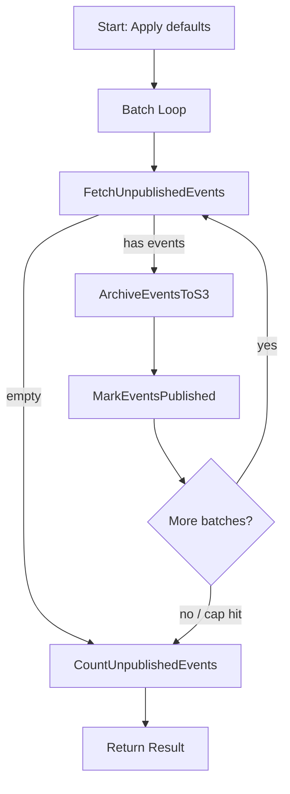

# Event Relay Workflow

| Field | Value |
|-------|-------|
| **Status** | `ACTIVE` |
| **Queue** | `data-pipeline` |
| **Category** | `data` |
| **Tags** | `data`, `events`, `relay`, `s3`, `cloud` |
| **Trigger** | `Schedule` |
| **Human-in-the-Loop** | `No` |
| **Launchpad Card** | `Read-only (scheduled)` |

## Overview

The Event Relay workflow drains unpublished domain events from the database, archives each batch as a JSONL file in S3, and marks the events as published. It runs on a schedule and processes events in configurable batches with a safety cap to prevent unbounded execution. This is the first stage of the Consumer Cloud pipeline — downstream consumers read from S3.

## Flow Diagram



## Input

```go
type EventRelayParams struct {
    BatchSize  int `json:"batchSize,omitempty"`  // default 500
    MaxBatches int `json:"maxBatches,omitempty"` // default 10 (safety cap per run)
}
```

**Example JSON:**
```json
{
  "batchSize": 500,
  "maxBatches": 10
}
```

## Output

```go
type EventRelayResult struct {
    StartedAt      time.Time `json:"startedAt"`
    CompletedAt    time.Time `json:"completedAt"`
    TotalArchived  int       `json:"totalArchived"`
    TotalBatches   int       `json:"totalBatches"`
    S3Keys         []string  `json:"s3Keys,omitempty"`
    RemainingCount int64     `json:"remainingCount"`
    Notes          []string  `json:"notes"`
}
```

## Steps

### 1. FetchUnpublishedEvents
- **Activity**: `FetchUnpublishedEvents`
- **Timeout**: Start-to-close 5 min
- **Retry**: Max 3 attempts, backoff 2.0, max interval 10 min
- **Description**: Queries the domain_events table for up to `batchSize` rows where `published = false`, ordered by creation time.

### 2. ArchiveEventsToS3
- **Activity**: `ArchiveEventsToS3`
- **Timeout**: Start-to-close 5 min
- **Retry**: Max 3 attempts, backoff 2.0, max interval 10 min
- **Description**: Serializes the event batch as JSONL and writes it to S3 under a date-partitioned key. Returns the S3 key.

### 3. MarkEventsPublished
- **Activity**: `MarkEventsPublished`
- **Timeout**: Start-to-close 5 min
- **Retry**: Max 3 attempts, backoff 2.0, max interval 10 min
- **Description**: Updates the `published` flag to `true` for all event IDs in the batch.

### 4. CountUnpublishedEvents
- **Activity**: `CountUnpublishedEvents`
- **Timeout**: Start-to-close 5 min
- **Retry**: Max 3 attempts, backoff 2.0, max interval 10 min
- **Description**: Returns the total count of remaining unpublished events. Used to populate `RemainingCount` in the result.

## Failure Modes

| Failure | Cause | Workflow Behavior | Manual Recovery |
|---------|-------|-------------------|-----------------|
| FetchUnpublishedEvents timeout | Database slow or large result set | Retries up to 3 times | Check DB health, reduce batchSize |
| ArchiveEventsToS3 failure | S3/MinIO unreachable or write error | Retries up to 3 times | Check STORAGE_ENDPOINT, bucket permissions |
| MarkEventsPublished failure | Database write error | Retries up to 3 times | Events will be re-fetched on next run (idempotent archive) |
| Partial completion | Batch cap reached | Adds note with remaining count | Next scheduled run picks up remaining events |

## Artifacts

| Artifact | Storage | Purpose |
|----------|---------|---------|
| Event batch JSONL | S3: `events/{date}/{batchId}.jsonl` | Archived events for downstream consumer cloud consumers |

## Operational Notes

### Scheduling
Scheduled to run every 5 minutes on the `data-pipeline` queue.

### Monitoring
- Check `RemainingCount` in the workflow result — a consistently high number indicates the relay can't keep up with event volume.
- Monitor S3 keys in the result to verify archives are being written.

### Manual Intervention
- Increase `batchSize` or `maxBatches` if the relay falls behind.
- Safe to run manually at any time — the workflow is idempotent.

---

> **Last updated**: 2026-06-30
> **Updated by**: Antigravity
