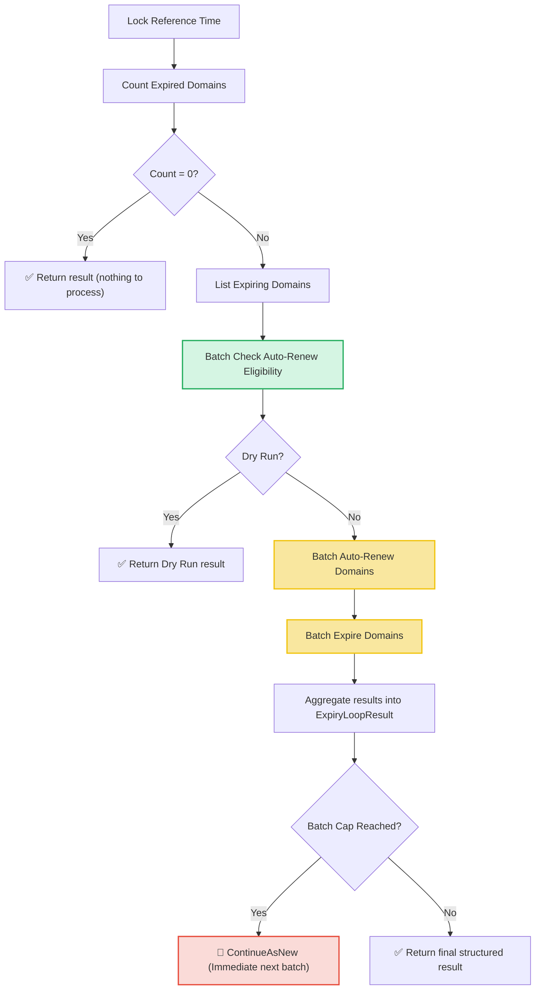

# Expiry Loop Workflow

| Field | Value |
|-------|-------|
| **Status** | `ACTIVE` |
| **Queue** | `object-lifecycle` |
| **Category** | `lifecycle` |
| **Tags** | `lifecycle`, `domains`, `expiry` |
| **Trigger** | `Schedule` / `REST` |
| **Human-in-the-Loop** | `No` |
| **Launchpad Card** | `Read-only (scheduled)` |

## Overview

The Expiry Loop is a scheduled workflow that processes domains that have passed their expiration date. It locks a single reference time (or accepts an override) to prevent TOCTOU races between counting and listing. It batches eligibility checking via the service layer, then uses batch activities to auto-renew or expire domains in a single service call per operation — eliminating the per-domain HTTP overhead of the previous implementation. If the batch cap is reached, the workflow uses `ContinueAsNew` to drain the remainder.

## Flow Diagram



## Input

```go
func ExpiryLoop(ctx workflow.Context, params ExpiryLoopParams) (ExpiryLoopResult, error)

type ExpiryLoopParams struct {
    BatchSize             int        `json:"batchSize,omitempty"`
    ConcurrencyLimit      int        `json:"concurrencyLimit,omitempty"`
    DryRun                bool       `json:"dryRun,omitempty"`
    ReferenceTimeOverride *time.Time `json:"referenceTimeOverride,omitempty"`
}
```

## Output

```go
type ExpiryLoopResult struct {
    StartedAt      time.Time           `json:"startedAt"`
    CompletedAt    time.Time           `json:"completedAt"`
    ReferenceTime  time.Time           `json:"referenceTime"`
    TotalFound     int64               `json:"totalFound"`
    TotalProcessed int                 `json:"totalProcessed"`
    AutoRenewed    int                 `json:"autoRenewed"`
    Expired        int                 `json:"expired"`
    Failed         int                 `json:"failed"`
    Skipped        int                 `json:"skipped"`
    Notes          []string            `json:"notes"`
    Failures       []ExpiryLoopFailure `json:"failures,omitempty"`
}

type ExpiryLoopFailure struct {
    DomainName string `json:"domainName"`
    Operation  string `json:"operation"` // "auto-renew-check", "auto-renew", "expire"
    Error      string `json:"error"`
}
```

## Query Handler

The workflow exposes a `progress` query handler that returns the current `ExpiryLoopResult` in real-time, allowing operators to monitor the progress of parallel execution.

## Steps

### 1. Lock Reference Time
- **Description**: Captures `workflow.Now(ctx).UTC()` or uses the optional `ReferenceTimeOverride`.

### 2. Count Expired Domains
- **Activity**: `activities.GetExpiredDomainCount`
- **Timeout**: 1 minute
- **Description**: Queries the database for the count of domains whose expiry date is at or before the reference time.

### 3. List Expiring Domains
- **Activity**: `activities.ListExpiringDomains`
- **Timeout**: 1 minute
- **Description**: Retrieves expiring domains using the reference time (up to 1,000 domains).

### 4. Batch Check Auto-Renew Eligibility
- **Activity**: `activities.CheckDomainsCanAutoRenew`
- **Timeout**: 1 minute
- **Description**: Checks auto-renew eligibility for the entire list of domains concurrently in a bounded goroutine pool inside the activity.

### 5. Batch Auto-Renew
- **Activity**: `BatchAutoRenewDomains` (struct method on `LifecycleActivities`)
- **Timeout**: 30 minutes (start-to-close), 2 minutes (heartbeat)
- **Description**: Auto-renews all eligible domains in a single batch activity call. Processes domains in chunks internally with heartbeats.

### 6. Batch Expire
- **Activity**: `BatchExpireDomains` (struct method on `LifecycleActivities`)
- **Timeout**: 30 minutes (start-to-close), 2 minutes (heartbeat)
- **Description**: Expires all ineligible-for-auto-renew domains in a single batch activity call.

### 7. Continue As New (Optional)
- **Description**: If the listed domains are fewer than the total found, the workflow executes a `ContinueAsNew` error to immediately begin processing the remaining domains.

## Failure Modes

| Failure | Cause | Workflow Behavior | Result Impact | Manual Recovery |
|---------|-------|-------------------|---------------|-----------------|
| Count query failure | DB connection issue | Workflow returns error | `Notes` contains error message | Check DB health; retry run |
| List query failure | DB query timeout | Workflow returns error | `Notes` contains error message | Same as above |
| Batch check failure | API rate limit/error | Workflow returns error | Workflow fails | Check API server health |
| Batch auto-renew failure | Service-layer error | Records failure, continues to expire step | `Failed++`, added to `Failures` | Review failures, manually renew via API |
| Batch expire failure | Service-layer error | Records failure | `Failed++`, added to `Failures` | Manually expire via API |
| Batch cap hit | >1000 expired domains | Runs `ContinueAsNew` immediately | Next run processes remainder | Automatic self-healing |

## Operational Notes

### Performance
- **Before (per-domain)**: N HTTP requests (one per domain) for auto-renew/expire writes.
- **After (batched)**: 2 activity calls total (1 for auto-renew, 1 for expire), each processing the full batch via the service layer directly.
- TLD/phase lookups are cached per TLD group within each batch.
- Registrar lookups are cached per ClID within the auto-renew batch.

### Monitoring
- Watch counts (`TotalFound`, `Failed`, `AutoRenewed`, `Expired`) in the Temporal UI.
- Use `progress` query to check execution logs in real-time.
- Heartbeat messages report chunk progress during batch activities.

---

> **Last updated**: 2026-06-29
> **Updated by**: Agent (refactored to batch activities) — eliminates per-domain HTTP overhead)
