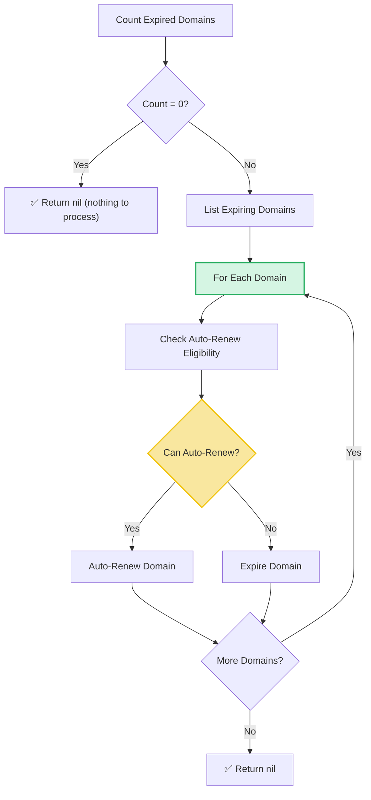

# Expiry Loop Workflow

| Field | Value |
|-------|-------|
| **Status** | `ACTIVE` |
| **Queue** | `object-lifecycle` |
| **Category** | `lifecycle` |
| **Tags** | `lifecycle`, `domains`, `expiry` |
| **Trigger** | `Schedule` |
| **Human-in-the-Loop** | `No` |
| **Launchpad Card** | `Read-only (scheduled)` |

## Overview

The Expiry Loop is a scheduled workflow that runs every hour to process domains that have passed their expiration date. For each expired domain, it checks whether the domain is eligible for auto-renewal. Eligible domains are automatically renewed; ineligible domains are expired (transitioned to a post-expiry lifecycle state). Individual domain failures are logged but do not halt the loop, ensuring one problematic domain doesn't block processing of others.

## Flow Diagram



## Input

```go
func ExpiryLoop(ctx workflow.Context) error
```

No input parameters. The workflow discovers expired domains dynamically.

## Output

Returns `error` only. Returns `nil` on success (including when there are no expired domains to process).

## Steps

### 1. Count Expired Domains
- **Activity**: `activities.GetExpiredDomainCount`
- **Timeout**: Start-to-close 1min
- **Retry**: Max 3 attempts, initial interval 1s, backoff coefficient 2.0, max interval 10min
- **Description**: Queries the database for the count of domains whose expiry date has passed. If count is zero, the workflow returns immediately.

### 2. List Expiring Domains
- **Activity**: `activities.ListExpiringDomains`
- **Timeout**: Same as above
- **Retry**: Same as above
- **Description**: Retrieves the list of expired domain items (name and metadata) for processing.

### 3. Check Auto-Renew Eligibility (per domain)
- **Activity**: `activities.CheckDomainCanAutoRenew`
- **Timeout**: Same as above
- **Retry**: Same as above
- **Description**: Checks whether the domain has auto-renew enabled and meets the criteria for automatic renewal (e.g., registrar has auto-renew capability, domain is within grace period). On failure, the domain is skipped with a log entry.

### 4a. Auto-Renew Domain
- **Activity**: `activities.AutoRenewDomain`
- **Timeout**: Same as above
- **Retry**: Same as above
- **Description**: Performs an automatic renewal of the domain, extending its registration period. On failure, the domain is skipped with a log entry.

### 4b. Expire Domain
- **Activity**: `activities.ExpireDomain`
- **Timeout**: Same as above
- **Retry**: Same as above
- **Description**: Transitions the domain to the expired lifecycle state. On failure, the domain is skipped with a log entry.

## Failure Modes

| Failure | Cause | Workflow Behavior | Manual Recovery |
|---------|-------|-------------------|-----------------|
| Count query failure | DB connection issue | Workflow fails | Check DB health; next scheduled run will retry |
| List query failure | DB query timeout | Workflow fails | Same as above |
| Auto-renew check failure | Individual domain data issue | Logs error, skips domain, continues loop | Review logs, fix domain data, wait for next run |
| Auto-renew failure | Renewal service error | Logs error, skips domain, continues loop | Manually renew domain via API |
| Expire failure | Domain state transition error | Logs error, skips domain, continues loop | Manually expire domain via API |

## Artifacts

No persistent artifacts produced. Domain state changes are reflected directly in the database.

## Operational Notes

### Scheduling
Runs every hour on a schedule.

### Monitoring
- Monitor the expired domain count — a consistently high count may indicate auto-renew failures accumulating.
- Watch for repeated error logs for the same domain across multiple runs.
- The 1-minute activity timeout is appropriate for individual domain operations but could be tight if the list query returns a very large result set.

### Manual Intervention
- Domains that consistently fail auto-renew should be investigated individually.
- To process expired domains outside the schedule: trigger the workflow manually via API.
- The workflow is idempotent — re-running processes any currently expired domains.

---

> **Last updated**: 2025-06-23
> **Updated by**: Agent (initial documentation)
