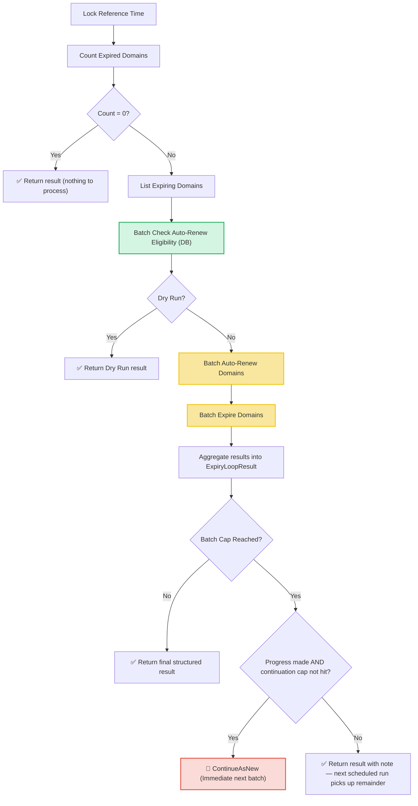

# Expiry Loop Workflow

| Field | Value |
|-------|-------|
| **Status** | `ACTIVE` |
| **Queue** | `lifecycle` |
| **Category** | `lifecycle` |
| **Tags** | `lifecycle`, `domains`, `expiry` |
| **Trigger** | `Schedule` / `REST` |
| **Human-in-the-Loop** | `No` |
| **Launchpad Card** | `Read-only (scheduled)` |

## Overview

The Expiry Loop is a scheduled workflow that processes domains that have passed their expiration date. It locks a single reference time (or accepts an override) which **both** the count and list queries evaluate, eliminating TOCTOU races. Eligibility is partitioned in one batch activity (`BatchCheckAutoRenewEligibility`) using batched DB lookups — one domain fetch, one TLD+phase lookup per TLD, one registrar lookup per ClID — replacing the earlier per-domain HTTP fan-out. Eligible domains are auto-renewed for exactly one year (`autoRenewYears`); the rest are expired (moved to `pendingDelete` with RGP dates derived from phase policy).

**Idempotency**: every batch write activity skips domains already transitioned by an earlier (partially completed) attempt — an activity retry can never double-renew, double-bill, or double-expire a domain. Skipped domains are reported in the `Skipped` counter.

**Hot-loop protection**: if the batch cap is reached, the workflow continues-as-new **only when the run made progress** (renewed + expired + skipped > 0) and the continuation chain is capped at `maxContinuationRuns` (50). A batch of persistently failing domains therefore completes with failure notes instead of spinning; the next scheduled run retries it.

## Flow Diagram



## Input

```go
func ExpiryLoop(ctx workflow.Context, params ExpiryLoopParams) (ExpiryLoopResult, error)

type ExpiryLoopParams struct {
    BatchSize             int        `json:"batchSize,omitempty"`             // max domains listed/processed per run (default 1000)
    DryRun                bool       `json:"dryRun,omitempty"`
    ReferenceTimeOverride *time.Time `json:"referenceTimeOverride,omitempty"`
    ContinuationCount     int        `json:"continuationCount,omitempty"`     // managed by the workflow
}
```

## Output

```go
type ExpiryLoopResult struct {
    StartedAt      time.Time           `json:"startedAt"`
    CompletedAt    time.Time           `json:"completedAt"`
    ReferenceTime  time.Time           `json:"referenceTime"`
    TotalFound     int64               `json:"totalFound"`
    TotalProcessed int                 `json:"totalProcessed"`
    AutoRenewed    int                 `json:"autoRenewed"`
    Expired        int                 `json:"expired"`
    Failed         int                 `json:"failed"`
    Skipped        int                 `json:"skipped"`  // no-ops: already renewed/expired/deleted
    Notes          []string            `json:"notes"`
    Failures       []ExpiryLoopFailure `json:"failures,omitempty"`
}

type ExpiryLoopFailure struct {
    DomainName string `json:"domainName"`
    Operation  string `json:"operation"` // "auto-renew-check", "auto-renew", "expire"
    Error      string `json:"error"`
}
```

## Query Handler

The workflow exposes a `progress` query handler that returns the current `ExpiryLoopResult` in real-time, allowing operators to monitor the progress of parallel execution.

## Steps

### 1. Lock Reference Time
- **Description**: Captures `workflow.Now(ctx).UTC()` or uses the optional `ReferenceTimeOverride`. The reference time is serialized as the `before` cutoff on both the count and list requests.

### 2. Count Expired Domains
- **Activity**: `activities.GetExpiredDomainCount`
- **Timeout**: 1 minute
- **Description**: Counts domains whose expiry date is at or before the reference time.

### 3. List Expiring Domains
- **Activity**: `activities.ListExpiringDomains`
- **Timeout**: 1 minute
- **Description**: Retrieves expiring domains using the reference time (up to `BatchSize`, default 1,000).

### 4. Batch Check Auto-Renew Eligibility
- **Activity**: `BatchCheckAutoRenewEligibility` (struct method on `LifecycleActivities`)
- **Timeout**: 30 minutes (start-to-close), 2 minutes (heartbeat)
- **Description**: Partitions the batch into auto-renew and expiry candidates via `DomainService.PartitionExpiredDomains` — batched DB lookups with per-TLD phase caching and per-ClID registrar caching. Domains needing no transition are reported as Skipped. Replaces the deprecated per-domain HTTP activity `CheckDomainsCanAutoRenew`.

### 5. Batch Auto-Renew
- **Activity**: `BatchAutoRenewDomains` (struct method on `LifecycleActivities`)
- **Timeout**: 30 minutes (start-to-close), 2 minutes (heartbeat)
- **Description**: Auto-renews all eligible domains for 1 year in chunks with heartbeats. **Idempotent**: domains whose expiry date is already in the future (renewed by a previous attempt) are skipped, preventing duplicate renewals and duplicate billing events on retry.

### 6. Batch Expire
- **Activity**: `BatchExpireDomains` (struct method on `LifecycleActivities`)
- **Timeout**: 30 minutes (start-to-close), 2 minutes (heartbeat)
- **Description**: Expires all ineligible domains. **Idempotent**: domains already `pendingDelete` are skipped.

### 7. Continue As New (Guarded)
- **Description**: If the listed domains are fewer than the total found, the workflow continues-as-new to process the remainder — but only when this run made progress, and at most `maxContinuationRuns` (50) times per scheduled run. Otherwise it completes with an explanatory note and the next scheduled run (hourly) picks up the remainder.

## Failure Modes

| Failure | Cause | Workflow Behavior | Result Impact | Manual Recovery |
|---------|-------|-------------------|---------------|-----------------|
| Count query failure | DB/API connection issue | Workflow returns error | `Notes` contains error message | Check API/DB health; retry run |
| List query failure | DB query timeout | Workflow returns error | `Notes` contains error message | Same as above |
| Eligibility partition failure | DB error | Workflow returns error | Workflow fails | Check worker DB connectivity |
| Per-domain check failure | Registrar/TLD lookup error | Recorded, run continues | `Failed++`, added to `Failures` | Review failures; domain retried next run |
| Batch auto-renew failure | Service-layer error | Records failure, continues to expire step | `Failed++`, added to `Failures` | Review failures, manually renew via API |
| Batch expire failure | Service-layer error | Records failure | `Failed++`, added to `Failures` | Manually expire via API |
| Batch cap hit, progress made | >BatchSize expired domains | `ContinueAsNew` immediately (max 50 chains) | Next run processes remainder | Automatic self-healing |
| Batch cap hit, no progress | Poison batch (all failing) | Completes with note — **no hot loop** | `Notes` explains | Investigate failures before next scheduled run |
| Activity retry after partial completion | Worker crash / timeout mid-batch | Retry re-processes list; already-transitioned domains are **skipped** | `Skipped` counts no-ops | None needed — idempotent |

## Operational Notes

### Performance
- Eligibility: 1 activity with ~3 DB round-trips per chunk (domains, TLDs, registrars) instead of N HTTP requests.
- Writes: 2 activity calls total (1 auto-renew, 1 expire), chunked internally (200/chunk) with heartbeats.
- TLD/phase lookups are cached per TLD; registrar lookups cached per ClID.

### Invariants
- Auto-renewals are always exactly 1 year (`autoRenewYears`).
- A domain is never renewed if its expiry date is in the future — this is the retry-idempotency guard.
- Reference time is locked once per run and shared by count + list.

### Monitoring
- Watch counts (`TotalFound`, `Failed`, `AutoRenewed`, `Expired`, `Skipped`) in the Temporal UI.
- Use the `progress` query to check execution state in real-time.
- Heartbeat messages report chunk progress during batch activities.
- A run ending with the "no progress" note means a poison batch needs investigation.

---

> **Last updated**: 2026-07-16
> **Updated by**: Agent — idempotent batch writes, DB-based eligibility partition, guarded continue-as-new (see ADR 0004)
