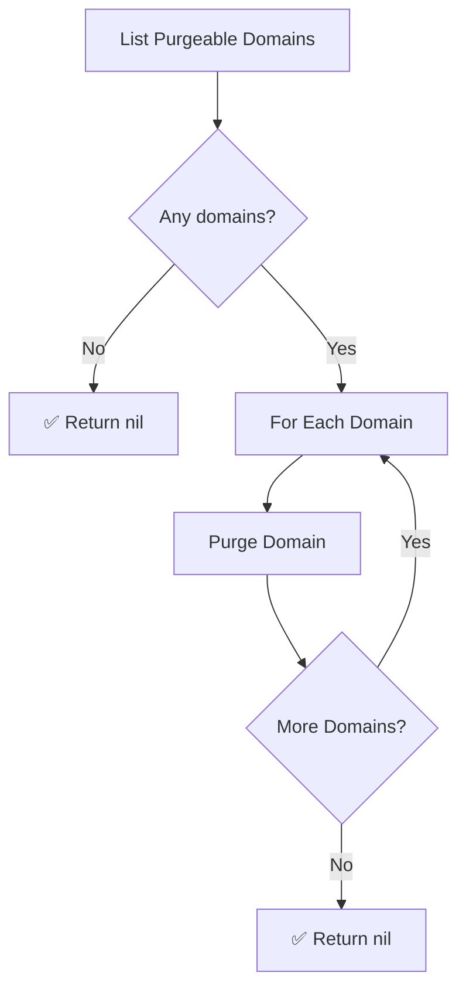

# Purge Loop Workflow

| Field | Value |
|-------|-------|
| **Status** | `ACTIVE` |
| **Queue** | `object-lifecycle` |
| **Category** | `lifecycle` |
| **Tags** | `lifecycle`, `domains`, `purge` |
| **Trigger** | `Schedule` |
| **Human-in-the-Loop** | `No` |
| **Launchpad Card** | `Read-only (scheduled)` |

## Overview

The Purge Loop is a scheduled workflow that runs every hour (with a 30-minute offset from the Expiry Loop) to permanently remove domains that have completed their redemption grace period and are eligible for purging. It lists all purgeable domains and deletes each one. Individual purge failures are logged but do not stop the loop.

## Flow Diagram



## Input

```go
func PurgeLoop(ctx workflow.Context) error
```

No input parameters. The workflow discovers purgeable domains dynamically.

## Output

Returns `error` only. Returns `nil` on success.

## Steps

### 1. List Purgeable Domains
- **Activity**: `activities.ListPurgeableDomains`
- **Timeout**: Start-to-close 1min
- **Retry**: Max 3 attempts, initial interval 1s, backoff coefficient 2.0, max interval 10min
- **Description**: Queries for domains that have passed the redemption grace period and are eligible for permanent deletion.

### 2. Purge Domain (per domain)
- **Activity**: `activities.PurgeDomain`
- **Timeout**: Same as above
- **Retry**: Same as above
- **Description**: Permanently removes the domain and its associated resources from the system. On failure, the domain is skipped with a log entry.

## Failure Modes

| Failure | Cause | Workflow Behavior | Manual Recovery |
|---------|-------|-------------------|-----------------|
| List query failure | DB connection issue | Workflow fails | Check DB health; next scheduled run will retry |
| Purge failure | Foreign key constraint, domain lock | Logs error, skips domain, continues | Investigate domain state, retry manually or wait for next run |

## Artifacts

No persistent artifacts produced. Domains are permanently removed from the database.

## Operational Notes

### Scheduling
Runs every hour at the 30-minute mark (offset from the Expiry Loop which runs on the hour).

### Monitoring
- Monitor for purge failures that repeat across runs — may indicate orphaned references.
- Track the count of purgeable domains over time to ensure the pipeline is flowing correctly (domains progressing through expiry → redemption → purge).

### Manual Intervention
- To force purge processing: trigger the workflow manually via API.
- The workflow is idempotent — re-running processes any currently purgeable domains.

---

> **Last updated**: 2025-06-23
> **Updated by**: Agent (initial documentation)
