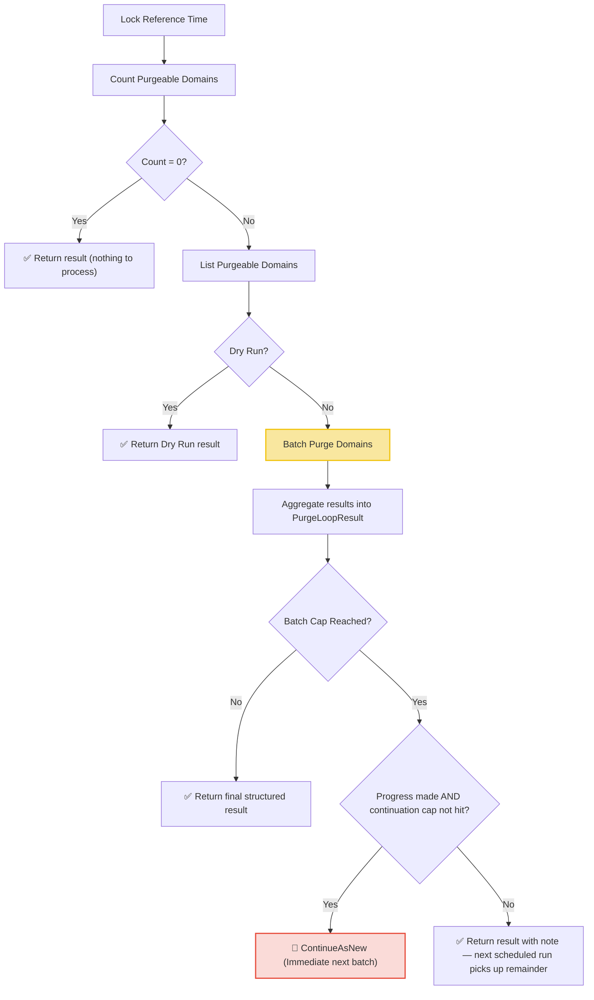

# Purge Loop Workflow

| Field | Value |
|-------|-------|
| **Status** | `ACTIVE` |
| **Queue** | `lifecycle` |
| **Category** | `lifecycle` |
| **Tags** | `lifecycle`, `domains`, `purge` |
| **Trigger** | `Schedule` / `REST` |
| **Human-in-the-Loop** | `No` |
| **Launchpad Card** | `Read-only (scheduled)` |

## Overview

The Purge Loop is a scheduled workflow that runs every hour to permanently remove domains that are `pendingDelete` and whose purge date has passed. It locks a single reference time which **both** the count and list queries evaluate — the cutoff is serialized to the admin API as the `before` parameter, so the server can no longer silently substitute its own `time.Now()` (a defect in the previous implementation, where the query object was accepted but never put on the wire; `ReferenceTimeOverride` and dry-run previews were no-ops as a result).

**Idempotency**: the batch purge activity reports already-purged domains (deleted by an earlier retry or concurrently) as `Skipped` instead of failing them, so activity retries converge.

**Hot-loop protection**: continue-as-new fires only when the run made progress (purged + skipped > 0) and at most `maxContinuationRuns` (50) times per scheduled run.

## Flow Diagram



## Input

```go
func PurgeLoop(ctx workflow.Context, params PurgeLoopParams) (PurgeLoopResult, error)

type PurgeLoopParams struct {
    BatchSize             int        `json:"batchSize,omitempty"`             // max domains listed/processed per run (default 1000)
    DryRun                bool       `json:"dryRun,omitempty"`
    ReferenceTimeOverride *time.Time `json:"referenceTimeOverride,omitempty"`
    ContinuationCount     int        `json:"continuationCount,omitempty"`     // managed by the workflow
}
```

## Output

```go
type PurgeLoopResult struct {
    StartedAt      time.Time          `json:"startedAt"`
    CompletedAt    time.Time          `json:"completedAt"`
    ReferenceTime  time.Time          `json:"referenceTime"`
    TotalFound     int64              `json:"totalFound"`
    TotalProcessed int                `json:"totalProcessed"`
    Purged         int                `json:"purged"`
    Failed         int                `json:"failed"`
    Skipped        int                `json:"skipped"`  // no-ops: already purged
    Notes          []string           `json:"notes"`
    Failures       []PurgeLoopFailure `json:"failures,omitempty"`
}

type PurgeLoopFailure struct {
    DomainName string `json:"domainName"`
    Error      string `json:"error"`
}
```

## Query Handler

The workflow exposes a `progress` query handler that returns the current `PurgeLoopResult` in real-time, allowing the UI to display live status and failure tables.

## Steps

### 1. Lock Reference Time
- **Description**: Captures `workflow.Now(ctx).UTC()` or uses the optional `ReferenceTimeOverride`. Serialized as the `before` cutoff on both count and list requests.

### 2. Count Purgeable Domains
- **Activity**: `activities.GetPurgeableDomainCount`
- **Timeout**: 1 minute
- **Description**: Counts domains that are `pendingDelete` with `purge_date <= before`.

### 3. List Purgeable Domains
- **Activity**: `activities.ListPurgeableDomains`
- **Timeout**: 1 minute
- **Description**: Retrieves purgeable domains at the same cutoff (up to `BatchSize`, default 1,000).

### 4. Batch Purge
- **Activity**: `BatchPurgeDomains` (struct method on `LifecycleActivities`)
- **Timeout**: 30 minutes (start-to-close), 2 minutes (heartbeat)
- **Description**: Permanently deletes the domains and their resources in chunks with heartbeats. **Idempotent**: already-deleted domains are reported as Skipped, not failed.

### 5. Continue As New (Guarded)
- **Description**: If the listed domains are fewer than the total found, continues-as-new — only when this run made progress and at most `maxContinuationRuns` (50) times.

## Failure Modes

| Failure | Cause | Workflow Behavior | Result Impact | Manual Recovery |
|---------|-------|-------------------|---------------|-----------------|
| Count query failure | DB/API connection issue | Workflow fails | `Notes` contains error message | Check API/DB health; retry run |
| List query failure | DB query timeout | Workflow fails | `Notes` contains error message | Same as above |
| Purge failure | DB constraint or lock | Records failure, continues | `Failed++`, failure added to `Failures` | Review failures list, fix DB/domain state |
| Batch cap hit, progress made | >BatchSize purgeable domains | `ContinueAsNew` immediately (max 50 chains) | Next run processes remainder | Automatic self-healing |
| Batch cap hit, no progress | Poison batch (all failing) | Completes with note — **no hot loop** | `Notes` explains | Investigate failures before next scheduled run |
| Activity retry after partial completion | Worker crash / timeout mid-batch | Already-purged domains are **skipped** on retry | `Skipped` counts no-ops | None needed — idempotent |

## Operational Notes

### Scheduling
Runs every hour at the 30-minute mark (offset from the Expiry Loop which runs on the hour).

### Invariants
- The reference time is locked once per run and shared by count + list (serialized as `before`).
- `DropCatch`-flagged domains produce an NNDN record before deletion.
- Domains in TLDs without an active GA phase are excluded by the repository query.

### Monitoring
- Watch counts (`TotalFound`, `Failed`, `Purged`, `Skipped`) in the Temporal UI.
- Use the `progress` query to check execution state in real-time.
- Heartbeat messages report chunk progress during batch activities.
- A run ending with the "no progress" note means a poison batch needs investigation.

---

> **Last updated**: 2026-07-16
> **Updated by**: Agent — query serialization fix, idempotent purge, guarded continue-as-new (see ADR 0004)
