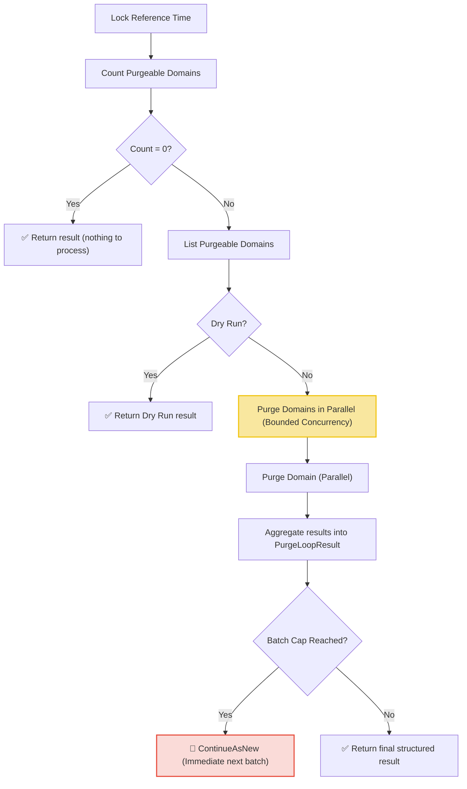

# Purge Loop Workflow

| Field | Value |
|-------|-------|
| **Status** | `ACTIVE` |
| **Queue** | `object-lifecycle` |
| **Category** | `lifecycle` |
| **Tags** | `lifecycle`, `domains`, `purge` |
| **Trigger** | `Schedule` / `REST` |
| **Human-in-the-Loop** | `No` |
| **Launchpad Card** | `Read-only (scheduled)` |

## Overview

The Purge Loop is a scheduled workflow that runs every hour to permanently remove domains that have completed their redemption grace period and are eligible for purging. It locks a reference time to count and list purgeable domains, checks progress concurrently using a worker pool with bounded concurrency, and aggregates outputs into a structured `PurgeLoopResult`. If the batch size is capped, it uses `ContinueAsNew` to drain the remainder immediately.

## Flow Diagram



## Input

```go
func PurgeLoop(ctx workflow.Context, params PurgeLoopParams) (PurgeLoopResult, error)

type PurgeLoopParams struct {
    BatchSize             int        `json:"batchSize,omitempty"`
    ConcurrencyLimit      int        `json:"concurrencyLimit,omitempty"`
    DryRun                bool       `json:"dryRun,omitempty"`
    ReferenceTimeOverride *time.Time `json:"referenceTimeOverride,omitempty"`
}
```

## Output

```go
type PurgeLoopResult struct {
    StartedAt      time.Time          `json:"startedAt"`
    CompletedAt    time.Time          `json:"completedAt"`
    TotalFound     int64              `json:"totalFound"`
    TotalProcessed int                `json:"totalProcessed"`
    Purged         int                `json:"purged"`
    Failed         int                `json:"failed"`
    Notes          []string           `json:"notes"`
    Failures       []PurgeLoopFailure `json:"failures,omitempty"`
}

type PurgeLoopFailure struct {
    DomainName string `json:"domainName"`
    Error      string `json:"error"`
}
```

## Query Handler

The workflow exposes a `progress` query handler that returns the current `PurgeLoopResult` in real-time, allowing the UI to display live status and failure tables.

## Steps

### 1. Count Purgeable Domains
- **Activity**: `activities.GetPurgeableDomainCount`
- **Timeout**: 1 minute
- **Description**: Queries for the count of domains eligible for purging.

### 2. List Purgeable Domains
- **Activity**: `activities.ListPurgeableDomains`
- **Timeout**: 1 minute
- **Description**: Retrieves expiring domains (up to 1,000 domains).

### 3. Parallel Purge Writes
- **Activity**: `activities.PurgeDomain`
- **Timeout**: 1 minute per activity
- **Description**: Permanently deletes the domains and their resources concurrently using a semaphore pattern (buffered channel) inside the workflow up to `ConcurrencyLimit` (default: 20).

### 4. Continue As New (Optional)
- **Description**: If the listed domains are fewer than the total found, the workflow executes a `ContinueAsNew` error to immediately begin processing the remaining domains.

## Failure Modes

| Failure | Cause | Workflow Behavior | Result Impact | Manual Recovery |
|---------|-------|-------------------|---------------|-----------------|
| Count query failure | DB connection issue | Workflow fails | `Notes` contains error message | Check DB health; retry run |
| List query failure | DB query timeout | Workflow fails | `Notes` contains error message | Same as above |
| Purge failure | DB constraint or lock | Records failure, continues | `Failed++`, failure added to `Failures` | Review failures list, fix DB/domain state |
| Batch cap hit | >1000 domains | Runs `ContinueAsNew` immediately | Next run processes remainder | Automatic self-healing |

## Operational Notes

### Scheduling
Runs every hour at the 30-minute mark (offset from the Expiry Loop which runs on the hour).

### Monitoring
- Watch counts (`TotalFound`, `Failed`, `Purged`) in the Temporal UI.
- Use `progress` query to check execution logs in real-time.

---

> **Last updated**: 2026-06-24
> **Updated by**: Agent (redesigned with parallel writes and progress tracking)
