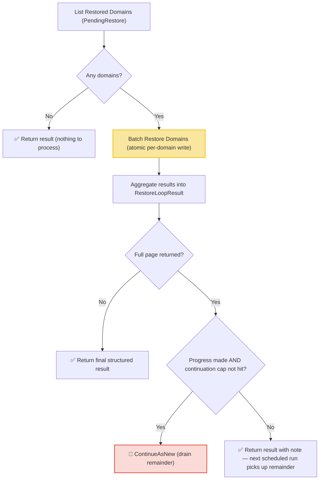

# Restore Workflow

| Field | Value |
|-------|-------|
| **Status** | `ACTIVE` |
| **Queue** | `lifecycle` |
| **Category** | `lifecycle` |
| **Tags** | `lifecycle`, `domains`, `restore` |
| **Trigger** | `Schedule` / `REST` |
| **Human-in-the-Loop** | `No` |
| **Launchpad Card** | `Read-only (scheduled)` |

## Overview

The Restore Workflow is a scheduled workflow that runs every 4 hours to finalize domain restorations. It lists domains currently in the `PendingRestore` state and processes them in a single batch activity call (`BatchRestoreDomains`).

**Atomicity**: for each domain, unsetting `PendingRestore` and the forced 1-year renewal are applied to the entity in memory and persisted with **one** `UpdateDomain` write. The previous implementation issued two independent writes (status update, then renewal) with manual compensation — a crash between them could leave a domain half-restored. That state is no longer reachable.

**Idempotency**: domains that are no longer `PendingRestore` (completed by an earlier retried attempt) are reported as `Skipped`, so activity retries can never double-renew or double-bill.

**Pagination**: the workflow processes one page (`BatchSize`, default 1,000) per run. When a full page is returned it continues-as-new to drain the remainder — guarded by a progress check and a continuation cap (`maxContinuationRuns`, 50) so a poison batch cannot hot-loop.

## Flow Diagram



## Input

```go
func RestoreWorkflow(ctx workflow.Context, params RestoreLoopParams) (RestoreLoopResult, error)

type RestoreLoopParams struct {
    BatchSize         int `json:"batchSize,omitempty"`         // max domains listed/processed per run (default 1000)
    ContinuationCount int `json:"continuationCount,omitempty"` // managed by the workflow
}
```

The workflow tolerates being started without arguments (all zero values), so existing schedules and manual triggers remain compatible.

## Output

```go
type RestoreLoopResult struct {
    StartedAt      time.Time        `json:"startedAt"`
    CompletedAt    time.Time        `json:"completedAt"`
    TotalFound     int              `json:"totalFound"`
    TotalProcessed int              `json:"totalProcessed"`
    Restored       int              `json:"restored"`
    Failed         int              `json:"failed"`
    Skipped        int              `json:"skipped"`  // no-ops: restore already completed
    Notes          []string         `json:"notes"`
    Failures       []RestoreFailure `json:"failures,omitempty"`
}

type RestoreFailure struct {
    DomainName string `json:"domainName"`
    Error      string `json:"error"`
}
```

## Query Handler

The workflow exposes a `progress` query handler that returns the current `RestoreLoopResult` in real-time, allowing operators to monitor progress.

## Steps

### 1. List Restored Domains
- **Activity**: `activities.ListRestoredDomains`
- **Timeout**: Start-to-close 1min
- **Retry**: Max 3 attempts, initial interval 1s, backoff coefficient 2.0, max interval 10min
- **Description**: Queries for domains with the `PendingRestore` status flag set (one page of up to `BatchSize`). Returns `DomainRestoredItem` structs containing the domain name and registrar client ID (`ClID`).

### 2. Batch Restore
- **Activity**: `BatchRestoreDomains` (struct method on `LifecycleActivities`)
- **Timeout**: 30 minutes (start-to-close), 2 minutes (heartbeat)
- **Description**: For each domain: fetch quote (billing), unset `PendingRestore`, force-renew 1 year (`restoreRenewalYears`), persist with a single write, publish a `domain.renewed` event carrying the quote. Grouped by TLD with cached phase lookups. **Idempotent**: domains no longer `PendingRestore` are skipped. A quote failure leaves the domain untouched.

### 3. Continue As New (Guarded)
- **Description**: When a full page was processed, continues-as-new to drain remaining `PendingRestore` domains — only if progress was made, and at most `maxContinuationRuns` (50) times.

## Failure Modes

| Failure | Cause | Workflow Behavior | Manual Recovery |
|---------|-------|-------------------|-----------------|
| List query failure | DB/API connection issue | Workflow fails entirely | Check API health; next run will retry |
| Batch restore failure (total) | Activity-level error | Workflow returns error | Check service health, retry run |
| Individual domain failure | Quote/billing error, TLD phase missing | Recorded in `Failures`; domain remains `PendingRestore` and is retried next run | Review failures, manually restore via API |
| Full page, no progress | Poison batch (all failing) | Completes with note — **no hot loop** | Investigate failures |
| Activity retry after partial completion | Worker crash / timeout mid-batch | Completed domains are **skipped** on retry | None needed — idempotent |

## Artifacts

No persistent artifacts produced. Domain state changes are reflected directly in the database.

## Operational Notes

### Scheduling
Runs every 4 hours (offset from Expiry Loop and Purge Loop to distribute load).

### Invariants
- Restore completion is a single DB write per domain — no half-restored state is reachable.
- The forced renewal is always exactly 1 year (`restoreRenewalYears`) and emits one `domain.renewed` event with the quote attached.

### Monitoring
- Watch counts (`TotalFound`, `Failed`, `Restored`, `Skipped`) in the Temporal UI.
- Use the `progress` query to check execution status in real-time.
- Monitor for domains that repeatedly fail restoration across multiple runs — these may need manual intervention.

### Manual Intervention
- To force restore processing: trigger the workflow manually via API (`restore-workflow`, optional `batchSize` param).
- For domains stuck in a failed state: manually renew via API and unset `PendingRestore`.
- The workflow is idempotent — re-running processes any currently `PendingRestore` domains.

---

> **Last updated**: 2026-07-16
> **Updated by**: Agent — atomic single-write restore, idempotency, pagination with guarded continue-as-new (see ADR 0004)
