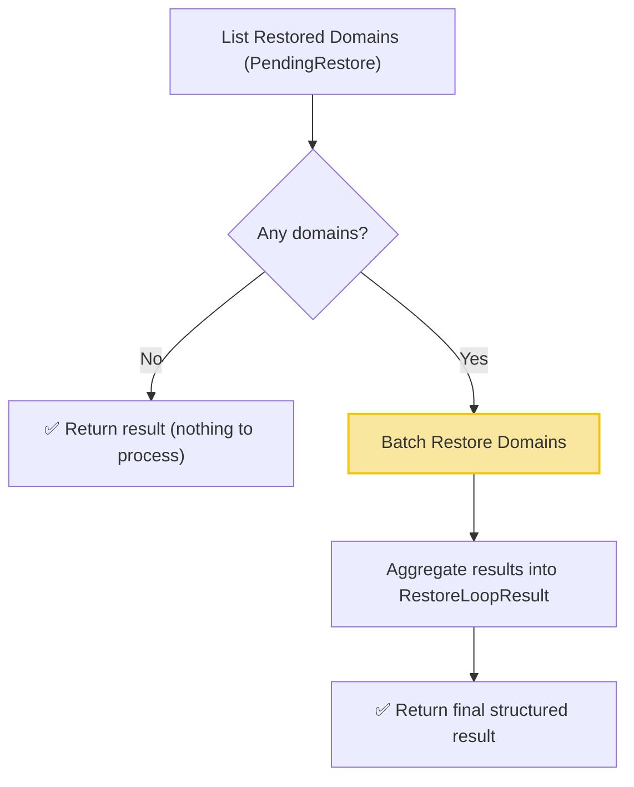

# Restore Workflow

| Field | Value |
|-------|-------|
| **Status** | `ACTIVE` |
| **Queue** | `object-lifecycle` |
| **Category** | `lifecycle` |
| **Tags** | `lifecycle`, `domains`, `restore` |
| **Trigger** | `Schedule` |
| **Human-in-the-Loop** | `No` |
| **Launchpad Card** | `Read-only (scheduled)` |

## Overview

The Restore Workflow is a scheduled workflow that runs every 4 hours to finalize domain restorations. It lists domains currently in the `PendingRestore` state and processes them in a single batch activity call (`BatchRestoreDomains`), which handles unsetting the status flag and performing the forced renewal internally. The workflow returns a structured `RestoreLoopResult` with counts and failure details.

## Flow Diagram



## Input

```go
func RestoreWorkflow(ctx workflow.Context) (RestoreLoopResult, error)
```

No input parameters. The workflow discovers `PendingRestore` domains dynamically.

## Output

```go
type RestoreLoopResult struct {
    StartedAt      time.Time        `json:"startedAt"`
    CompletedAt    time.Time        `json:"completedAt"`
    TotalFound     int              `json:"totalFound"`
    TotalProcessed int              `json:"totalProcessed"`
    Restored       int              `json:"restored"`
    Failed         int              `json:"failed"`
    Notes          []string         `json:"notes"`
    Failures       []RestoreFailure `json:"failures,omitempty"`
}

type RestoreFailure struct {
    DomainName string `json:"domainName"`
    Error      string `json:"error"`
}
```

## Query Handler

The workflow exposes a `progress` query handler that returns the current `RestoreLoopResult` in real-time, allowing operators to monitor progress.

## Steps

### 1. List Restored Domains
- **Activity**: `activities.ListRestoredDomains`
- **Timeout**: Start-to-close 1min
- **Retry**: Max 3 attempts, initial interval 1s, backoff coefficient 2.0, max interval 10min
- **Description**: Queries for all domains with the `PendingRestore` status flag set. Returns a list of `DomainRestoredItem` structs containing the domain name and registrar client ID (`ClID`).

### 2. Batch Restore
- **Activity**: `BatchRestoreDomains` (struct method on `LifecycleActivities`)
- **Timeout**: 30 minutes (start-to-close), 2 minutes (heartbeat)
- **Description**: Restores all listed domains in a single batch activity call. Processes domains in chunks internally with heartbeats. Handles unsetting the `PendingRestore` status and performing forced 1-year renewals.

## Failure Modes

| Failure | Cause | Workflow Behavior | Manual Recovery |
|---------|-------|-------------------|-----------------|
| List query failure | DB connection issue | Workflow fails entirely | Check DB health; next run will retry |
| Batch restore failure (total) | Activity-level error | Workflow returns error | Check service health, retry run |
| Individual domain failure | Billing error, domain lock | Recorded in `Failures` list | Review failures, manually restore via API |

## Artifacts

No persistent artifacts produced. Domain state changes are reflected directly in the database.

## Operational Notes

### Scheduling
Runs every 4 hours (offset from Expiry Loop and Purge Loop to distribute load).

### Monitoring
- Watch counts (`TotalFound`, `Failed`, `Restored`) in the Temporal UI.
- Use `progress` query to check execution status in real-time.
- Monitor for domains that repeatedly fail restoration across multiple runs — these may need manual intervention.

### Manual Intervention
- To force restore processing: trigger the workflow manually via API.
- For domains stuck in a failed state: manually renew via API and unset `PendingRestore`.
- The workflow is idempotent — re-running processes any currently `PendingRestore` domains.

---

> **Last updated**: 2026-06-29
> **Updated by**: Agent (refactored to batch activities with structured result)
