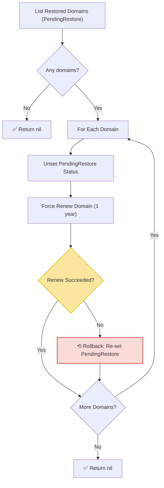

# Restore Workflow

| Field | Value |
|-------|-------|
| **Status** | `ACTIVE` |
| **Queue** | `object-lifecycle` |
| **Category** | `lifecycle` |
| **Tags** | `lifecycle`, `domains`, `restore` |
| **Trigger** | `Schedule` |
| **Human-in-the-Loop** | `No` |
| **Launchpad Card** | `Read-only (scheduled)` |

## Overview

The Restore Workflow is a scheduled workflow that runs every hour (with a 15-minute offset) to finalize domain restorations. It processes domains currently in the `PendingRestore` state by removing that status flag and performing a forced 1-year renewal. If the renewal fails, it rolls back by re-setting the `PendingRestore` status so the domain can be retried on the next run. Individual domain failures are logged but do not halt the loop.

## Flow Diagram



## Input

```go
func RestoreWorkflow(ctx workflow.Context) error
```

No input parameters. The workflow discovers `PendingRestore` domains dynamically.

## Output

Returns `error` only. Returns `nil` on success.

## Steps

### 1. List Restored Domains
- **Activity**: `activities.ListRestoredDomains`
- **Timeout**: Start-to-close 1min
- **Retry**: Max 3 attempts, initial interval 1s, backoff coefficient 2.0, max interval 10min
- **Description**: Queries for all domains with the `PendingRestore` status flag set. Returns a list of `DomainRestoredItem` structs containing the domain name and registrar client ID (`ClID`).

### 2. Unset PendingRestore Status (per domain)
- **Activity**: `activities.UnSetDomainStatus`
- **Input**: `ToggleDomainStatusCommand{DomainName, Status: PendingRestore, CorrelationID: workflowID}`
- **Timeout**: Same as above
- **Retry**: Same as above
- **Description**: Removes the `PendingRestore` status flag from the domain. On failure, logs a warning and continues to attempt the renewal.

### 3. Force Renew Domain (per domain)
- **Activity**: `activities.RenewDomain`
- **Input**: `workflowID, RenewDomainCommand{Name, ClID, Years: 1}, true (force)`
- **Timeout**: Same as above
- **Retry**: Same as above
- **Description**: Performs a forced renewal of the domain for 1 year. The `force` flag bypasses normal eligibility checks since this is a restoration.

### 4. (Rollback) Re-set PendingRestore Status
- **Activity**: `activities.SetDomainStatus`
- **Input**: Same `ToggleDomainStatusCommand` as step 2
- **Trigger**: Only executed if the Force Renew in step 3 fails
- **Timeout**: Same as above
- **Retry**: Same as above
- **Description**: If the renewal fails, the `PendingRestore` status is re-applied so the domain will be picked up on the next scheduled run for retry. This is the rollback/compensation mechanism.

## Failure Modes

| Failure | Cause | Workflow Behavior | Manual Recovery |
|---------|-------|-------------------|-----------------|
| List query failure | DB connection issue | Workflow fails entirely | Check DB health; next run will retry |
| Unset status failure | Domain not found, concurrent modification | Logs warning, continues to renew attempt | Investigate domain state |
| Renew failure | Billing error, domain lock, system error | Rolls back: re-sets `PendingRestore`, continues loop | Check renewal service, fix domain manually |
| Rollback failure | DB error during re-set | Logs error — domain is left without `PendingRestore` and without renewal | **Critical**: manually re-set status or renew domain |

## Artifacts

No persistent artifacts produced. Domain state changes are reflected directly in the database.

## Operational Notes

### Scheduling
Runs every hour at the 15-minute mark (offset from Expiry Loop and Purge Loop to distribute load).

### Monitoring
- Monitor for domains that repeatedly fail renewal across multiple runs — these may need manual intervention.
- Watch for rollback failures (the "double failure" scenario where both renew and re-set fail), as these leave domains in an inconsistent state.
- Track the count of `PendingRestore` domains — a growing count indicates the restore pipeline is falling behind.

### Manual Intervention
- To force restore processing: trigger the workflow manually via API.
- For domains stuck in a failed state: manually renew via API and unset `PendingRestore`.
- The workflow is idempotent — re-running processes any currently `PendingRestore` domains.

---

> **Last updated**: 2025-06-23
> **Updated by**: Agent (initial documentation)
