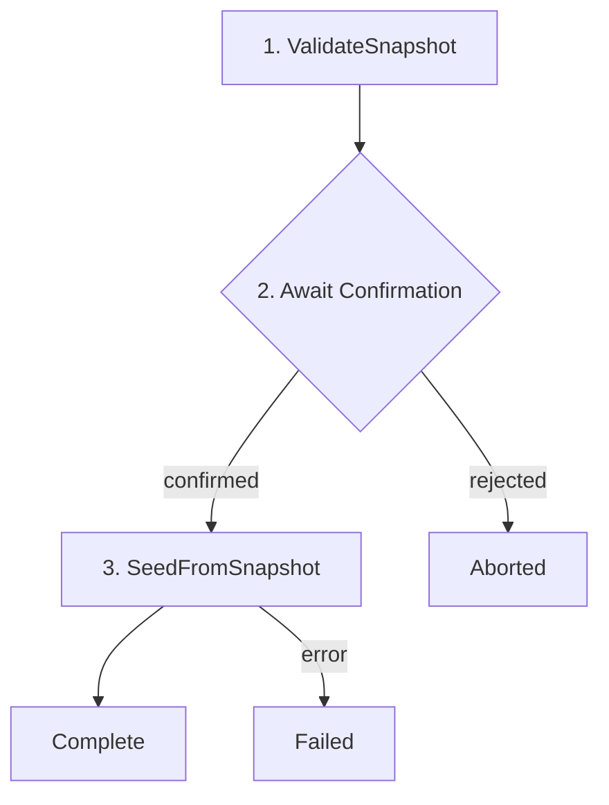

# Seed from Snapshot

---

| Field | Value |
|-------|-------|
| **Status** | `ACTIVE` |
| **Queue** | `data-pipeline` |
| **Category** | `operations` |
| **Tags** | `operations`, `snapshot`, `seed`, `import` |
| **Trigger** | `API` |
| **Human-in-the-Loop** | `Yes` — signal: `ConfirmSeedFromSnapshot` |
| **Launchpad Card** | `Yes` |

## Overview

Populates a PostgreSQL database from a previously taken JSONL snapshot. The workflow first validates the snapshot and displays table counts for operator review. After the operator confirms via signal, it streams the JSONL file from S3 and inserts rows into Postgres using `ON CONFLICT DO NOTHING` for idempotent, gap-filling behavior.

> **Important:** This workflow uses `ON CONFLICT DO NOTHING` — it will **not** overwrite existing rows. It is designed to populate an empty or partially-populated database. Existing rows are skipped, not updated. This makes it safe to retry without data loss.

> **Note:** The `domain_events` table is not included in snapshots and will not be seeded.

## Flow Diagram



## Input

```go
type SeedFromSnapshotParams struct {
    SnapshotKey string // S3 key prefix, e.g. "snapshot-pre-migration-20260625-080000"
}
```

**Example JSON:**
```json
{
  "snapshotKey": "snapshot-pre-migration-20260625-080000"
}
```

## Output

```go
type SeedFromSnapshotResult struct {
    InsertedCounts map[string]int64
    SkippedCounts  map[string]int64
    TotalInserted  int64
    TotalSkipped   int64
}
```

## Steps

### 1. Validate Snapshot
- **Activity**: `ValidateSnapshot`
- **Timeout**: Start-to-close 5m
- **Retry**: Max 3 attempts
- **Description**: Downloads `manifest.json` from the snapshot folder. Validates the snapshot JSONL file exists. Returns table counts for operator review.

### 2. Await Confirmation
- **Activity**: None — signal wait
- **Description**: Pauses and waits for the `ConfirmSeedFromSnapshot` signal (bool). The operator reviews the table counts displayed in the UI. If rejected (`false`), the workflow aborts.

### 3. Seed from Snapshot
- **Activity**: `SeedFromSnapshot`
- **Timeout**: Start-to-close 12h, Heartbeat 5m
- **Retry**: Max 3 attempts
- **Description**: Streams the JSONL file from S3, decodes each line, and inserts into Postgres. Uses `ON CONFLICT DO NOTHING` for idempotent inserts. Processes in FK-safe order (the JSONL is already ordered). Batches inserts (1000 rows) with heartbeats. Returns per-table inserted/skipped counts.

## Signals

| Signal Name | Payload Type | Description |
|-------------|-------------|-------------|
| `ConfirmSeedFromSnapshot` | `bool` | `true` to proceed with seeding, `false` to abort |

## Failure Modes

| Failure | Cause | Workflow Behavior | Manual Recovery |
|---------|-------|-------------------|-----------------|
| Snapshot not found | Invalid key or deleted | Fails at validation | Verify S3 key, retry |
| S3 download failure | MinIO/B2 down | Retries up to 3 times | Check S3 connectivity |
| DB write error | Postgres connection drop | Retries up to 3 times | Check DB health |
| FK violation | Snapshot data inconsistent | Row skipped (ON CONFLICT DO NOTHING) | Investigate snapshot integrity |

## Artifacts

| Artifact | Storage | Purpose |
|----------|---------|---------|
| Source snapshot | S3: `snapshot-{label}-{timestamp}/` | The JSONL file being read |

## Operational Notes

### Scheduling
Not scheduled. Triggered manually when seeding a new environment.

### Monitoring
Query the workflow state via the `"state"` query handler to see current phase, table counts, inserted/skipped counts, and current table being processed.

### Manual Intervention
Launch from the Launchpad UI by providing the snapshot S3 key prefix. After validation, confirm via the signal button in the UI.

---

> **Last updated**: 2026-06-25
