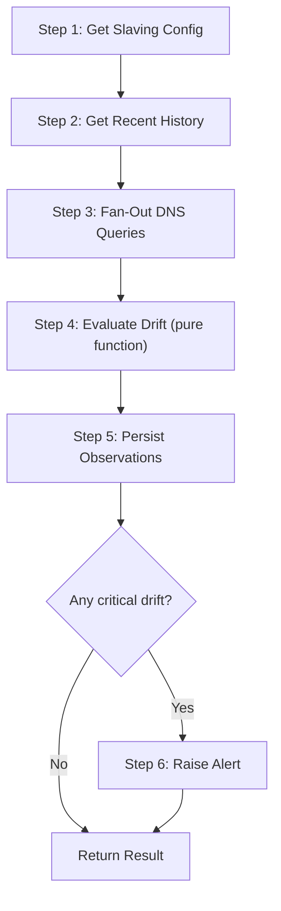

# Serial Drift Monitor — `CheckSerialDriftWorkflow`

| Field | Value |
|-------|-------|
| **Status** | `ACTIVE` |
| **Queue** | `data-pipeline` |
| **Category** | `operations` |
| **Tags** | `operations`, `dns`, `serial`, `drift`, `monitoring` |
| **Trigger** | `API` / `Schedule` |
| **Human-in-the-Loop** | `No` |
| **Launchpad Card** | `Yes` |

## Overview

The Serial Drift Monitor workflow queries all configured master and slave nameservers for a zone's SOA serial number, compares them using RFC 1982 serial number arithmetic, detects stalled propagation by analyzing historical observation trends, and raises alerts when critical drift is detected. It is designed to run on a schedule (e.g., every 5 minutes) for each monitored zone slaving configuration.

## Flow Diagram



## Input

```go
type SerialDriftParams struct {
    TenantID  string `json:"tenantId"`   // Tenant identifier
    SlavingID string `json:"slavingId"`  // Zone slaving config ID
    Zone      string `json:"zone"`       // DNS zone name (e.g., "example.com")
}
```

**Example JSON:**
```json
{
  "tenantId": "tenant-abc",
  "slavingId": "slaving-xyz",
  "zone": "example.com"
}
```

## Output

```go
type SerialDriftResult struct {
    RunID        string           `json:"runId"`
    StartedAt    time.Time        `json:"startedAt"`
    CompletedAt  time.Time        `json:"completedAt"`
    MasterSerial uint32           `json:"masterSerial"`
    SOARefresh   uint32           `json:"soaRefresh"`
    SOARetry     uint32           `json:"soaRetry"`
    SOAExpire    uint32           `json:"soaExpire"`
    Observations []ObservationRef `json:"observations"`
    DriftStatus  string           `json:"driftStatus"`
    Notes        []string         `json:"notes"`
}
```

## Steps

### 1. Get Slaving Config
- **Activity**: `GetSlavingConfig`
- **Timeout**: Start-to-close 30s
- **Retry**: Max 3 attempts, backoff coefficient 2.0
- **Description**: Retrieves the zone slaving configuration from the `zone_slavings` table, including master/slave nameserver lists and stall detection thresholds.

### 2. Get Recent History
- **Activity**: `GetRecentHistory`
- **Timeout**: Start-to-close 30s
- **Retry**: Max 3 attempts, backoff coefficient 2.0
- **Description**: Fetches recent drift observations joined with their runs, ordered newest first. Used for consecutive-stall detection. Limit is `stalledAfterN + 1`.

### 3. Fan-Out DNS Queries
- **Activity**: `QuerySOASerial` (called N times concurrently)
- **Timeout**: Start-to-close 30s per query
- **Retry**: Max 3 attempts, backoff coefficient 2.0
- **Description**: Uses `workflow.Go` to concurrently query every master and slave nameserver. Each query always returns `(result, nil)` — DNS errors are captured in the result's `Error` field so the workflow can gracefully handle partial failures.

### 4. Evaluate Drift
- **Not an activity** — pure, deterministic function
- **Description**: Compares each slave's SOA serial against the master using RFC 1982 serial number arithmetic:
  - **converged**: slave serial == master serial
  - **lagging** (expected): slave behind master, not yet stalled
  - **stalled** (critical): slave stuck at same serial for `stalledAfterN` consecutive runs while master advanced
  - **unreachable** (warning): DNS query returned an error
  - **lagging** (warning): slave ahead of master (unusual, per RFC 1982 wraparound)

### 5. Persist Observations
- **Activity**: `PersistObservations`
- **Timeout**: Start-to-close 30s
- **Retry**: Max 3 attempts, backoff coefficient 2.0
- **Description**: Creates a `drift_runs` record and individual `drift_observations` records in a single DB transaction.

### 6. Raise Alert (conditional)
- **Activity**: `RaiseAlert`
- **Timeout**: Start-to-close 30s
- **Retry**: Max 3 attempts, backoff coefficient 2.0
- **Description**: Called only if any observation has `driftTier == "critical"`. Currently logs the alert; future integration with PagerDuty/Slack. Alert failures do not fail the workflow.

## Failure Modes

| Failure | Cause | Workflow Behavior | Manual Recovery |
|---------|-------|-------------------|-----------------|
| Master nameserver unreachable | Network issue, DNS misconfiguration | Workflow fails with "no reachable master" error, drift status = "unknown" | Check master NS health, retry workflow |
| All slave queries fail | Network partition | Workflow completes with all observations as "unreachable", drift status = "warning" | Investigate network connectivity |
| DB unavailable | PostgreSQL down | Activity retries up to 3 times, then workflow fails | Check DB health, retry workflow |
| Stall false positive | Observation history too short | Requires `stalledAfterN` consecutive stalled observations — short history cannot trigger critical | Adjust `stalledAfterN` threshold |

## Artifacts

| Artifact | Storage | Purpose |
|----------|---------|---------|
| `drift_runs` record | PostgreSQL | Run metadata: master serial, SOA params, drift status |
| `drift_observations` records | PostgreSQL | Per-nameserver observation: serial, status, drift tier |

## Operational Notes

### Scheduling
Schedule via Temporal schedules or API trigger. Recommended interval: every 5 minutes per monitored zone.

### Monitoring
- Query the `progress` query handler for in-flight status
- Monitor `drift_runs.drift_status` for `critical` values
- Alert on consecutive `critical` runs

### Manual Intervention
- Adjust `zone_slavings.stalled_after_n` to tune stall detection sensitivity
- Manually trigger via Temporal UI or Launchpad for ad-hoc checks
- Cancel running workflows via Temporal UI if DNS infrastructure is under maintenance

---

> **Last updated**: 2026-06-30
> **Updated by**: AI assistant
