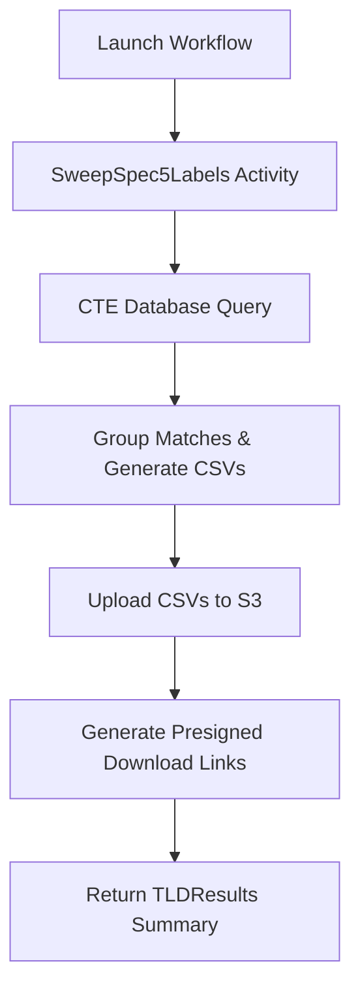

# Spec5 Domain Sweep Workflow

---

| Field | Value |
|-------|-------|
| **Status** | `ACTIVE` |
| **Queue** | `data-pipeline` |
| **Category** | `operations` |
| **Tags** | `operations`, `spec5`, `sweep` |
| **Trigger** | `API` / `CLI` |
| **Human-in-the-Loop** | `No` |
| **Launchpad Card** | `Yes` |

## Overview

Sweeps the domain inventory to return a list of ICANN Spec5 labels (reserved or blocked names) that exist as registered domains. It helps operators identify if any restricted labels have been registered.

## Flow Diagram



## Input

```go
type Spec5SweepParams struct {
	TLD     string   `json:"tld,omitempty"`     // A single TLD to check, e.g. "com"
	TLDs    []string `json:"tlds,omitempty"`    // A list of TLDs to check, e.g. ["com", "net"]
	AllTLDs bool     `json:"allTlds,omitempty"` // If true, checks the entire system (all TLDs in db)
}
```

**Example JSON:**
```json
{
  "tlds": ["com", "net"],
  "allTlds": false
}
```

## Output

```go
type Spec5SweepResult struct {
	TLDResults map[string]Spec5SweepTLDResult `json:"tldResults"`
}

type Spec5SweepTLDResult struct {
	Count       int64  `json:"count"`                 // Number of matching domains found
	ArtifactKey string `json:"artifactKey,omitempty"` // S3 key of the matching domains CSV
	DownloadURL string `json:"downloadUrl,omitempty"` // Presigned S3 GET URL
}
```

## Steps

### 1. Spec5 Sweep
- **Activity**: `SweepSpec5Labels`
- **Timeout**: Start-to-close 10m
- **Retry**: Max 3 attempts, backoff coefficient 2.0
- **Description**: Runs a single raw SQL CTE query, groups matches, creates CSVs, uploads them, and generates presigned links.

## Failure Modes

| Failure | Cause | Workflow Behavior | Manual Recovery |
|---------|-------|-------------------|-----------------|
| Database timeout / connection error | Network issues or slow database server | Retries up to 3 times, then fails | Verify database health, check DATABASE_URL, and retry |
| S3 upload failure | MinIO service offline or bucket missing | Retries up to 3 times, then fails | Verify MinIO service and bucket configuration |

## Artifacts

| Artifact | Storage | Purpose |
|----------|---------|---------|
| `spec5-sweep/{wfId}/{tld}-matching-spec5.csv` | S3/MinIO | List of matching domains, labels, and types |

## Operational Notes

### Scheduling
This workflow is run on-demand via the Launchpad API.

### Monitoring
Check Temporal Web UI logs and worker standard output for any database query execution metrics or S3 upload trace heartbeats.

---

> **Last updated**: 2026-06-25
> **Updated by**: Antigravity
