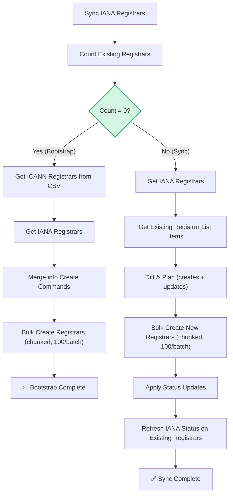

# Sync Registrars Workflow

| Field | Value |
|-------|-------|
| **Status** | `ACTIVE` |
| **Queue** | `object-lifecycle` |
| **Category** | `operations` |
| **Tags** | `operations`, `registrars`, `sync` |
| **Trigger** | `Schedule` / `API` |
| **Human-in-the-Loop** | `No` |
| **Launchpad Card** | `Read-only (scheduled)` |

## Overview

The Sync Registrars Workflow keeps the system's registrar data in sync with IANA and ICANN sources. It operates in two distinct modes: **Bootstrap** (when zero registrars exist in the system) imports registrars from a local ICANN CSV file merged with IANA data, while **Sync** (when registrars already exist) computes a diff between current IANA data and the existing registrar records, then applies creates, status updates, and IANA status refreshes. The workflow runs daily on a schedule and can also be triggered manually via API.

## Flow Diagram



## Input

```go
func SyncRegistrarsWorkflow(ctx workflow.Context, batchsize int) error
```

- `batchsize` (`int`): Controls how many registrars to fetch per batch from IANA/internal APIs.

**Example JSON:**
```json
{
  "batchsize": 500
}
```

## Output

No output struct — returns `error` only. Success is indicated by a `nil` return.

## Steps

### 1. Sync IANA Registrars
- **Activity**: `activities.SyncIanaRegistrars`
- **Timeout**: Start-to-close 1min
- **Retry**: Max 3 attempts, initial interval 1s, backoff coefficient 2.0, max interval 10min
- **Description**: Downloads and syncs the latest IANA registrar data into the local IANA registrar store.

### 2. Count Existing Registrars
- **Activity**: `activities.CountRegistrars`
- **Timeout**: Same as above
- **Retry**: Same as above
- **Description**: Counts the number of registrars currently in the system. Determines which path (Bootstrap or Sync) to follow.

### Bootstrap Path (Count = 0)

#### 3a. Get ICANN Registrars from CSV
- **Activity**: `activities.GetICANNRegistrars`
- **Timeout**: Same as above
- **Retry**: Same as above
- **Description**: Reads ICANN registrar data from the local CSV file (`./initdata/icannRegistrarList.csv`).

#### 4a. Get IANA Registrars
- **Activity**: `activities.GetIANARegistrars`
- **Timeout**: Same as above
- **Retry**: Same as above
- **Description**: Fetches all IANA registrar records from the local store in batches.

#### 5a. Merge into Create Commands
- **Activity**: `activities.MakeCreateRegistrarCommands`
- **Timeout**: Same as above
- **Retry**: Same as above
- **Description**: Merges ICANN CSV data with IANA data to produce a list of `CreateRegistrarCommand` objects.

#### 6a. Bulk Create Registrars
- **Function**: `activities.BulkCreateRegistrars` (called directly, chunked in batches of 100)
- **Description**: Creates all registrars in the system. Processes commands in chunks of 100.

### Sync Path (Count > 0)

#### 3b. Get IANA Registrars
- **Activity**: `activities.GetIANARegistrars`
- **Timeout**: Same as above
- **Retry**: Same as above
- **Description**: Fetches all current IANA registrar records.

#### 4b. Get Existing Registrar List Items
- **Activity**: `activities.GetRegistrarListItems`
- **Timeout**: Same as above
- **Retry**: Same as above
- **Description**: Fetches all existing registrar records from the system for comparison.

#### 5b. Diff & Plan
- **Activity**: `activities.DiffAndPlanRegistrars`
- **Timeout**: Same as above
- **Retry**: Same as above
- **Description**: Computes the difference between IANA data and existing registrars. Produces a plan with creates (new registrars) and updates (status changes).

#### 6b. Apply Creates
- **Function**: `activities.BulkCreateRegistrars` (chunked in batches of 100)
- **Description**: Creates newly discovered registrars.

#### 7b. Apply Status Updates
- **Activity**: `activities.SetRegistrarStatus` (per registrar)
- **Timeout**: Same as above
- **Retry**: Same as above
- **Description**: Updates the status of registrars whose IANA status has changed.

#### 8b. Refresh IANA Status
- **Activity**: `activities.SetRegistrarIANAStatus` (per registrar)
- **Timeout**: Same as above
- **Retry**: Same as above
- **Description**: Ensures the IANA status field is current on all existing registrars that have a match in the IANA data.

## Failure Modes

| Failure | Cause | Workflow Behavior | Manual Recovery |
|---------|-------|-------------------|-----------------|
| IANA sync failure | Network error fetching IANA data | Workflow fails immediately | Check network, retry on next schedule |
| Count query failure | DB connection issue | Workflow fails | Check DB health, retry manually |
| Bulk create partial failure | DB constraint or timeout | Fails mid-chunk; prior chunks committed | Re-run workflow — bootstrap is not fully idempotent |
| Status update failure | Individual registrar not found | Logs error, continues to next registrar | Review logs, fix data manually |

## Artifacts

| Artifact | Storage | Purpose |
|----------|---------|---------|
| IANA registrar data | Local IANA store (DB) | Cached IANA data for diff/sync |
| ICANN CSV | `./initdata/icannRegistrarList.csv` | Bootstrap seed data |

## Operational Notes

### Scheduling
Runs daily on a schedule. Also triggerable via API for immediate sync.

### Monitoring
- Monitor for bootstrap vs. sync path — if the system unexpectedly has zero registrars, investigate before the next scheduled run.
- Watch for status update errors in logs — these may indicate data inconsistencies.
- The 1-minute start-to-close timeout is tight for large batch operations; monitor for timeout-related retries.

### Manual Intervention
- To force a full re-sync: trigger the workflow manually via API.
- Bootstrap only runs once (when count is zero). After initial setup, the workflow always takes the sync path.
- If the ICANN CSV file needs updating, replace `./initdata/icannRegistrarList.csv` before running bootstrap.

---

> **Last updated**: 2025-06-23
> **Updated by**: Agent (initial documentation)
