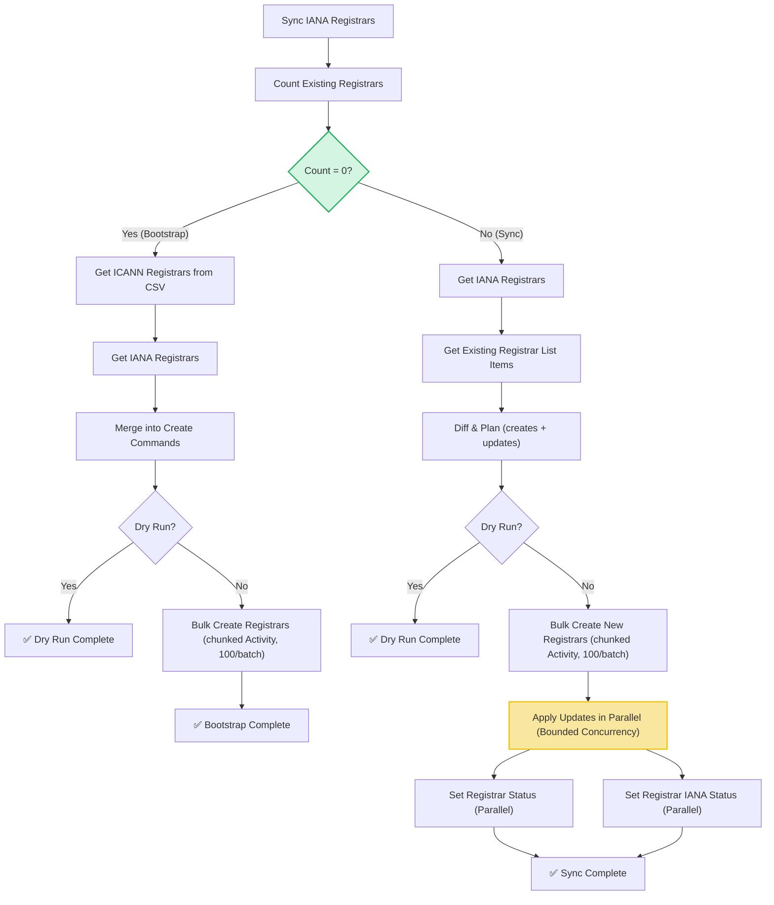

# Sync Registrars Workflow

| Field | Value |
|-------|-------|
| **Status** | `ACTIVE` |
| **Queue** | `object-lifecycle` |
| **Category** | `operations` |
| **Tags** | `operations`, `registrars`, `sync` |
| **Trigger** | `Schedule` / `API` |
| **Human-in-the-Loop** | `No` |
| **Launchpad Card** | `Read-only (scheduled)` |

## Overview

The Sync Registrars Workflow keeps the system's registrar data in sync with IANA and ICANN sources. It operates in two distinct modes: **Bootstrap** (when zero registrars exist in the system) imports registrars from a local ICANN CSV file merged with IANA data, while **Sync** (when registrars already exist) computes a diff between current IANA data and the existing registrar records, then applies creates, status updates, and IANA status refreshes. The workflow applies creates in chunked activities and updates in parallel with bounded concurrency.

## Flow Diagram



## Input

```go
func SyncRegistrarsWorkflow(ctx workflow.Context, params SyncRegistrarsParams) (SyncRegistrarsResult, error)

type SyncRegistrarsParams struct {
    BatchSize        int  `json:"batchSize,omitempty"`
    ConcurrencyLimit int  `json:"concurrencyLimit,omitempty"`
    DryRun           bool `json:"dryRun,omitempty"`
}
```

## Output

```go
type SyncRegistrarsResult struct {
    StartedAt      time.Time               `json:"startedAt"`
    CompletedAt    time.Time               `json:"completedAt"`
    TotalProcessed int                     `json:"totalProcessed"`
    Created        int                     `json:"created"`
    Updated        int                     `json:"updated"`
    Failed         int                     `json:"failed"`
    Notes          []string                `json:"notes"`
    Failures       []SyncRegistrarsFailure `json:"failures,omitempty"`
}

type SyncRegistrarsFailure struct {
    ClID      string `json:"clId"`
    Operation string `json:"operation"` // "create", "update-status", "update-iana-status"
    Error     string `json:"error"`
}
```

## Query Handler

The workflow exposes a `progress` query handler that returns the current `SyncRegistrarsResult` in real-time, allowing operators to monitor the status of creates and parallel updates.

## Steps

### 1. Sync IANA Registrars
- **Activity**: `activities.SyncIanaRegistrars`
- **Description**: Downloads and syncs the latest IANA registrar data into the local store.

### 2. Count Existing Registrars
- **Activity**: `activities.CountRegistrars`
- **Description**: Counts registrars in the database. Determines if bootstrap is required.

### Bootstrap Path (Count = 0)

#### 3a. Get ICANN Registrars
- **Activity**: `activities.GetICANNRegistrars`
- **Description**: Reads ICANN seed data from the local CSV list.

#### 4a. Get IANA Registrars
- **Activity**: `activities.GetIANARegistrars`
- **Description**: Fetches current IANA registrar records.

#### 5a. Merge into Create Commands
- **Activity**: `activities.MakeCreateRegistrarCommands`
- **Description**: Compiles CSV and IANA data into create instructions.

#### 6a. Bulk Create Registrars
- **Activity**: `activities.BulkCreateRegistrars` (called via `ExecuteActivity`, chunked 100/batch)
- **Description**: Performs database inserts for the bootstrap batch.

### Sync Path (Count > 0)

#### 3b. Diff & Plan
- **Activity**: `activities.DiffAndPlanRegistrars`
- **Description**: Compiles a plan of creates and updates comparing cached IANA data with the system's registrars.

#### 4b. Apply Creates
- **Activity**: `activities.BulkCreateRegistrars` (chunked 100/batch)
- **Description**: Creates newly accredited registrars.

#### 5b. Parallel Updates
- **Activities**: `activities.SetRegistrarStatus` and `activities.SetRegistrarIANAStatus`
- **Description**: Updates statuses concurrently using a semaphore pattern (buffered channel) inside the workflow up to `ConcurrencyLimit` (default: 20).

## Failure Modes

| Failure | Cause | Workflow Behavior | Manual Recovery |
|---------|-------|-------------------|-----------------|
| IANA sync failure | Network error fetching IANA data | Workflow fails immediately | Check connectivity, retry run |
| Count query failure | DB connection issue | Workflow fails | Check DB health, retry run |
| Bulk create failure | DB constraint or timeout | Fails chunk; returns error | Re-run workflow (creates are idempotent) |
| Update failure | DB lock or individual error | Records failure, continues | Review failures table, fix registrar state |

---

> **Last updated**: 2026-06-24
> **Updated by**: Agent (redesigned with parallel updates, progress queries, and direct call bugfix)
