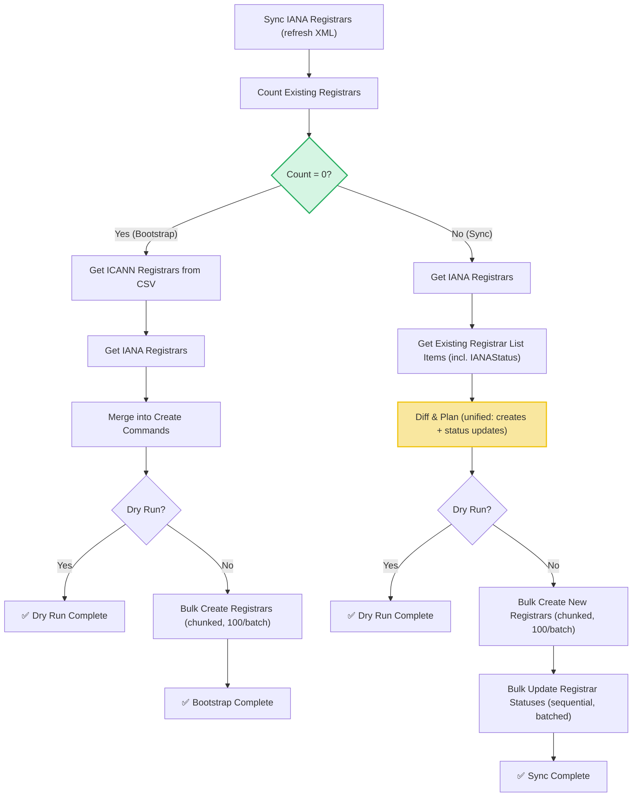

# Sync Registrars Workflow

| Field | Value |
|-------|-------|
| **Status** | `ACTIVE` |
| **Queue** | `object-lifecycle` |
| **Category** | `operations` |
| **Tags** | `operations`, `registrars`, `sync` |
| **Trigger** | `Schedule` / `API` |
| **Human-in-the-Loop** | `No` |
| **Launchpad Card** | `Read-only (scheduled)` |

## Overview

The Sync Registrars Workflow keeps the system's registrar data in sync with IANA and ICANN sources. It operates in two distinct modes: **Bootstrap** (when zero registrars exist in the system) imports registrars from a local ICANN CSV file merged with IANA data, while **Sync** (when registrars already exist) computes a unified diff between current IANA data and the existing registrar records — comparing both platform status and IANA status — then applies creates and status updates in a single batched activity. Reserved IANA registrars are skipped (except special GurIDs 9995 and 9996).

## Flow Diagram



## Input

```go
func SyncRegistrarsWorkflow(ctx workflow.Context, params SyncRegistrarsParams) (SyncRegistrarsResult, error)

type SyncRegistrarsParams struct {
    BatchSize        int  `json:"batchSize,omitempty"`
    ConcurrencyLimit int  `json:"concurrencyLimit,omitempty"`
    DryRun           bool `json:"dryRun,omitempty"`
}
```

## Output

```go
type SyncRegistrarsResult struct {
    StartedAt      time.Time               `json:"startedAt"`
    CompletedAt    time.Time               `json:"completedAt"`
    TotalIANA      int                     `json:"totalIana"`
    TotalExisting  int                     `json:"totalExisting"`
    TotalProcessed int                     `json:"totalProcessed"`
    Created        int                     `json:"created"`
    Updated        int                     `json:"updated"`
    Skipped        int                     `json:"skipped"`
    Unchanged      int                     `json:"unchanged"`
    Failed         int                     `json:"failed"`
    Notes          []string                `json:"notes"`
    CreatedItems   []SyncCreatedRegistrar  `json:"createdItems,omitempty"`
    UpdatedItems   []SyncUpdatedRegistrar  `json:"updatedItems,omitempty"`
    Failures       []SyncRegistrarsFailure `json:"failures,omitempty"`
}

type SyncCreatedRegistrar struct {
    ClID       string `json:"clId"`
    Name       string `json:"name"`
    GurID      int    `json:"gurId"`
    Status     string `json:"status"`
    IANAStatus string `json:"ianaStatus"`
}

type SyncUpdatedRegistrar struct {
    ClID          string `json:"clId"`
    OldStatus     string `json:"oldStatus,omitempty"`
    NewStatus     string `json:"newStatus,omitempty"`
    OldIANAStatus string `json:"oldIanaStatus,omitempty"`
    NewIANAStatus string `json:"newIanaStatus,omitempty"`
}

type SyncRegistrarsFailure struct {
    ClID      string `json:"clId"`
    Operation string `json:"operation"`
    Error     string `json:"error"`
}
```

### Checks and Balances

The result struct provides full operational transparency:

| Field | Purpose |
|-------|---------|
| `TotalIANA` | Source count — how many registrars IANA reports |
| `TotalExisting` | Platform count before sync — existing registrars |
| `Created` | New registrars added to the platform |
| `Updated` | Registrars whose status was updated |
| `Skipped` | Reserved registrars intentionally skipped |
| `Unchanged` | Registrars already in sync (no action needed) |
| `Failed` | Registrars that could not be updated |

**Invariant**: `TotalIANA = Created + Updated + Skipped + Unchanged + (items with create errors)`

## Query Handler

The workflow exposes a `progress` query handler that returns the current `SyncRegistrarsResult` in real-time, allowing operators to monitor creates and updates as they happen.

## Steps

### 1. Sync IANA Registrars
- **Activity**: `activities.SyncIanaRegistrars`
- **Description**: Downloads the IANA XML registry and refreshes the local `iana_registrars` table (full replace).
- **Timeout**: 1 minute | **Retries**: 3

### 2. Count Existing Registrars
- **Activity**: `activities.CountRegistrars`
- **Description**: Counts registrars in the database. Determines if bootstrap (count=0) or sync path is taken.
- **Timeout**: 1 minute | **Retries**: 3

### Bootstrap Path (Count = 0)

#### 3a. Get ICANN Registrars
- **Activity**: `activities.GetICANNRegistrars`
- **Description**: Reads ICANN seed data from the local CSV file (`./initdata/icannRegistrarList.csv`).

#### 4a. Get IANA Registrars
- **Activity**: `activities.GetIANARegistrars`
- **Description**: Fetches all IANA registrar records from the local `iana_registrars` table (paginated).

#### 5a. Merge into Create Commands
- **Activity**: `activities.MakeCreateRegistrarCommands`
- **Description**: Merges CSV and IANA data into `CreateRegistrarCommand` slices with proper status mapping.

#### 6a. Bulk Create Registrars
- **Activity**: `activities.BulkCreateRegistrars` (chunked 100/batch)
- **Description**: Performs database inserts for the bootstrap batch.

### Sync Path (Count > 0)

#### 3b. Get IANA Registrars
- **Activity**: `activities.GetIANARegistrars`
- **Description**: Fetches all IANA registrar records.

#### 4b. Get Existing Registrar List Items
- **Activity**: `activities.GetRegistrarListItems`
- **Description**: Fetches all existing registrars including both platform status and IANA status.

#### 5b. Diff & Plan
- **Activity**: `activities.DiffAndPlanRegistrars`
- **Description**: Computes a unified diff comparing both platform status and IANA status. Produces `Creates` (new registrars) and `Updates` (status changes). Skips reserved registrars (except GurIDs 9995/9996). Forces OK for special GurIDs.

#### 6b. Bulk Create New Registrars
- **Activity**: `activities.BulkCreateRegistrars` (chunked 100/batch)
- **Description**: Creates any newly accredited registrars.

#### 7b. Bulk Update Registrar Statuses
- **Activity**: `activities.BulkUpdateRegistrarStatuses`
- **Description**: Applies all status updates (platform and/or IANA) in a single activity. Makes sequential HTTP calls only for fields that actually changed. Collects failures without aborting.
- **Timeout**: 10 minutes | **Retries**: 3

## Failure Modes

| Failure | Cause | Workflow Behavior | Manual Recovery |
|---------|-------|-------------------|--------------------|
| IANA sync failure | Network error fetching XML | Workflow fails immediately | Check connectivity, retry run |
| Count query failure | DB connection issue | Workflow fails | Check DB health, retry run |
| Bulk create failure | DB constraint or timeout | Fails chunk; returns error | Re-run workflow (creates are idempotent) |
| Bulk update failure | Activity-level error | Workflow fails with error | Review error, retry run |
| Individual update failure | HTTP error on single registrar | Collected in `Failures`; workflow continues | Review failures list, fix registrar state manually |

## Operational Notes

- **Daily schedule**: Runs automatically once per day
- **Dry run**: Set `DryRun: true` to preview creates/updates without making changes
- **Typical runtime**: Most runs complete in seconds (only actual diffs are applied)
- **Previous design**: Before this optimization, the workflow made ~4,500 individual HTTP calls per run to brute-force IANA statuses. Now it only updates registrars that actually changed.

---

> **Last updated**: 2026-06-24
> **Updated by**: Agent (optimized: unified diff for both statuses, replaced parallel loops with batched activity, added checks-and-balances reporting)
