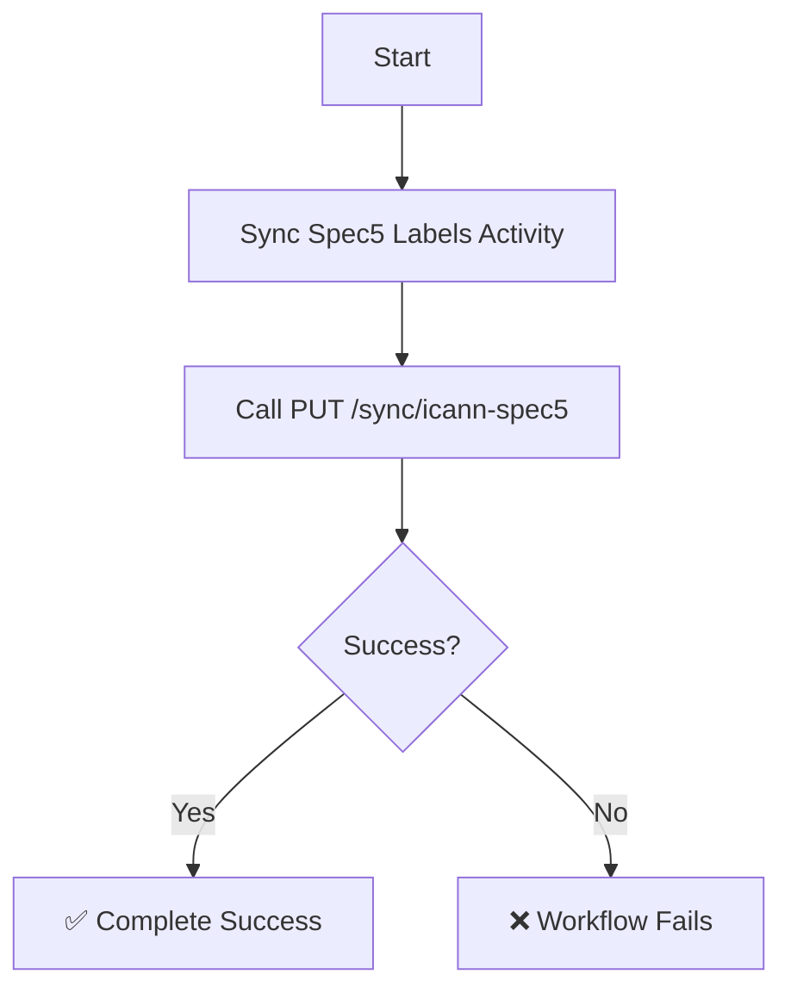

# Sync Spec5 Workflow

| Field | Value |
|-------|-------|
| **Status** | `ACTIVE` |
| **Queue** | `data-pipeline` |
| **Category** | `data` |
| **Tags** | `data`, `spec5`, `sync` |
| **Trigger** | `Schedule` / `API` |
| **Human-in-the-Loop** | `No` |
| **Launchpad Card** | `Read-only (scheduled)` |

## Overview

The Sync Spec5 Workflow synchronizes the local cache of Registry Agreement (RA) Specification 5 reserved/blocked labels in the database with the official ICANN Reserved Names registry. It triggers the REST endpoint `PUT /sync/icann-spec5` which downloads ICANN's XML file and merges it with hardcoded static Specification 5 rules.

## Flow Diagram



## Input

```go
func SyncSpec5Workflow(ctx workflow.Context) error
```

No input parameters.

## Output

Returns `error` only. Returns `nil` on success.

## Steps

### 1. Sync Spec5 Labels
- **Activity**: `activities.SyncSpec5`
- **Timeout**: Start-to-close 10min
- **Retry**: Max 3 attempts, initial interval 1s, backoff coefficient 2.0, max interval 10min
- **Description**: Triggers a synchronization via the API by making a `PUT` request to `/sync/icann-spec5`. The API endpoint deletes all existing Spec5 labels and populates the database table `spec5_labels` with the latest records from ICANN and local static rules.

## Failure Modes

| Failure | Cause | Workflow Behavior | Manual Recovery |
|---------|-------|-------------------|-----------------|
| XML Download Failure | ICANN site is down or URL changed | Activity retries, then workflow fails | Verify ICANN registry URL availability; trigger manual run when up |
| DB Write Failure | DB transaction or network failure during update | Activity retries, then workflow fails | Check PostgreSQL health, reset/retry workflow |

## Artifacts

No file artifacts are produced. Database table `spec5_labels` is updated.

## Operational Notes

### Scheduling
Runs daily to pull updates from ICANN.

### Monitoring
- Monitor for `SyncSpec5` activity failures in Temporal dashboards.
- Monitor the `spec5_labels` table row count (expect ~200+ entries).

### Manual Intervention
- Trigger workflow execution via Temporal CLI/Web Console or `/sync/icann-spec5` API endpoint directly.

---

> **Last updated**: 2026-06-25
> **Updated by**: Antigravity
