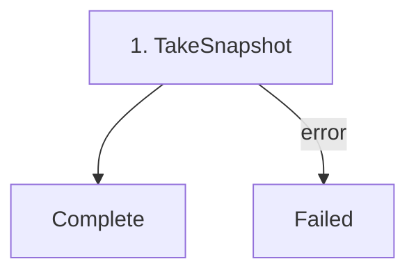

# Take Snapshot

---

| Field | Value |
|-------|-------|
| **Status** | `ACTIVE` |
| **Queue** | `data-pipeline` |
| **Category** | `operations` |
| **Tags** | `operations`, `snapshot`, `backup`, `export` |
| **Trigger** | `API` |
| **Human-in-the-Loop** | `No` |
| **Launchpad Card** | `Yes` |

## Overview

Exports the entire PostgreSQL database as a single JSONL (JSON Lines) file to S3/MinIO. Each line contains a table name and the row data. Tables are exported in foreign-key-safe order so the resulting snapshot can be re-imported without constraint violations.

The following tables are exported (in order):

1. iana_registrars
2. spec5_labels
3. registry_operators
4. tlds
5. phases
6. phase_prices
7. phase_fees
8. nndns
9. registrars
10. accreditations (join table)
11. contacts
12. hosts
13. host_addresses
14. domains
15. domain_hosts (join table)
16. premium_lists
17. premium_labels
18. fx
19. tld_dns_records

> **Note:** The `domain_events` table is intentionally excluded. It is append-only event data that can grow very large and is not needed for seeding a new environment.

## Flow Diagram



## Input

```go
type TakeSnapshotParams struct {
    Label string // User-provided label, e.g. "pre-migration-2026-06-25"
}
```

**Example JSON:**
```json
{
  "label": "pre-migration-2026-06-25"
}
```

## Output

```go
type TakeSnapshotResult struct {
    SnapshotKey string            // S3 key of the JSONL file
    ManifestKey string            // S3 key of the manifest JSON
    TableCounts map[string]int64  // Per-table row counts
    TotalRows   int64
}
```

## Steps

### 1. Take Snapshot
- **Activity**: `TakeSnapshot`
- **Timeout**: Start-to-close 12h, Heartbeat 5m
- **Retry**: Max 3 attempts
- **Description**: Iterates all 19 tables in FK-safe order. For each table, reads rows in batches of 1000, encodes each row as a JSONL line `{"table": "name", "data": {...}}`, and streams the output via `io.Pipe()` to S3 `UploadStream()`. Records heartbeats per batch. On completion, uploads a `manifest.json` with per-table row counts and metadata.

## Signals

None.

## Failure Modes

| Failure | Cause | Workflow Behavior | Manual Recovery |
|---------|-------|-------------------|-----------------|
| S3 upload failure | MinIO/B2 down | Retries up to 3 times | Check S3 connectivity, retry workflow |
| DB read error | Postgres connection drop | Retries up to 3 times | Check DB health, retry workflow |
| Heartbeat timeout | Activity stalled | Temporal cancels, retries | Investigate DB/S3 performance |

## Artifacts

| Artifact | Storage | Purpose |
|----------|---------|---------|
| `snapshot.jsonl` | S3: `snapshot-{label}-{timestamp}/` | Full database snapshot in JSONL format |
| `manifest.json` | S3: `snapshot-{label}-{timestamp}/` | Metadata: label, timestamp, per-table row counts, total rows |

## Operational Notes

### Scheduling
Not scheduled. Triggered manually via the Launchpad UI or REST API.

### Monitoring
Query the workflow state via the `"state"` query handler to see current phase, current table being exported, and per-table row counts.

### Manual Intervention
Launch from the Launchpad UI by providing an optional label. View results in the MinIO console or download via presigned URLs.

---

> **Last updated**: 2026-06-25
