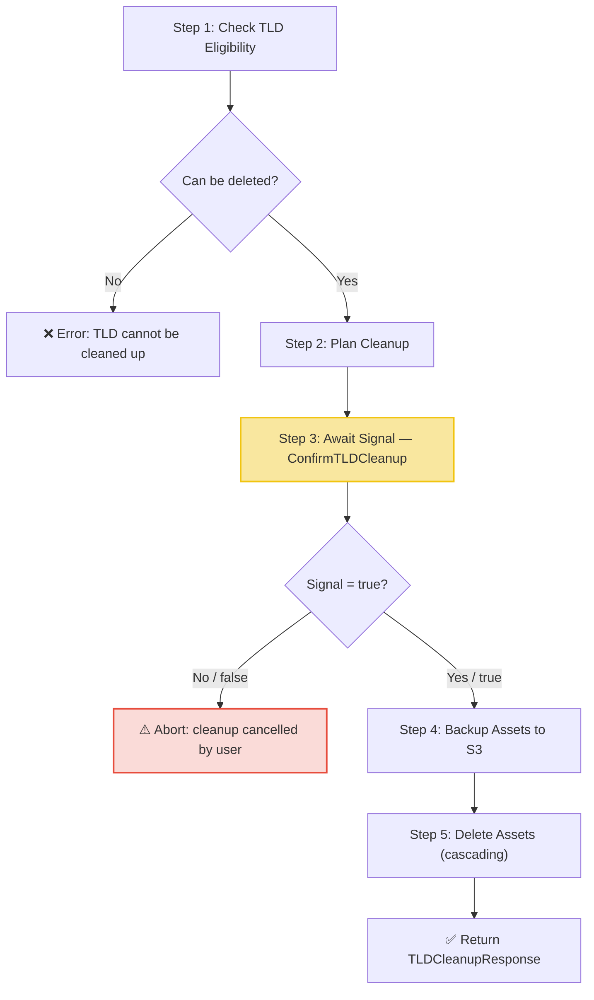

# TLD Cleanup Workflow

| Field | Value |
|-------|-------|
| **Status** | `ACTIVE` |
| **Queue** | `data-pipeline` |
| **Category** | `operations` |
| **Tags** | `operations`, `tld`, `cleanup` |
| **Trigger** | `API` |
| **Human-in-the-Loop** | `Yes` — signal: `ConfirmTLDCleanup` |
| **Launchpad Card** | `Yes` |

## Overview

The TLD Cleanup Workflow safely removes all assets (domains, contacts, hosts, etc.) associated with a given TLD. It first checks whether the TLD is eligible for deletion, builds a deletion plan with a manifest, then **pauses and waits for explicit human confirmation** via a Temporal signal before proceeding. Once confirmed, it streams a backup of all assets to S3, then performs a cascading deletion. If the signal sends `false`, the workflow aborts and returns only the manifest key.

## Flow Diagram



## Input

```go
type TLDCleanupParams struct {
    TLD              string
    KeepTLDAndPhases bool
}
```

- `TLD`: The top-level domain whose assets should be removed.
- `KeepTLDAndPhases`: If `true`, the TLD record and its launch phases are preserved; only child assets (domains, contacts, hosts) are deleted.

**Example JSON:**
```json
{
  "TLD": "example",
  "KeepTLDAndPhases": false
}
```

## Output

```go
type TLDCleanupResponse struct {
    ManifestKey  string `json:"manifestKey"`
    BackupKey    string `json:"backupKey"`
    DeletedCount int64  `json:"deletedCount"`
}
```

## Steps

### 1. Check TLD Eligibility
- **Activity**: `TLDCleanupActivities.CheckTLDCanBeDeleted`
- **Timeout**: Start-to-close 12h, Heartbeat 5min
- **Retry**: Max 3 attempts
- **Description**: Validates whether the TLD can be safely deleted. Checks for active operations, dependencies, or policy restrictions. Returns `CanBeDeleted` bool and a `Reason` string if not eligible.

### 2. Plan Cleanup
- **Activity**: `TLDCleanupActivities.PlanTLDCleanup`
- **Timeout**: Same as above
- **Retry**: Same as above
- **Description**: Generates a cleanup manifest listing all entities to be deleted (domains, contacts, hosts). Uploads the manifest to S3. Returns counts of each entity type and the manifest key for review.

### 3. Await User Confirmation (Signal Gate)
- **Signal**: `ConfirmTLDCleanup`
- **Payload Type**: `bool`
- **Description**: The workflow blocks here, waiting indefinitely for a signal. The operator should review the manifest (available via the manifest key) before sending the signal. Sending `true` proceeds with backup and deletion. Sending `false` aborts the workflow.
- **Timeout behavior**: No automatic timeout — the workflow waits indefinitely. Manual cancellation via Temporal UI is available.

### 4. Backup Assets
- **Activity**: `TLDCleanupActivities.BackupTLDAssets`
- **Timeout**: Same as above
- **Retry**: Same as above
- **Description**: Streams all assets referenced in the manifest to an S3 backup archive. Returns the backup key and count of entities saved. This step ensures data can be recovered if the deletion is regretted.

### 5. Delete Assets
- **Activity**: `TLDCleanupActivities.DeleteTLDAssets`
- **Timeout**: Same as above
- **Retry**: Same as above
- **Description**: Performs cascading deletion of all entities listed in the manifest. The deletion order is built into the activity to respect foreign key constraints (e.g., domains before contacts).

## Signals

| Signal Name | Payload Type | Description |
|-------------|-------------|-------------|
| `ConfirmTLDCleanup` | `bool` | Sent by operator to approve (`true`) or reject (`false`) the cleanup after reviewing the manifest |

**Timeout behavior**: No automatic timeout. The workflow waits indefinitely for the signal. To abort a waiting workflow, either send `false` or cancel the workflow via the Temporal UI.

## Failure Modes

| Failure | Cause | Workflow Behavior | Manual Recovery |
|---------|-------|-------------------|-----------------|
| TLD not eligible | Active domains, policy restriction | Fails with descriptive error | Review reason, resolve blockers, retry |
| Planning failure | DB query failure, S3 upload error | Fails before signal gate | Check DB/S3 health, retry workflow |
| Backup failure | S3 write error, network issue | Fails after confirmation; manifest key preserved | Retry workflow — will re-check, re-plan |
| Deletion failure | DB constraint violation, timeout | Fails partially; manifest + backup keys preserved | Use backup to restore, investigate constraints |
| No signal received | Operator forgot or workflow abandoned | Workflow stays open consuming resources | Send signal or cancel via Temporal UI |

## Artifacts

| Artifact | Storage | Purpose |
|----------|---------|---------|
| Cleanup manifest | S3 (key in result `ManifestKey`) | Itemized list of entities to delete — used for review and deletion |
| Backup archive | S3 (key in result `BackupKey`) | Full backup of all deleted entities for disaster recovery |

## Operational Notes

### Scheduling
Not scheduled. Triggered via API / Launchpad. This is an operator-initiated destructive action.

### Monitoring
- Watch for workflows stuck in the signal-wait state for extended periods — these may indicate abandoned operations.
- Monitor the `DeletedCount` in completed workflows to track the scale of cleanup operations.
- Large TLDs (millions of domains) may approach the 12h start-to-close timeout during backup or deletion.

### Manual Intervention
- **Before signaling**: Review the manifest via the S3 key returned in the planning step. The Launchpad UI shows the manifest summary.
- **To approve**: Send signal `ConfirmTLDCleanup` with value `true`.
- **To reject**: Send signal `ConfirmTLDCleanup` with value `false`, or cancel the workflow.
- **After partial failure**: The backup key is always returned if the backup step succeeded. Use it to restore data if needed.

---

> **Last updated**: 2025-06-23
> **Updated by**: Agent (initial documentation)
