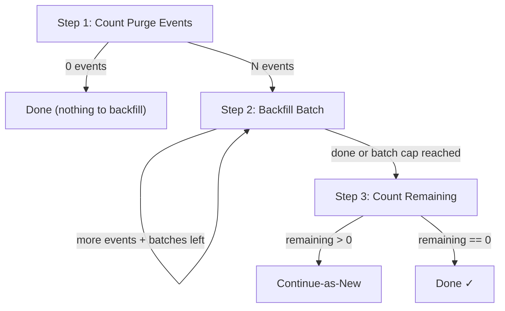

| Field | Value |
|-------|-------|
| **Status** | `ACTIVE` |
| **Queue** | `data-pipeline` |
| **Category** | `operations` |
| **Tags** | `operations`, `tombstone`, `backfill`, `domain`, `archival` |
| **Trigger** | `API` (Launchpad) |
| **Human-in-the-Loop** | `No` |
| **Launchpad Card** | `Yes` |

## Overview

Scans historical `domain.purged` events and creates tombstone records for domains that were purged before the tombstone system was introduced. The workflow is idempotent — it uses UPSERT semantics on tombstone creation, so it's safe to run multiple times. It processes events in batches with heartbeats and uses continue-as-new if the batch cap is reached, enabling it to backfill arbitrarily large datasets without timing out.

## Flow Diagram



## Input

```go
type TombstoneBackfillParams struct {
    BatchSize  int `json:"batchSize,omitempty"`  // events per batch (default 200)
    MaxBatches int `json:"maxBatches,omitempty"` // safety cap per run (default 50)
}
```

**Example JSON:**
```json
{
  "batchSize": 200,
  "maxBatches": 50
}
```

## Output

```go
type TombstoneBackfillResult struct {
    StartedAt         time.Time `json:"startedAt"`
    CompletedAt       time.Time `json:"completedAt"`
    EventsScanned     int64     `json:"eventsScanned"`
    TombstonesCreated int64     `json:"tombstonesCreated"`
    TombstonesSkipped int64     `json:"tombstonesSkipped"` // already existed
    TotalBatches      int       `json:"totalBatches"`
    RemainingCount    int64     `json:"remainingCount"`
    Errors            int64     `json:"errors"`
    Notes             []string  `json:"notes"`
}
```

## Steps

### 1. Count Purge Events
- **Activity**: `CountPurgeEvents`
- **Timeout**: Start-to-close 2m
- **Retry**: Max 3 attempts, backoff 2.0
- **Description**: Counts all `domain.purged` events in the `domain_events` table. If zero, the workflow exits immediately with a "nothing to backfill" note.

### 2. Backfill Batch (loop)
- **Activity**: `BackfillTombstonesBatch`
- **Timeout**: Start-to-close 10m, Heartbeat 2m
- **Retry**: Max 3 attempts, backoff 2.0
- **Description**: Fetches a batch of `domain.purged` events, checks for existing tombstones (skip if found), reconstructs tombstone from event payload (`Data` and `AfterState` fields), and creates via UPSERT. Records heartbeat every 50 events. Returns a cursor for the next batch. Loop runs up to `MaxBatches` times.

### 3. Count Remaining
- **Activity**: `CountPurgeEventsWithoutTombstones`
- **Timeout**: Start-to-close 2m
- **Retry**: Max 3 attempts, backoff 2.0
- **Description**: Counts `domain.purged` events that still don't have a corresponding tombstone (via LEFT JOIN / NOT EXISTS). If remaining > 0 and the batch cap was reached, the workflow uses continue-as-new to process more.

## Failure Modes

| Failure | Cause | Workflow Behavior | Manual Recovery |
|---------|-------|-------------------|-----------------|
| DB connection failure | PostgreSQL unreachable | Retries up to 3 times with backoff | Check DB connectivity, re-run workflow |
| Tombstone creation error | Schema mismatch or constraint violation | Logs error, increments error counter, continues | Check `errors` count in result, inspect logs |
| Heartbeat timeout | Activity hung or very slow batch | Activity cancelled, retried | Reduce `batchSize` and re-run |
| Continue-as-new loop | Very large backlog | Eventually completes across multiple runs | Monitor progress via Temporal UI |

## Artifacts

| Artifact | Storage | Purpose |
|----------|---------|---------|
| `domain_tombstones` rows | PostgreSQL | Tombstone records for archived domains |

## Operational Notes

### Running
Launch from the Temporal UI or the Launchpad in the admin dashboard. Default parameters work for most cases. For very large backlogs, consider reducing `batchSize` to 100 for more frequent heartbeats.

### Monitoring
- Check `TombstonesCreated` vs `EventsScanned` in the result to verify coverage
- `TombstonesSkipped` indicates previously backfilled events (idempotent)
- `Errors` > 0 indicates events with unparseable payloads — inspect workflow logs

### Idempotency
The workflow is fully idempotent thanks to UPSERT semantics on tombstone creation. Running it multiple times is safe and will simply skip already-backfilled events.

---

> **Last updated**: 2026-06-30
> **Updated by**: Domain Archival Phase 4
