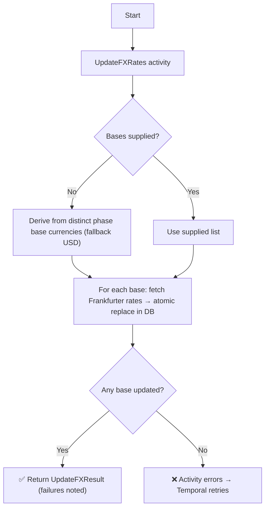

# Update FX Workflow

| Field | Value |
|-------|-------|
| **Status** | `ACTIVE` |
| **Queue** | `fast-ops` |
| **Category** | `data` |
| **Tags** | `data`, `finance`, `fx` |
| **Trigger** | `Schedule` / `REST` |
| **Human-in-the-Loop** | `No` |
| **Launchpad Card** | `Read-only (scheduled)` |

## Overview

The Update FX Workflow refreshes foreign exchange rates once a day from the **Frankfurter API** (https://frankfurter.dev/) — an open, key-less rates service aggregating reference rates from 84 central banks. A single direct-DB activity (`UpdateFXRates`) fetches the latest rates for every base currency quoting needs and **atomically replaces** each base's rates in the database (delete + insert in one transaction, so a failure can never leave a base without rates).

The base currency list is derived at run time from the **distinct `base_currency` values configured on phases** (falling back to `USD` when none exist) — exactly the set `GetQuote` converts from — so adding a TLD phase in a new currency requires no code change. Callers can override the list via `BaseCurrencies`.

A base that fails is reported in `Failures` and keeps its previous rates; the run only fails when **no** base could be updated.

## Flow Diagram



## Input

```go
func UpdateFX(ctx workflow.Context, params UpdateFXParams) (UpdateFXResult, error)

type UpdateFXParams struct {
    // Overrides the base currencies to update. Empty = derive from phases.
    BaseCurrencies []string `json:"baseCurrencies,omitempty"`
}
```

The workflow tolerates being started without arguments (zero values apply), so existing schedules and manual triggers remain compatible.

## Output

```go
type UpdateFXResult struct {
    StartedAt         time.Time                  `json:"startedAt"`
    CompletedAt       time.Time                  `json:"completedAt"`
    BasesUpdated      []string                   `json:"basesUpdated"`
    RatesStored       int                        `json:"ratesStored"`
    Failed            int                        `json:"failed"`
    DerivedFromPhases bool                       `json:"derivedFromPhases"`
    Notes             []string                   `json:"notes"`
    Failures          []activities.FXBaseFailure `json:"failures,omitempty"`
}
```

## Query Handler

The workflow exposes a `progress` query handler returning the current `UpdateFXResult`.

## Steps

### 1. Update FX Rates
- **Activity**: `UpdateFXRates` (struct method on `FXActivities` — direct DB + Frankfurter, no admin-API hop)
- **Timeout**: 10 minutes (start-to-close), 2 minutes (heartbeat)
- **Retry**: Max 3 attempts, initial interval 1s, backoff coefficient 2.0, max interval 10min
- **Description**: Derives the base list (unless supplied), then per base: `GET /v2/rates?base={cur}` from Frankfurter and transactionally replaces that base's rows in the `fx` table. Heartbeats between bases. Returns a structured result; errors only when every base failed. Safe to retry — each base update is an idempotent replace.

The deprecated per-currency HTTP activity (`activities.UpdateFX`, which called `PUT /sync/fx/{cur}` per currency against a hardcoded 7-currency list) remains registered only to drain in-flight executions.

## Failure Modes

| Failure | Cause | Workflow Behavior | Manual Recovery |
|---------|-------|-------------------|-----------------|
| Single base fails | Frankfurter error for that base | Reported in `Failures`; previous rates for that base remain | Review failures; rates refresh next day |
| All bases fail | Frankfurter down, network error | Activity errors → 3 retries → workflow fails (visible red run) | Check Frankfurter status; trigger manual run |
| Phase lookup fails | DB error | Activity errors → retries → workflow fails | Check worker DB connectivity |
| Crash mid-replace | Worker dies inside the transaction | Transaction rolls back — previous rates remain intact | None needed |

## Artifacts

No persistent artifacts produced. Exchange rates are updated directly in the `fx` table.

## Operational Notes

### Scheduling
Runs **daily at 18:00 UTC** (24h interval, 18h offset — after the ECB reference publication at ~14:15 UTC, so each run captures that day's rates). Schedule ID `update-fx`, managed by bootstrap; the reconciler applies the interval change automatically on deploy.

### Rate source
Frankfurter v2 (`https://api.frankfurter.dev/v2/rates`): no API key, no quotas, ~165+ quote currencies per base including PEN and RUB. The previous source (openexchangerates.org) required `OPENEXCHANGERATES_APP_ID` and only supported `base=USD` on the free plan — every non-USD base silently failed. That env var and the `openfx` package have been removed.

### Monitoring
- A red `update-fx` run now means rates genuinely failed to update (the old workflow always returned success).
- Check `Failures` in the result for per-base errors.
- Stale FX rates (no update for >48 hours) should trigger an alert — quotes in non-base currencies fail with `ErrMissingFXRate` when rates are missing entirely, and use day-old rates otherwise.

### Manual Intervention
- To force an FX update: trigger `update-fx` via the workflow API, optionally with `{"baseCurrencies": ["USD", "PEN"]}`.
- Ad-hoc single-base refresh: `PUT /sync/fx/{currency}` (also Frankfurter-backed).
- Adding a new currency requires no code change — configure the phase's base currency and the next run picks it up.

---

> **Last updated**: 2026-07-16
> **Updated by**: Agent — switched to Frankfurter, daily schedule, derived base list, atomic replace (see ADR 0005)
