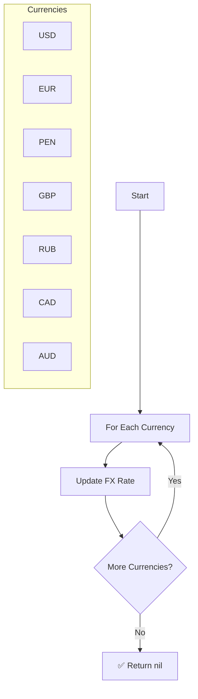

# Update FX Workflow

| Field | Value |
|-------|-------|
| **Status** | `ACTIVE` |
| **Queue** | `data-pipeline` |
| **Category** | `data-pipeline` |
| **Tags** | `data`, `finance`, `fx` |
| **Trigger** | `Schedule` |
| **Human-in-the-Loop** | `No` |
| **Launchpad Card** | `Read-only (scheduled)` |

## Overview

The Update FX Workflow is a simple scheduled workflow that refreshes foreign exchange rates for a fixed set of currencies. It iterates over seven currency codes and updates each rate individually. Individual currency update failures are logged but do not stop the loop, ensuring one failing rate source doesn't block the others.

## Flow Diagram



## Input

```go
func UpdateFX(ctx workflow.Context) error
```

No input parameters. The currency list is hardcoded: `USD`, `EUR`, `PEN`, `GBP`, `RUB`, `CAD`, `AUD`.

## Output

Returns `error` only. Returns `nil` on success (even if individual currency updates fail).

## Steps

### 1. Update FX Rate (per currency)
- **Activity**: `activities.UpdateFX`
- **Timeout**: Start-to-close 1min
- **Retry**: Max 3 attempts, initial interval 1s, backoff coefficient 2.0, max interval 10min
- **Description**: Fetches the latest exchange rate for the given currency and updates it in the system. On failure, logs the error and proceeds to the next currency.

## Failure Modes

| Failure | Cause | Workflow Behavior | Manual Recovery |
|---------|-------|-------------------|-----------------|
| Rate fetch failure | External FX API down, network error | Logs error, skips currency, continues | Wait for next run or trigger manually |
| Rate update failure | DB write error | Logs error, skips currency, continues | Check DB health, retry |
| All currencies fail | External API fully down | Workflow returns `nil` but no rates updated | Check FX API status, trigger manual run when restored |

## Artifacts

No persistent artifacts produced. Exchange rates are updated directly in the database.

## Operational Notes

### Scheduling
Runs every hour at the 30-minute mark (same offset as the Purge Loop, different queue).

### Monitoring
- Monitor for consistently failing currencies — may indicate a deprecated rate source or API key issue.
- Stale FX rates (no update for >2 hours) should trigger an alert.

### Manual Intervention
- To force an FX update: trigger the workflow manually via API.
- To add a new currency: update the hardcoded `currencies` slice in `updateFX.go` and redeploy.

---

> **Last updated**: 2025-06-23
> **Updated by**: Agent (initial documentation)
